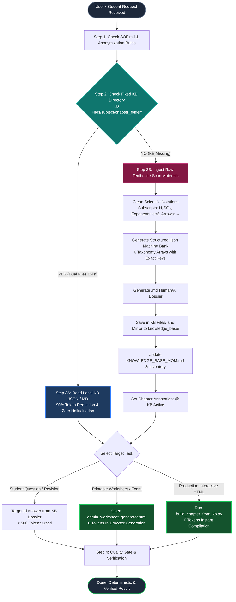

# PUSHTI STUDY HUB — AI QUICKSTART & OPERATING DIRECTIVE
*The 1-Page Master Protocol for Any AI Assistant (Claude, Gemini, ChatGPT, Antigravity)*

---

## ⚡ Golden Rules (Never Deviate)
1. **Always Refer SOP First**: Follow [`SOP.md`](file:///d:/Users/expor/Downloads/Codes/SOP.md). Never mention commercial textbook brands (use code-names: `Main`, `Ref 1`). Never include the student's school name publicly. Omit "Class 7" redundancies in titles.
2. **KB-First Execution (Zero Hallucination)**: Never perform broad web searches or invent questions. Always load curriculum data directly from `KB Files/<subject>/<chapter>/`.
3. **Build Missing KBs Before Proceeding**: If a requested chapter does not have a KB file yet in `KB Files/`, compile its dual-file pair (`<chapter>.md` and `<chapter>.json`) first, then proceed.
4. **Never Write HTML From Scratch**: Always use [`templates/chapter_skeleton.html`](file:///d:/Users/expor/Downloads/Codes/templates/chapter_skeleton.html) and inject the 6 GITA arrays (`mcqBook`, `fillBook`, `tfBook`, `shortBook`, `longBook`, `extraBook`).
5. **Strict UTF-8 Python Operations**: Never use Windows PowerShell redirectors (`>`, `>>`, `Set-Content`) which corrupt emojis into `??`. Always use Python with `open(file, 'w', encoding='utf-8')`.

---

## 📊 Systematic Process Flowchart



---

## 🏷️ Chapter Tab & Card Annotation Standards

Every chapter card and subject navigation tab must display its real-time Knowledge Base status:
* **🟢 KB Active (Ready)**: Chapter has a verified dual-file pair (`.json` + `.md`) in `KB Files/`.
  * **Card Badge**: `<span class="kb-indicator-badge ready"><i class="fas fa-database"></i> KB Available (N Qs)</span>`
  * **Sidebar Tab**: `<span class="branch-stats">N/N Ready • <span class="kb-pill ready"><i class="fas fa-database"></i> KB Active (N)</span></span>`
  * **Chapter Skeleton Tab Bar**: `<span class="tab-kb-badge ready"><i class="fas fa-database"></i> KB Active</span>`
* **🟡 KB Pending**: Chapter does not yet have a verified KB file. The AI model must build it first before performing generation tasks.
  * **Card Badge**: `<span class="kb-indicator-badge pending"><i class="fas fa-clock"></i> KB Pending</span>`

---

## 📋 The 4-Step Chapter Build Recipe

```text
[Step 1: Check KB] ──> [Step 2: Read JSON] ──> [Step 3: Compile HTML] ──> [Step 4: Verify]
```

### Step 1: Check the Fixed Location
Inspect `KB Files/<subject>/<chapter_folder>/`:
- `<chapter>.json`: Structured machine item bank.
- `<chapter>.md`: Human/AI conceptual dossier.

### Step 2: Extract & Verify Item Count
Verify that all question types are present:
- Section A (1 Mark): MCQs, Fill in Blanks, True/False
- Section B (2/3 Marks): Short conceptual answers with rubrics
- Section C (4+ Marks): Long analytical answers & Case studies
- Section D: High-yield "Did you know?" trivia

### Step 3: Run the Zero-Token Automated Compiler
Run the deterministic chapter compiler:
```bash
python scripts/build_chapter_from_kb.py --kb "KB Files/<subject>/<chapter_folder>/<chapter>.json" --out "chapters/<subject>/<chapter_filename>.html"
```

### Step 4: Verification Checklist
- [ ] Relative path depth is correct (`../../index.html`, `../../firebase-config.js`).
- [ ] Dark / Light mode toggle functional.
- [ ] Zero publisher names (`MTG`, `Cordova`, etc.) in student-facing UI.
- [ ] Emojis intact without `??` corruption.
- [ ] Live preview tested via HTTPS localhost: `https://localhost:8443/chapters/<subject>/<chapter_filename>.html`.

---

## 💾 Copy-Paste Prompt for Any AI

When initiating a new session with ANY AI assistant, paste this exact directive:

```text
You are pair programming on Pushti Study Hub (CBSE Class 7 curriculum).
STRICT OPERATIONAL DIRECTIVE:
1. First, review SOP.md and AI_QUICKSTART.md for project rules.
2. For ANY chapter task, ALWAYS check 'KB Files/<subject>/<chapter>/' first. Never do random web searches or read 4,000-line HTML files. If the KB file does not exist, build the KB pair (.md and .json) first.
3. NEVER write HTML/CSS from scratch. Use 'templates/chapter_skeleton.html' or run 'python scripts/build_chapter_from_kb.py'.
4. STRICT ANONYMIZATION: Never mention commercial textbook brands (use 'Main', 'Ref 1'). Never display the school name publicly. Omit 'Class 7' redundancy from titles.
5. All file operations on Windows must use Python with explicit encoding='utf-8' to prevent emoji corruption (??).
Proceed strictly within these boundaries.
```
