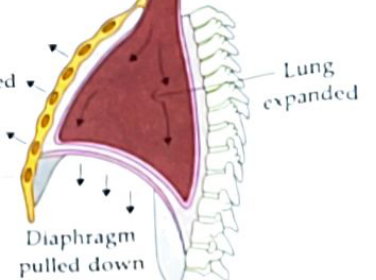
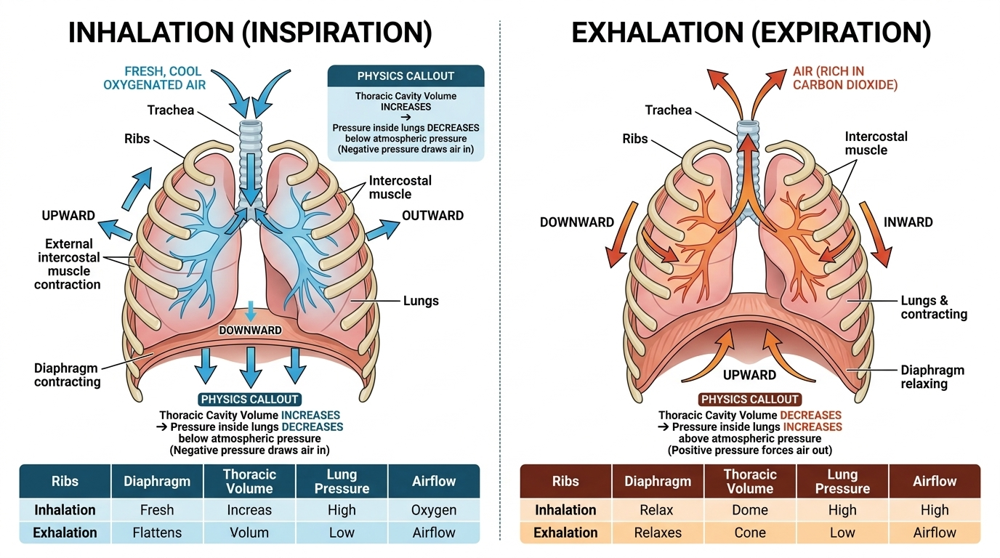
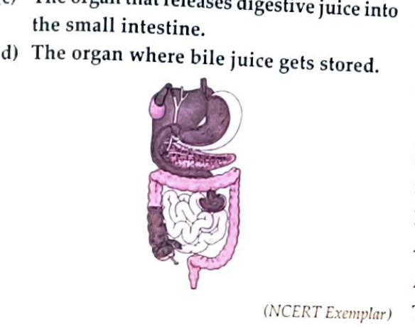
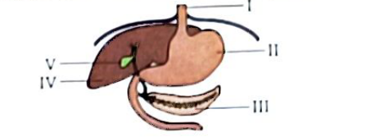
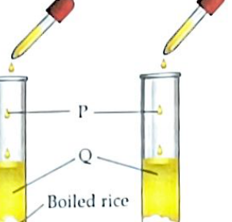
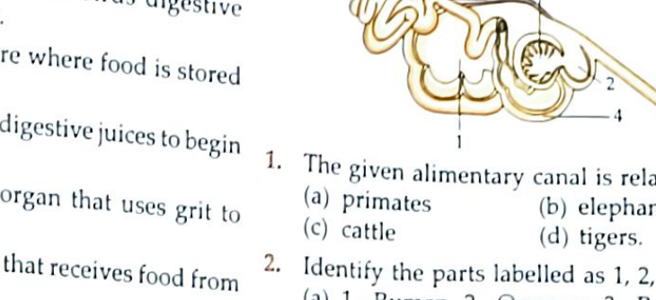
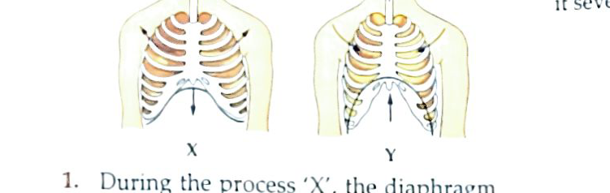
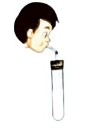

# Science (Biology) — Chapter 3: Life Processes in Animals

**Curriculum Standard:** Class VII Science (Biology) | **Book Pages:** 35–70
**Authoritative Assessment Items:** 250 Items | **Schema:** Dual-Schema Compliant (`questions` & `assessment_items`)

---

## Chapter Summary
Exhaustive curriculum coverage of animal physiology focusing on nutrition and respiration: the 5 sequential stages of holozoic nutrition (ingestion, digestion, absorption, assimilation, egestion); microscopic feeding in unicellular organisms (Paramecium cilia, Hydra tentacles, Amoeba pseudopodia); complete anatomy of the human alimentary canal and digestive glands (salivary amylase/ptyalin, stomach gastric juice/pepsin/HCl, liver bile emulsification, pancreatic amylase/trypsin/lipase, intestinal villi absorption); comparative digestion in ruminant herbivores (4-chambered compound stomach: rumen, reticulum, omasum, abomasum, cellulolytic bacterial fermentation) and birds (crop, proventriculus, muscular gizzard); cellular respiration (aerobic vs anaerobic lactic acid fermentation); human respiratory anatomy and thoracic pressure mechanics of breathing (intercostal muscles, diaphragm displacement); composition of inhaled vs exhaled air; chemical verification of carbon dioxide with lime water; and comparative respiration across taxa (earthworm cutaneous diffusion, insect spiracle-tracheal network, aquatic fish gill counter-current exchange, and amphibian cutaneous/pulmonary breathing).

### Key Learning Outcomes
* Explain the five fundamental stages of holozoic nutrition: ingestion, mechanical/chemical digestion, absorption, cellular assimilation, and egestion.
* Compare diverse ingestion mechanisms in lower organisms: cilia in Paramecium, stinging tentacle nematocysts in Hydra, tube feet and stomach eversion in Starfish.
* Trace the anatomical pathway of the human digestive system, identifying the specific enzymes and digestive secretions of salivary glands, stomach, liver, pancreas, and small intestine.
* Analyze the mechanical functions of human dentition (incisors, canines, premolars, molars) and understand the role of intestinal villi in nutrient absorption.
* Examine specialized herbivore digestion in ruminants: microbial fermentation of cellulose in the rumen, cud regurgitation, and functions of reticulum, omasum, and abomasum.
* Differentiate between mechanical breathing (ventilation) and intracellular cellular respiration (aerobic oxidation yielding 38 ATP vs anaerobic lactic acid formation).
* Detail the pressure-volume thoracic mechanics of human inhalation (ribs moving up/out, diaphragm flattening down) and exhalation (ribs moving down/in, diaphragm doming up).
* Demonstrate the chemical test for exhaled carbon dioxide using clear lime water forming insoluble calcium carbonate precipitate.
* Compare diverse animal respiratory adaptations: cutaneous respiration in earthworms, spiracle-tracheal branching in insects, vascularized gill filaments in fish, and dual breathing in frogs.

---

## In-Depth Theory Modules

### Module MOD_01: Five Stages of Holozoic Nutrition & Ingestion in Lower Organisms
*Book Pages: 35–37*

### 1. Concept of Life Processes & Nutrition
All living organisms perform vital biological activities necessary for survival, collectively termed **Life Processes** (nutrition, respiration, transportation, excretion, reproduction). Being heterotrophic, animals cannot synthesize their own food and must consume organic nutrients.

### 2. Five Stages of Holozoic Nutrition
1. **Ingestion:** The intake of solid complex food into the organism's body.
2. **Digestion:** The breakdown of complex, insoluble, non-diffusible food molecules into simple, soluble, diffusible molecules via mechanical mastication and hydrolytic enzymes.
3. **Absorption:** The passage of soluble digested nutrients across the epithelial membranes of the alimentary canal into the bloodstream or lymph.
4. **Assimilation:** The cellular uptake and biological utilization of absorbed nutrients for energy release, growth, protoplasmic synthesis, and tissue repair.
5. **Egestion:** The elimination of unabsorbed, undigested, and solid waste matter (faeces) from the body through the anus.

### 3. Diverse Ingestion Adaptations in Animals
* **Amoeba:** Uses temporary finger-like projections of cytoplasm called **pseudopodia** to engulf food particles into a food vacuole (phagocytosis).
* **Paramecium:** Slipper-shaped freshwater ciliate; constant, coordinated beating of thousands of hair-like **cilia** sweeps microscopic food particles through the oral groove into the cytostome (cell mouth).
* **Hydra:** A simple multicellular freshwater cnidarian that uses hollow **tentacles** armed with stinging cells (**nematocysts**) to paralyze prey, pushing it directly into its gastrovascular mouth cavity.
* **Starfish (Asterias):** Marine echinoderm that preys on hard-shelled molluscs (clams, oysters). It uses hydraulic tube feet to pry open the shell valves, pops (everses) its stomach out through its mouth into the shell, secretes enzymes to digest the soft animal inside, and retracts the stomach back into its body!
* **Butterflies & Moths:** Possess a long, coiled tubular feeding organ called a **proboscis** to suck nectar from deep floral tubes.
* **Frogs & Lizards:** Possess a long, sticky, bifurcated tongue attached at the front of the lower jaw, which flips outwards to ensnare flying insects.

---

### Module MOD_02: The Human Digestive System: Anatomy, Dentition & Enzymatic Cascade
*Book Pages: 37–41*

### 1. The Human Alimentary Canal
The human alimentary canal is a continuous, muscular, convoluted tube approximately 8 to 9 metres in length, extending from the mouth to the anus.

### 2. Buccal Cavity & Human Dentition
* **Teeth Types and Functions:**
  1. **Incisors (8 total):** Flat, chisel-shaped front teeth for cutting and biting food.
  2. **Canines (4 total):** Sharp, pointed teeth flanking incisors for tearing tough or fibrous food.
  3. **Premolars (8 total):** Broad, ridged grinding teeth for crushing and chewing.
  4. **Molars (12 total):** Large, flat, multi-cusped rear teeth for thorough grinding and pulverizing.
* **Dentition Stages:** Humans develop two sets of teeth: temporary milk/deciduous teeth (20 teeth, shed between 6–12 years) and permanent adult teeth (32 teeth total).
* **Tongue:** A highly mobile, voluntary muscular organ attached to the floor of the buccal cavity. Functions:
  - Mixes masticated food thoroughly with saliva into a lubricated semi-solid ball called a **bolus**.
  - Pushes bolus backwards into the pharynx during swallowing (**deglutition**).
  - Possesses microscopic **taste buds** detecting sweet, salty, sour, and bitter taste modalities.
  - Essential for articulate human speech.

### 3. Digestive Glands and Enzymatic Cascade
1. **Salivary Glands (3 Pairs):**
   - Secrete 1.0 to 1.5 litres of **Saliva** daily (pH ~6.8).
   - Contains the hydrolytic enzyme **Salivary Amylase (Ptyalin)**, which digests insoluble dietary starch into soluble maltose disaccharide sugar:
     $$\text{Starch} + \text{Salivary Amylase} \xrightarrow{\text{pH 6.8}} \text{Maltose}$$
   - Contains **Mucus** (lubrication) and **Lysozyme** (antibacterial enzyme).
2. **Oesophagus (Food Pipe):**
   - Muscular tube (~25 cm long) connecting pharynx to stomach.
   - Pushes the food bolus forward through involuntary, rhythmic, alternating waves of circular muscle contraction and relaxation called **Peristalsis**. No enzymatic digestion occurs here.
3. **Stomach:**
   - J-shaped, thick-walled, expandable muscular sac on the left side of the upper abdomen.
   - Gastric mucosal glands secrete **Gastric Juice** comprising:
     - **Hydrochloric Acid (HCl):** Creates an intensely acidic medium (pH 1.5–2.0) required to kill ingested bacteria and activate inactive pepsinogen into active **pepsin**.
     - **Pepsin:** Cleaves complex dietary proteins into soluble peptones and peptides:
       $$\text{Proteins} + \text{Pepsin} \xrightarrow{\text{Acidic pH}} \text{Peptones} + \text{Peptides}$$
     - **Mucus:** Forms a continuous protective alkaline barrier coating the stomach wall, preventing self-digestion and corrosive erosion by concentrated HCl.
4. **Liver & Gall Bladder:**
   - **Liver:** The largest internal glandular organ in the human body (~1.5 kg, reddish-brown).
   - Secretes **Bile Juice** (yellowish-green alkaline fluid), which is stored and concentrated in the pear-shaped **Gall Bladder**.
   - Bile contains no digestive enzymes! However, it is vital because:
     1. It neutralizes the acidic gastric chyme entering from the stomach, creating an alkaline pH essential for pancreatic enzymes.
     2. **Emulsification of Fats:** Bile salts break down large, insoluble fat globules into micro-droplets, drastically increasing their surface area for enzyme action.
5. **Pancreas:**
   - Cream-coloured composite gland located below the stomach.
   - Secretes **Pancreatic Juice** containing:
     - **Pancreatic Amylase:** Hydrolyzes remaining starches into maltose.
     - **Trypsin:** Cleaves peptones and peptides into smaller peptides and amino acids in alkaline medium.
     - **Pancreatic Lipase:** Hydrolyzes emulsified fat droplets into fatty acids and glycerol:
       $$\text{Emulsified Fats} + \text{Lipase} \to \text{Fatty Acids} + \text{Glycerol}$$
6. **Small Intestine & Intestinal Absorption:**
   - The longest segment of the alimentary canal (~6 to 7.5 metres long, narrow bore).
   - Site of **complete digestion** of carbohydrates (to glucose), proteins (to amino acids), and fats (to fatty acids and glycerol).
   - **Villi:** The inner mucosal lining bears millions of microscopic, finger-like projections called **villi** (singular: villus). Each villus contains a dense network of blood capillaries and a central lymph vessel (**lacteal**).
   - Villi vastly expand the effective absorptive surface area (by over 30-fold), enabling rapid diffusion of digested nutrients directly into blood and lymph circulation.
7. **Large Intestine & Egestion:**
   - Wider and shorter tube (~1.5 metres long).
   - Possesses no digestive enzymes. Absorbs excess water and essential mineral salts from the remaining undigested liquid residue, converting it into semi-solid **faeces**.
   - Faeces are temporarily stored in the **rectum** and periodically expelled through the muscular **anus** (defaecation).

---

### Module MOD_03: Specialized Digestion in Ruminants & Birds
*Book Pages: 41–43*

### 1. Digestion in Ruminant Herbivores (Cattle, Buffalo, Sheep, Goats, Deer)
Herbivorous grazing animals consume enormous quantities of grass rich in **cellulose** (a tough, fibrous structural plant polysaccharide). Mammalian digestive enzymes cannot break down the $\beta$-glycosidic bonds of cellulose. Ruminants possess a specialized **compound stomach** with four distinct anatomical compartments:
1. **Rumen (First & Largest Chamber):**
   - The animal quickly chews and swallows grass, storing it in the massive rumen.
   - Harbour millions of symbiotic anaerobic cellulolytic bacteria and protozoans that produce the enzyme **cellulase**, initiating the fermentation and partial digestion of cellulose.
   - The partially digested food formed here is called **cud**.
2. **Reticulum (Honeycomb Chamber):**
   - Works intimately with the rumen. When the animal is resting, the reticulum forms small masses of cud and regurgitates them backwards up the oesophagus into the buccal cavity.
   - The animal rhythmically and thoroughly re-chews this regurgitated cud (**chewing the cud** or **rumination**), mechanically pulverizing the plant fibers.
3. **Omasum (Manyplies / Psalterium):**
   - Re-swallowed cud enters the omasum, where thin, leaf-like mucosal folds absorb excess water, bicarbonate, and volatile fatty acids.
4. **Abomasum (True Stomach):**
   - The fourth chamber, corresponding biochemically to the human stomach.
   - Secretes concentrated hydrochloric acid and gastric proteases, carrying out true chemical digestion of proteins and microbial cell mass before passage into the small intestine.

*Why Humans Cannot Digest Grass:* Humans and other monogastric animals lack cellulose-fermenting microflora and possess an extremely small, vestigial caecum; hence cellulose passes through human bowels completely undigested as dietary roughage.

### 2. Digestive Adaptations in Birds (Aves)
Birds lack heavy bony jaws, teeth, and facial chewing muscles to keep their body streamlined and light for flight:
* **Crop:** An expandable sac-like pouch located in the lower oesophagus where swallowed grain, seeds, and insects are temporarily stored and softened with moisture.
* **Proventriculus:** The glandular stomach that secretes digestive acid and pepsin.
* **Gizzard (Ventriculus):** A thick, extremely muscular, stone-lined grinding stomach. Birds intentionally swallow small stones and grit (**gastroliths**), which are held inside the gizzard. The powerful muscular walls churn and grind hard seeds against the stones with immense mechanical force, functioning as internal teeth!

---

### Module MOD_04: Cellular Respiration vs Breathing & Bioenergetics
*Book Pages: 43–45*

### 1. Breathing vs Cellular Respiration
* **Breathing (Ventilation / External Respiration):**
  - A strictly physical, mechanical process involving the inhalation of oxygen-rich air and the exhalation of carbon dioxide-rich air across a respiratory surface.
  - Takes place outside the cells; involves no biochemical enzyme catalysis; yields zero energy (ATP).
* **Cellular Respiration (Internal / Tissue Respiration):**
  - An intracellular biochemical oxidation process where glucose molecules are broken down inside mitochondria to release metabolic energy stored as **ATP (Adenosine Triphosphate)**.
  - Occurs in all living cells; catalyzed by specific metabolic enzymes; releases energy continuously.

### 2. Aerobic vs Anaerobic Respiration
1. **Aerobic Respiration:**
   - Breakdown of glucose in the presence of adequate molecular oxygen ($O_2$).
   - Occurs in the cytoplasm and mitochondria of eukaryotic organisms:
     $$\text{Glucose} + 6O_2 \to 6CO_2 + 6H_2O + \text{Energy (38 ATP)}$$
   - Complete oxidation; high energy yield (38 ATP molecules per molecule of glucose oxidized).
2. **Anaerobic Respiration (Fermentation):**
   - Breakdown of glucose in the absolute absence of oxygen ($O_2$).
   - **Alcoholic Fermentation (in Yeast):**
     $$\text{Glucose} \xrightarrow{\text{Yeast / Invertase}} 2\text{C}_2\text{H}_5\text{OH (Ethanol)} + 2CO_2 + \text{Energy (2 ATP)}$$
     Used commercially in brewing beer/wine and baking bread (where $CO_2$ causes dough to rise).
   - **Lactic Acid Fermentation (in Overworked Human Skeletal Muscle):**
     - During intense, vigorous sprinting or heavy exercise, the circulatory oxygen supply cannot keep pace with the muscular energy demand.
     - Muscle cells temporarily respire anaerobically to sustain ATP production:
       $$\text{Glucose} \xrightarrow{\text{Lack of } O_2} 2\text{ Lactic Acid} + \text{Energy (2 ATP)}$$
     - Accumulation of lactic acid in muscular tissue causes acute **muscle fatigue and muscle cramps**.
     - Relief is obtained by taking a **hot water bath** or receiving a vigorous **massage**, which dilates blood vessels, restores oxygen-rich blood flow, and accelerates the aerobic breakdown of lactic acid into $CO_2$ and $H_2O$.

---

### Module MOD_05: Human Respiratory Anatomy & Thoracic Pressure Mechanics
*Book Pages: 45–48*

### 1. Anatomy of the Human Respiratory System
* **Nostrils & Nasal Cavity:** Air enters via external nares. The mucosal lining is lined with fine ciliated hairs and warm mucus that filter out suspended dust, pollen, and microbes, while warming and humidifying incoming air.
* **Pharynx & Larynx:** Common passage for food and air. The **epiglottis** (a cartilaginous flap) prevents food from entering the trachea during swallowing. The larynx houses the vocal cords.
* **Trachea (Windpipe):** A rigid tube (~12 cm long) reinforced with incomplete C-shaped rings of hyaline cartilage that prevent tracheal collapse during thoracic pressure drops.
* **Bronchi & Bronchioles:** Trachea bifurcates into the left and right primary bronchi, which enter the respective lungs and branch repeatedly into narrower bronchioles.
* **Alveoli (Air Sacs):** Microscopic, thin-walled, spherical pouches surrounded by an extensive network of capillary beds. There are ~300 million alveoli in human lungs, providing a massive surface area (~80 m²) for rapid gas exchange via passive diffusion.

### 2. The Pressure-Volume Mechanics of Breathing
Lungs possess no muscular tissue of their own; pulmonary ventilation is driven strictly by pressure differentials generated by thoracic cavity muscle movements:
1. **Inhalation (Inspiration):**
   - External **intercostal muscles contract**, pulling the ribcage **UPWARDS and OUTWARDS**.
   - The dome-shaped muscular **diaphragm contracts and flattens DOWNWARDS**.
   - Total volume of the thoracic cavity **increases**.
   - Internal pulmonary air pressure **decreases** below atmospheric pressure.
   - Atmospheric air rushes into the lungs through the respiratory tract until pressures equalize.
2. **Exhalation (Expiration):**
   - Intercostal muscles **relax**, allowing the ribcage to move **DOWNWARDS and INWARDS**.
   - The diaphragm **relaxes**, returning to its upward **DOME shape**.
   - Total volume of the thoracic cavity **decreases**.
   - Internal pulmonary air pressure **increases** above atmospheric pressure.
   - Carbon dioxide-rich air is forced out of the lungs into the environment.

### 3. Composition of Inhaled vs Exhaled Air
| Component | Inhaled Air (%) | Exhaled Air (%) | Biological Explanation |
| :--- | :--- | :--- | :--- |
| **Oxygen ($O_2$)** | 21.0% | 16.4% | ~4.6% oxygen diffuses into blood capillaries for cellular respiration. |
| **Carbon Dioxide ($CO_2$)** | 0.04% | 4.4% | ~100-fold increase due to metabolic release of $CO_2$ from cellular respiration. |
| **Nitrogen ($N_2$)** | 78.0% | 78.0% | Inert, biologically unused in respiration. |
| **Water Vapour** | Variable / Lower | Saturated / High | Moisture evaporated from respiratory mucosal surfaces. |

*Chemical Test for Exhaled $CO_2$:* Bubbling exhaled breath through clear lime water ($Ca(OH)_2$) turns it milky due to the formation of insoluble calcium carbonate:
$$Ca(OH)_2\text{ (aq)} + CO_2\text{ (g)} \to CaCO_3\text{ (s, white ppt)} + H_2O\text{ (l)}$$

---

### Module MOD_06: Comparative Respiration in Other Animal Taxa
*Book Pages: 48–50*

### 1. Cutaneous Respiration in Earthworms & Leeches
* Earthworms lack specialized respiratory organs. They breathe directly through their thin, permeable, highly vascularized skin (**cutaneous respiration**).
* Secretion of cutaneous mucus and coelomic fluid keeps the skin permanently moist and slimy.
* Atmospheric oxygen dissolves in the surface moisture and diffuses directly into the underlying superficial blood capillaries, while carbon dioxide diffuses out.
* *Critical Requirement:* If an earthworm's skin dries out in hot sunlight, gas diffusion halts completely and the earthworm suffocates and dies.

### 2. Tracheal Respiration in Insects (Cockroach, Grasshopper)
* Insects possess a specialized respiratory network independent of their circulatory blood:
* **Spiracles:** Microscopic, valve-regulated lateral openings located along the sides of the insect's thoracic and abdominal segments.
* **Tracheae & Tracheoles:** Spiracles open into an intricate network of branching internal air tubes called **tracheae**, which subdivide into microscopic fluid-filled **tracheoles** penetrating directly into every living cell and muscle fiber.
* Atmospheric air enters spiracles, travels through tracheae, and delivers oxygen straight to tissue cells without using blood hemoglobin. Carbon dioxide diffuses back into tracheae and exits through spiracles.

### 3. Aquatic Branchial Respiration in Fishes
* Fishes breathe dissolved oxygen present in water using specialized organs called **gills**.
* Gills are sheltered under a bony protective flap called the **operculum**.
* Each gill consists of rows of feathery **gill filaments** bearing microscopic lamellae densely packed with blood capillaries.
* **Mechanism:** The fish gulps water through its mouth; as the mouth closes, water is forced over the gill filaments and out through the opercular cleft. As water flows across the filaments, dissolved oxygen diffuses directly into the capillary blood, while carbon dioxide diffuses out into the passing water.

### 4. Amphibian Dual Respiration in Frogs
Frogs possess three versatile respiratory adaptations corresponding to their amphibious lifecycle:
1. **Cutaneous Respiration (Underwater & Hibernation):** In water or during winter hibernation, a frog breathes entirely through its moist, slimy, vascular skin.
2. **Buccopharyngeal Respiration (At Rest on Land):** Rhythmic pumping of the floor of the buccal cavity draws air over the moist, vascularized oral mucosal lining.
3. **Pulmonary Respiration (Active on Land):** Uses a pair of simple, thin-walled sac-like lungs to breathe atmospheric air during active terrestrial hopping.

---

## Classroom Activities & Empirical Demonstrations

### Activity: Action of Salivary Amylase on Starch
Take two test tubes A and B. Add 1 teaspoon of boiled rice to tube A and 1 teaspoon of boiled rice chewed for 3–5 minutes to tube B. Add 3–4 mL water to both, then add 2–3 drops of iodine solution. Test tube A turns blue-black (starch present), whereas test tube B does not turn blue-black (salivary amylase in saliva broke down starch into maltose sugar).

### Activity: Verifying Carbon Dioxide in Exhaled Breath
Take a clean test tube containing freshly prepared clear lime water [Ca(OH)₂]. Insert a plastic drinking straw and blow exhaled breath gently through the straw for 1–2 minutes. The lime water turns milky white due to insoluble calcium carbonate precipitation (CaCO₃), confirming that exhaled air contains a high concentration of carbon dioxide (4.4%).

---

## Pedagogical Illustrations & In-Text Worked Problems

### Illustration: ILLUS_01
**Problem / Question:** Why does chewing a piece of plain bread or chapati for several minutes make it taste sweet?

**Solution & Conceptual Analysis:** Saliva secreted by salivary glands contains the digestive enzyme salivary amylase (ptyalin). Prolonged mastication mixes the food thoroughly, allowing amylase to break down tasteless complex starch into sweet-tasting maltose disaccharide sugar.

### Illustration: ILLUS_02
**Problem / Question:** What is peristalsis and where does it occur?

**Solution & Conceptual Analysis:** Peristalsis is the rhythmic, involuntary wave-like muscular contraction and relaxation of the circular and longitudinal muscles of the alimentary canal wall that pushes food forward from the oesophagus all the way to the rectum.

### Illustration: ILLUS_03
**Problem / Question:** Why is the small intestine in herbivores like cows significantly longer than in carnivores like tigers?

**Solution & Conceptual Analysis:** Herbivores eat plant matter containing tough, fibrous cellulose, which takes much longer to ferment and digest with symbiotic bacteria. Hence, herbivores have a very long small intestine (~7–9 m) to provide sufficient transit time for cellulose digestion. Carnivores consume easily digestible meat and protein, requiring a much shorter intestinal tract.

### Illustration: ILLUS_04
**Problem / Question:** Why do athletes experience acute muscle cramps during intense sprinting, and how does a hot water bath provide relief?

**Solution & Conceptual Analysis:** During intense sprinting, skeletal muscles require energy faster than oxygen can be supplied by the bloodstream. Muscle cells temporarily respire anaerobically, converting glucose into lactic acid. Lactic acid accumulation causes painful cramps. A hot water bath improves blood circulation, restoring oxygen supply to muscles, which aerobically oxidizes lactic acid into carbon dioxide and water, relieving cramps.

---

## Competition & Olympiad Windows

### Enzymatic Cleavage Pathways in Human Digestion
Carbohydrates: Starch -> (Salivary & Pancreatic Amylase) -> Maltose -> (Maltase) -> Glucose.
Proteins: Proteins -> (Pepsin in acid & Trypsin in alkali) -> Peptides -> (Peptidases) -> Amino acids.
Fats: Large fat globules -> (Bile salts emulsification) -> Micro-droplets -> (Pancreatic & Intestinal Lipase) -> Fatty acids + Glycerol.

### Counter-Current Gas Exchange Mechanism in Fish Gills
Water flows over fish gill lamellae in the opposite direction to capillary blood flow (counter-current exchange). This maintains a continuous concentration gradient of oxygen from water to blood across the entire length of the capillary bed, maximizing oxygen extraction efficiency up to 80%.

---

## Complete Authoritative Assessment Bank

*Total Exhaustive Assessment Items:* **250 Items**

### Textbook Solved Examples

#### Item 001 [bio_ch3_se_001] — Human Digestive System
**Type:** `short_answer` | **Marks:** `3` | **Difficulty:** `medium` | **Source:** `textbook_solved_example`

**Question:**
Write short notes on the following:
(i) Mastication
(ii) Functions of tongue
(iii) Large intestine

**Answer:**
(i) Mastication: The process of chewing food which involves movement of jaws and teeth is called mastication. It breaks down food into small particles which allows efficient mixing of saliva with it.
(ii) Functions of tongue: The tongue helps us to taste the food through taste buds. It moves food inside the buccal cavity between the teeth for chewing, mixes saliva uniformly with food while chewing, and helps us to swallow the bolus.
(iii) Large intestine: The large intestine is about 1.5 m in length, wider and shorter than the small intestine. Its primary functions are: to absorb water and necessary mineral salts from undigested food residue coming from the small intestine, and to eliminate remaining solid waste matter in the form of faeces through the rectum and anus.

**Explanation:**
Mastication mechanically breaks down food; the tongue tastes and positions food; the large intestine reabsorbs water and compacts waste.

---

#### Item 002 [bio_ch3_se_002] — Nutrition in Animals: Ruminants
**Type:** `short_answer` | **Marks:** `2` | **Difficulty:** `medium` | **Source:** `textbook_solved_example`

**Question:**
Cows and buffaloes are usually seen chewing continuously even when they are not grazing. Explain.

**Answer:**
Cows and buffaloes are ruminants (cud-chewing herbivores). During grazing, they quickly swallow large amounts of grass/fodder with minimal initial chewing. This swallowed food is stored in the rumen (first compartment of the stomach), where cellulose is partially digested and fermented by symbiotic anaerobic bacteria and protozoa. This partially digested food is called 'cud'. Later, when the animal is resting, the cud is regurgitated in small lumps back into the mouth cavity, where the animal chews it thoroughly (rumination).

**Explanation:**
Rumination allows herbivores to quickly harvest vegetative forage and mechanically break down tough cellulose fibres later in safety.

---

#### Item 003 [bio_ch3_se_003] — Human Respiration: Breathing Mechanics
**Type:** `short_answer` | **Marks:** `3` | **Difficulty:** `medium` | **Source:** `textbook_solved_example`

**Question:**
Study the mechanism of breathing:
(i) Which breathing process involves ribs moving upward and outward while the diaphragm moves down?
(ii) What anatomical and physical changes take place during this process?

*Mechanism of Inhalation in Humans: Ribcage movement and Diaphragm contraction*

> [!TIP] **Master Concept Deep Dive (360° Infographic)**
> 
> * **Pressure Physics**: Thoracic volume expansion lowers intra-pulmonary pressure below atmospheric pressure (Boyle's Law: negative pressure draws ambient air into lungs).
> * **Muscular Action**: External intercostals contract (ribcage up & out); Diaphragm contracts and flattens downward.
> * **Exam Trap**: The diaphragm does NOT relax or expand during inhalation; it actively contracts and flattens downward.

**Answer:**
(i) Inhalation (Inspiration).
(ii) During inhalation, the external intercostal muscles contract, pulling the ribs upward and outward, while the dome-shaped diaphragm contracts and flattens downward. This combined muscular action increases the overall volume of the thoracic cavity. As the elastic lungs expand to fill the cavity, the air pressure inside the lungs drops below atmospheric pressure. Consequently, air from the outside atmosphere rushes in through the nostrils, trachea, and bronchi to fill the alveoli with fresh oxygen-rich air.

**Explanation:**
Inhalation is an active muscular process where chest volume expansion causes intra-pulmonary pressure to drop, drawing ambient air into the lungs.

---

#### Item 004 [bio_ch3_se_004] — Human Digestive System: Stomach
**Type:** `short_answer` | **Marks:** `2` | **Difficulty:** `medium` | **Source:** `textbook_solved_example`

**Question:**
How does the digestion of food take place in the stomach?

**Answer:**
In the stomach, both mechanical and chemical digestion take place:
1. Mechanical digestion occurs through the rhythmic churning contractions and expansions of the thick muscular stomach walls, which break down food lumps and thoroughly mix them with gastric juice into a acidic semi-fluid called chyme.
2. Chemical digestion is carried out by gastric secretions: hydrochloric acid (HCl) creates an acidic medium (pH 1.5–2.5) that activates pepsinogen into pepsin, which digests complex proteins into peptides and peptones. Gastric mucus shields the inner stomach epithelium from acid corrosion.

**Explanation:**
The stomach combines muscular churning with acid and pepsin action to partially digest proteins.

---

#### Item 005 [bio_ch3_se_005] — Human Digestive System
**Type:** `short_answer` | **Marks:** `2` | **Difficulty:** `medium` | **Source:** `textbook_solved_example`

**Question:**
Why is a fibre-rich diet important for the digestive system?

**Answer:**
A fibre-rich diet provides indigestible plant roughage (cellulose). Fibre adds bulk to the food bolus and chyme, stimulating rhythmic waves of peristalsis along the alimentary canal, especially in the small and large intestines. It ensures regular propulsion of fecal material, prevents compaction, and facilitates smooth bowel movements, thereby preventing constipation and colon disorders.

**Explanation:**
Dietary fibre stimulates intestinal peristalsis and retains water in the stool, preventing constipation.

---

#### Item 006 [bio_ch3_se_006] — Human Respiration: Breathing Rate
**Type:** `short_answer` | **Marks:** `2` | **Difficulty:** `easy` | **Source:** `textbook_solved_example`

**Question:**
Whenever we feel drowsy or sleepy, we start yawning. Does yawning help us in any way?

**Answer:**
Yes. When we feel drowsy or sleepy, our breathing rate slows down significantly and breaths become shallow. As a result, the lungs take in less oxygen and carbon dioxide begins to accumulate in the bloodstream. Yawning is an involuntary deep inhalation that draws a large volume of air into the alveoli, increasing blood oxygen saturation and expelling excess carbon dioxide, thereby helping to restore alertness.

**Explanation:**
Yawning is a physiological compensatory response to shallow breathing during fatigue or boredom, boosting blood oxygenation.

---

#### Item 007 [bio_ch3_se_007] — Human Digestive System: Chemical Digestion
**Type:** `short_answer` | **Marks:** `1` | **Difficulty:** `easy` | **Source:** `textbook_solved_example`

**Question:**
What are the end products of fat digestion?

**Answer:**
The complete breakdown products of fats (lipids) by the action of lipase enzymes are fatty acids and glycerol.

**Explanation:**
Triglycerides are hydrolysed into individual fatty acid chains and glycerol molecules by pancreatic and intestinal lipases.

---

#### Item 008 [bio_ch3_se_008] — Nutrition in Animals: Overview
**Type:** `short_answer` | **Marks:** `2` | **Difficulty:** `medium` | **Source:** `textbook_solved_example`

**Question:**
The basic process of digestion and release of energy is the same in almost all animals. Justify this statement.

**Answer:**
Although different animals exhibit diverse feeding adaptations and anatomical structures, the fundamental biochemical process remains universal: all animals ingest complex food molecules, secrete digestive enzymes to chemically break down large insoluble polymers into simple absorbable monomers (e.g., glucose, amino acids, fatty acids), absorb and transport these monomers to body cells, and oxidize them during cellular respiration to release usable metabolic energy (ATP) with the production of CO₂ and H₂O.

**Explanation:**
All heterotrophs rely on hydrolytic enzymatic breakdown followed by intracellular oxidative phosphorylation to release metabolic energy.

---

#### Item 009 [bio_ch3_se_009] — Human Digestive System: Small Intestine
**Type:** `short_answer` | **Marks:** `3` | **Difficulty:** `medium` | **Source:** `textbook_solved_example`

**Question:**
Why is the small intestine considered as the major site for digestion and absorption of nutrients?

**Answer:**
The small intestine is the principal site because:
1. Complete Digestion: It receives alkaline bile from the liver (which emulsifies fats) and enzyme-rich pancreatic juice from the pancreas, while its own intestinal glands secrete intestinal juice (succus entericus). These enzymes complete the digestion of carbohydrates into monosaccharides (glucose), proteins into amino acids, and fats into fatty acids and glycerol.
2. Maximum Absorption: About 90% of all nutrient absorption occurs here. Its inner lining features millions of microscopic finger-like villi and microvilli, expanding the absorptive surface area exponentially and facilitating rapid diffusion of nutrients into rich capillary and lacteal networks.

**Explanation:**
The small intestine completes the enzymatic digestion of all macromolecules and absorbs over 90% of all digested nutrients through villi.

---

#### Item 010 [bio_ch3_se_010] — Respiration in Other Animals: Fish
**Type:** `short_answer` | **Marks:** `2` | **Difficulty:** `medium` | **Source:** `textbook_solved_example`

**Question:**
How do gills help fishes in breathing?

**Answer:**
Gills are specialized vascular respiratory organs composed of comb-like arches bearing numerous thin, membranous gill filaments and secondary lamellae. These filaments are densely packed with microscopic blood capillaries. As the fish gulps water through its mouth and forces it outward across the gill slits, dissolved oxygen in the passing water diffuses across the thin respiratory membrane into the capillary blood, while metabolic carbon dioxide diffuses from the blood into the water.

**Explanation:**
Gill lamellae provide a vast surface area and thin counter-current capillary beds for dissolved oxygen exchange in aquatic environments.

---

#### Item 011 [bio_ch3_se_011] — Digestive Enzymes: Salivary Amylase
**Type:** `short_answer` | **Marks:** `3` | **Difficulty:** `medium` | **Source:** `textbook_solved_example`

**Question:**
Study the given experimental set-up: Test tube A contains boiled rice + 3–4 mL water; test tube B contains boiled and chewed rice + 3–4 mL water. What will you observe after pouring 2–3 drops of iodine solution in each test tube? Explain the biochemical reason.

**Answer:**
Observations and Reasons:
1. Test Tube A (Boiled rice): The contents turn deep blue-black upon adding iodine solution. Boiled rice contains intact starch molecules, which form a characteristic blue-black complex with iodine.
2. Test Tube B (Boiled and chewed rice): The solution remains brownish-yellow or shows no blue-black colour change. During chewing, saliva was mixed with the rice, and the salivary enzyme salivary amylase (ptyalin) broke down the insoluble starch polymers into simple reducing sugars (maltose/glucose), leaving no free starch to react with iodine.

**Explanation:**
Salivary amylase hydrolyses starch into maltose, eliminating the starch-iodine blue-black colour reaction.

---

#### Item 012 [bio_ch3_se_012] — Human Digestive System: Absorption
**Type:** `short_answer` | **Marks:** `2` | **Difficulty:** `medium` | **Source:** `textbook_solved_example`

**Question:**
What are villi? What role do they play in the absorption of food?

**Answer:**
Villi (singular: villus) are tiny, finger-like mucosal projections lining the inner epithelial wall of the small intestine (ileum). Their role is to dramatically increase the absorptive surface area of the intestinal mucosa. Each villus is covered by a single layer of epithelial cells and contains a rich network of blood capillaries and a central lymph vessel called a lacteal, enabling rapid absorption of water-soluble nutrients directly into blood capillaries and fatty acids/glycerol into lacteals.

**Explanation:**
Villi expand mucosal surface area manifold and provide vascularized pathways for nutrient absorption.

---

#### Item 013 [bio_ch3_se_013] — Respiration in Animals: Amphibians
**Type:** `short_answer` | **Marks:** `2` | **Difficulty:** `easy` | **Source:** `textbook_solved_example`

**Question:**
Name an animal that can breathe on land as well as in water. How does it accomplish respiration in both environments?

**Answer:**
The frog (an amphibian) can breathe both on land and in water:
1. In water: Frogs respire exclusively through their thin, moist, highly vascularized skin (cutaneous respiration), where dissolved oxygen diffuses directly into cutaneous blood vessels.
2. On land: Frogs breathe primarily using lungs (pulmonary respiration) as well as through the moist lining of their mouth cavity (buccopharyngeal respiration).

**Explanation:**
Frogs utilize cutaneous respiration submerged in water, and switch to pulmonary and buccopharyngeal respiration on land.

---

#### Item 014 [bio_ch3_se_014] — Human Respiration: Respiration vs Breathing
**Type:** `short_answer` | **Marks:** `2` | **Difficulty:** `medium` | **Source:** `textbook_solved_example`

**Question:**
Breathing and respiration are not the same. Justify this statement.

**Answer:**
Breathing and respiration represent distinct physiological levels:
1. Breathing is an extracellular, physical/mechanical process involving the muscular inhalation of oxygen-rich air and exhalation of carbon dioxide-rich air. No chemical transformation occurs, and no metabolic energy is released.
2. Respiration is a complex intracellular, biochemical process occurring in mitochondria where absorbed glucose is enzymatically oxidized in the presence of oxygen to release usable biochemical energy (ATP), alongside CO₂ and water.
Therefore, breathing is only the initial gas-exchange step of the broader respiratory process.

**Explanation:**
Breathing is physical ventilation; respiration is intracellular biochemical oxidation yielding ATP.

---

#### Item 015 [bio_ch3_se_015] — Human Digestive System: Organs & Functions
**Type:** `short_answer` | **Marks:** `3` | **Difficulty:** `medium` | **Source:** `textbook_solved_example`

**Question:**
In the human digestive system:
(a) Identify the organs that serve as the food pipe, the muscular churning pouch, and the major enzyme-producing endocrine/exocrine gland.
(b) Name the secretion produced by the liver and explain how it helps in fat digestion.
(c) What is the function of the gall bladder in the human digestive system?

**Answer:**
(a) Oesophagus (food pipe), Stomach (churning pouch), and Pancreas (pancreatic juice producer).
(b) The liver produces bile juice. Bile contains bile salts that emulsify large fat globules into tiny micro-droplets, creating a high surface area for lipase enzymes to digest fats efficiently.
(c) The gall bladder stores and concentrates bile juice produced by the liver temporarily, releasing it into the duodenum via the bile duct when fatty chyme arrives.

**Explanation:**
Bile from the liver is stored in the gall bladder and emulsifies fats in the duodenum to facilitate lipolysis.

---

#### Item 016 [bio_ch3_se_016] — Comparative Respiration in Animals
**Type:** `short_answer` | **Marks:** `4` | **Difficulty:** `medium` | **Source:** `textbook_solved_example`

**Question:**
Pick the odd-one-out from each of the following groups based on respiratory organs and give reasons:
(a) Cockroach, grasshopper, snail, ant
(b) Lizard, cow, earthworm, snake
(c) Crocodile, whale, dolphin, fish
(d) Snake, tadpole, crow, goat

**Answer:**
(a) Snail is the odd one out. Cockroach, grasshopper, and ant are all insects that breathe through a tracheal network of spiracles and tracheae, whereas snails respire through gills (ctenidia) or a pulmonary mantle cavity.
(b) Earthworm is the odd one out. Earthworms respire entirely through their moist, slimy skin via cutaneous diffusion, whereas lizards, cows, and snakes possess well-developed lungs.
(c) Fish is the odd one out. Fish respire through gills, whereas crocodiles (reptiles), whales, and dolphins (aquatic mammals) possess lungs and must breathe air at the surface.
(d) Tadpole is the odd one out. Tadpoles respire through external/internal gills in water, whereas snakes, crows, and goats respire through lungs.

**Explanation:**
Animals possess distinct respiratory organs (tracheae, skin, gills, lungs) adapted to their phylogenic class and habitat.

---

#### Item 017 [bio_ch3_se_017] — Respiration in Other Animals: Fish
**Type:** `short_answer` | **Marks:** `3` | **Difficulty:** `medium` | **Source:** `textbook_solved_example`

**Question:**
How does the exchange of gases take place in fish?

**Answer:**
In fish, gas exchange occurs across gills:
1. The fish opens its mouth to take in oxygen-bearing water and closes its mouth, pumping the water over thin, filament-bearing gills protected beneath the operculum.
2. As water flows across the microscopic gill lamellae, oxygen dissolved in the water diffuses across the ultra-thin capillary walls into red blood cells, binding to hemoglobin.
3. Simultaneously, dissolved carbon dioxide waste carried by venous blood diffuses outward into the passing water stream, which exits through the opercular slits.
4. Oxygenated arterial blood is then transported from the gills directly to the rest of the body tissues.

**Explanation:**
Water-to-blood gas diffusion occurs across thin gill lamellae filaments supplied with capillary networks.

---

#### Item 018 [bio_ch3_se_018] — Nutrition in Animals: Nutrients
**Type:** `short_answer` | **Marks:** `2` | **Difficulty:** `easy` | **Source:** `textbook_solved_example`

**Question:**
Name the different essential nutritional components present in food.

**Answer:**
The essential nutrient classes present in food are:
1. Carbohydrates (primary energy source)
2. Fats / Lipids (concentrated energy storage and insulation)
3. Proteins (bodybuilding, enzyme synthesis, and tissue repair)
4. Minerals (metabolic cofactors and skeletal structure, e.g., calcium, iron)
5. Vitamins (protective biochemical regulators)
6. Dietary fibre / Roughage and Water (essential digestive aids).

**Explanation:**
Balanced nutrition requires carbohydrates, fats, proteins, vitamins, minerals, fibre, and water.

---

#### Item 019 [bio_ch3_se_019] — Human Digestive System: Peristalsis
**Type:** `short_answer` | **Marks:** `2` | **Difficulty:** `medium` | **Source:** `textbook_solved_example`

**Question:**
How does food move in the opposite direction during vomiting?

**Answer:**
Normally, involuntary waves of contraction and relaxation of circular and longitudinal muscles in the alimentary canal wall (peristalsis) propel food downward from the pharynx to the stomach. However, when the stomach becomes overloaded, irritated by toxins, or exposed to stale/contaminated food, protective neural reflexes trigger 'reverse peristalsis' (anti-peristalsis). The muscular walls of the duodenum and stomach contract forcefully in reverse while the cardiac sphincter relaxes, propelling gastric contents upward through the oesophagus and expelling them out through the mouth as vomit.

**Explanation:**
Vomiting is caused by reverse peristalsis triggered by neural protective reflexes against toxic or irritating stomach contents.

---

#### Item 020 [bio_ch3_se_020] — Nutrition in Animals: Ruminants
**Type:** `short_answer` | **Marks:** `2` | **Difficulty:** `medium` | **Source:** `textbook_solved_example`

**Question:**
Identify the four sequential compartments of the complex stomach in ruminants and state their order of food passage.

*Sequential Compartments of Complex Ruminant Stomach: Rumen, Reticulum, Omasum, Abomasum*

**Answer:**
The four compartments of the ruminant stomach in sequence are:
1. Rumen (paunch) – largest fermentation chamber containing cellulose-degrading microbes.
2. Reticulum (honeycomb) – sorts food particles and forms cud pellets for regurgitation.
3. Omasum (manyplies) – absorbs excess water, bicarbonate, and volatile fatty acids.
4. Abomasum (true stomach) – secretes gastric acid and digestive enzymes (pepsin) to digest microbial proteins and remaining nutrients.

**Explanation:**
The four chambers of a ruminant stomach are Rumen, Reticulum, Omasum, and Abomasum.

---

#### Item 021 [bio_ch3_se_021] — Human Digestive System: Organs & Glands
**Type:** `short_answer` | **Marks:** `2` | **Difficulty:** `medium` | **Source:** `textbook_solved_example`

**Question:**
Identify the digestive organs corresponding to each of the following descriptions:
(a) The largest gland in the human body.
(b) The organ where protein digestion begins.
(c) The organ that releases pancreatic digestive juice into the small intestine.
(d) The organ where bile juice gets stored.

**Answer:**
(a) Liver (largest gland in the human body)
(b) Stomach (where gastric pepsin begins protein hydrolysis)
(c) Pancreas (releases pancreatic juice containing amylase, trypsin, and lipase)
(d) Gall bladder (stores and concentrates bile juice produced by the liver).

**Explanation:**
The liver is the largest gland; the stomach starts proteolysis; the pancreas releases pancreatic juice; the gall bladder stores bile.

---

#### Item 022 [bio_ch3_se_022] — Human Digestive System: Sensory Organs
**Type:** `short_answer` | **Marks:** `2` | **Difficulty:** `medium` | **Source:** `textbook_solved_example`

**Question:**
You were blindfolded and asked to identify two drinks: drink A as lime juice and drink B as bitter gourd juice. How could you identify them despite being blindfolded?

**Answer:**
We identify the drinks using specialized gustatory receptors (taste buds) located on the papillae of the tongue. The tongue can detect distinct taste modalities without visual cues. Lime juice contains citric acid which stimulates acid-sensitive sour taste receptors, while bitter gourd (karela) contains cucurbitacins which stimulate bitter taste receptors located toward the posterior back region of the tongue. The sensory signals are relayed via cranial nerves to the brain, enabling precise taste recognition.

**Explanation:**
Taste buds on the tongue detect sour and bitter chemical compounds independently of vision.

---

#### Item 023 [bio_ch3_se_023] — Human Digestive System: Gall Bladder
**Type:** `short_answer` | **Marks:** `2` | **Difficulty:** `medium` | **Source:** `textbook_solved_example`

**Question:**
A patient got her gall bladder removed surgically due to gallstones. After the surgery, she faced digestive difficulty when consuming fat-rich food in bulk. Why does this occur?

**Answer:**
The gall bladder stores and concentrates bile juice synthesized by the liver, releasing large pulses of bile into the duodenum whenever fat-rich meals enter from the stomach. Following surgical removal of the gall bladder (cholecystectomy), bile drips continuously but slowly into the small intestine without storage or concentrated bolus release. When high-fat meals are ingested in bulk, there is insufficient concentrated bile to emulsify large fat globules, resulting in impaired lipase activity, malabsorption, and digestive discomfort.

**Explanation:**
Loss of the gall bladder eliminates bile concentration and meal-triggered bolus release, making high-fat meal digestion sluggish.

---

#### Item 024 [bio_ch3_se_024] — Human Respiration: Respiratory Pathway
**Type:** `short_answer` | **Marks:** `2` | **Difficulty:** `easy` | **Source:** `textbook_solved_example`

**Question:**
Trace the sequential anatomical pathway of inhaled oxygen in the human respiratory system from the atmosphere to the blood-exchange site.

**Answer:**
The pathway of inhaled air in sequence is:
Nostrils → Nasal cavity → Pharynx → Larynx → Trachea (windpipe) → Bronchi (left & right) → Bronchioles → Alveoli (air sacs).

**Explanation:**
Air travels from the external nostrils through the upper airway passages and bronchial tree to reach terminal alveolar sacs.

---

### NCERT Section & Exemplar Problems

#### Item 025 [bio_ch3_ncert_001] — Human Digestive System: Tract Anatomy
**Type:** `short_answer` | **Marks:** `2` | **Difficulty:** `easy` | **Source:** `ncert_exercise`

**Question:**
Complete the sequential journey of food through the compartments of the human alimentary canal from ingestion to egestion.

**Answer:**
Mouth (Buccal cavity) → Pharynx → Oesophagus (Food pipe) → Stomach → Small intestine (Duodenum, Jejunum, Ileum) → Large intestine (Colon, Rectum) → Anus.

**Explanation:**
The human alimentary canal forms a continuous muscular tube extending from the buccal cavity to the anus.

---

#### Item 026 [bio_ch3_ncert_002] — Digestive Enzymes: Salivary Amylase
**Type:** `short_answer` | **Marks:** `3` | **Difficulty:** `medium` | **Source:** `ncert_exercise`

**Question:**
Sahil placed pieces of chapati in test tube A, Neha placed chewed chapati in test tube B, and Santushti placed boiled and mashed potato in test tube C. All added a few drops of iodine solution to their test tubes. What would be their observations and scientific reasons?

**Answer:**
Observations and Reasons:
1. Test tube A (Pieces of unchewed chapati): Turns blue-black. Chapati contains starch that reacts with iodine.
2. Test tube B (Chewed chapati): Remains yellowish-brown or shows no color change. Chewing mixes chapati with salivary amylase, which hydrolyses starch into simple sugars (maltose), eliminating the starch substrate.
3. Test tube C (Boiled and mashed potato): Turns deep blue-black. Potatoes are rich in unhydrolysed starch, which forms a vivid blue-black complex with iodine.

**Explanation:**
Iodine detects unchanged starch in tubes A and C, whereas salivary amylase in tube B converted starch into maltose.

---

#### Item 027 [bio_ch3_ncert_003] — Human Respiration: Breathing Mechanics
**Type:** `mcq` | **Marks:** `1` | **Difficulty:** `easy` | **Source:** `ncert_exercise`

**Question:**
What is the primary role of the diaphragm in breathing?

**Options:**
- (a) To filter the inhaled air
- (b) To produce vocal sound
- (c) To help in inhalation and exhalation
- (d) To absorb dissolved oxygen

**Answer:**
(c) To help in inhalation and exhalation

**Explanation:**
The diaphragm is the primary respiratory muscle whose rhythmic downward contraction and upward relaxation changes thoracic cavity volume, driving inhalation and exhalation.

---

#### Item 028 [bio_ch3_ncert_004] — Human Respiration: Organ Anatomy
**Type:** `matching` | **Marks:** `5` | **Difficulty:** `medium` | **Source:** `ncert_exercise`

**Question:**
Match the respiratory parts in Column I with their corresponding physiological functions in Column II:

Column I:
(a) Nostrils
(b) Alveoli
(c) Ribcage
(d) Nasal passages
(e) Windpipe (Trachea)

Column II:
(i) Fresh air from outside enters the respiratory system
(ii) Exchange of gases (O₂ and CO₂) occurs across thin capillary membranes
(iii) Protects delicate thoracic organs like lungs and heart
(iv) Tiny hair and mucus help to trap dust, pollen, and microbes
(v) Air reaches the lungs through this cartilaginous tube

**Answer:**
(a) - (i), (b) - (ii), (c) - (iii), (d) - (iv), (e) - (v)

**Explanation:**
Nostrils provide the air entrance; alveoli execute gas diffusion; ribcage protects thoracic organs; nasal passages filter air; trachea conducts air.

---

#### Item 029 [bio_ch3_ncert_005] — Human Respiration: Respiration vs Breathing
**Type:** `short_answer` | **Marks:** `2` | **Difficulty:** `medium` | **Source:** `ncert_exercise`

**Question:**
Anil claims to his friend Sanvi that respiration and breathing are exactly the same biological process. What scientific questions can Sanvi ask him to make him understand that his claim is incorrect?

**Answer:**
Sanvi can ask the following probing questions:
1. 'Does breathing produce metabolic energy (ATP) in cells, or does it only move air mechanically into and out of the lungs?'
2. 'Where does the chemical oxidation of glucose take place—inside microscopic cellular mitochondria or inside the lung cavities?'
3. 'Can an organism release energy from food without cellular biochemical enzymes, which are absent in simple physical breathing?'
These questions highlight that breathing is merely mechanical pulmonary ventilation, whereas respiration is intracellular biochemical oxidation.

**Explanation:**
Breathing is physical air movement; cellular respiration is enzymatic glucose oxidation generating ATP inside cells.

---

#### Item 030 [bio_ch3_ncert_006] — Human Respiration: Composition of Air
**Type:** `short_answer` | **Marks:** `2` | **Difficulty:** `medium` | **Source:** `ncert_exercise`

**Question:**
Three students make statements regarding inhalation:
Anu: 'We inhale air.'
Shanu: 'We inhale oxygen.'
Tanu: 'We inhale air rich in oxygen.'
Which of these statements is most accurate scientifically and why?

**Answer:**
Tanu's statement ('We inhale air rich in oxygen') is the most scientifically precise, along with Anu's basic statement. Humans cannot selectively inhale pure oxygen from the atmosphere; rather, we inhale ambient atmospheric air which is rich in oxygen (~21% O₂, 78% N₂, 0.04% CO₂). Shanu's statement is inaccurate because we do not breathe pure 100% oxygen gas.

**Explanation:**
Ambient inhaled air is a mixture of gases containing ~21% oxygen, not pure oxygen gas.

---

#### Item 031 [bio_ch3_ncert_007] — Human Respiration: Protective Reflexes
**Type:** `short_answer` | **Marks:** `2` | **Difficulty:** `easy` | **Source:** `ncert_exercise`

**Question:**
We often sneeze when we inhale a lot of dust-laden air. What is the physiological reason for this reflex?

**Answer:**
The nasal passages are lined with sensitive mucus membranes and fine cilia designed to trap foreign particles. When air laden with high amounts of dust, smoke, or pollen bypasses nasal hairs and irritates the nerve endings in the nasal lining, it triggers an involuntary protective reflex called sneezing. A sudden, forceful blast of air is expelled through the nose and mouth, violently dislodging and clearing foreign irritants from the respiratory tract.

**Explanation:**
Sneezing is a protective neuromuscular reflex that clears foreign irritants from the nasal mucosa.

---

#### Item 032 [bio_ch3_ncert_008] — Human Respiration: Physical Activity & Breathing Rate
**Type:** `short_answer` | **Marks:** `2` | **Difficulty:** `medium` | **Source:** `ncert_exercise`

**Question:**
Paridhi and Anusha of Grade 7 completed their morning workout running together. When they counted their breaths per minute, Anusha was breathing significantly faster than Paridhi. Provide at least two possible physiological explanations for this difference.

**Answer:**
Two valid physiological reasons include:
1. Difference in aerobic fitness/cardiovascular stamina: Paridhi may possess higher aerobic conditioning and larger lung vital capacity, allowing her body to satisfy muscular oxygen demand with fewer deep breaths, whereas Anusha's body requires more rapid breaths to supply oxygen and clear carbon dioxide.
2. Running intensity and body mass/metabolic demand: Anusha might have run at a higher physical intensity, or has a higher metabolic rate during intense exercise, producing more lactic acid and CO₂, triggering carotid and aortic chemoreceptors to accelerate the respiratory breathing centre in the medulla.

**Explanation:**
Breathing rate during exercise depends on cardiovascular fitness, vital lung capacity, and metabolic CO₂ production rates.

---

#### Item 033 [bio_ch3_ncert_009] — Digestive Enzymes: Salivary Digestion
**Type:** `short_answer` | **Marks:** `3` | **Difficulty:** `medium` | **Source:** `ncert_exercise`

**Question:**
Yadu took two test tubes A and B, added a pinch of rice flour half-filled with water and stirred. To tube B, he added saliva and left both tubes for 35–45 minutes. Then he added iodine solution to both. What biological hypothesis was Yadu testing, and what were the expected results?

**Answer:**
Yadu was testing the hypothesis: 'Saliva contains a digestive enzyme (salivary amylase) that chemically breaks down starch into simple sugars.'
Expected Results:
- Test tube A (without saliva): The solution turns deep blue-black upon adding iodine, confirming the persistence of starch in rice flour.
- Test tube B (with saliva): The solution shows no blue-black colour change (remains yellowish-brown), confirming that salivary amylase successfully digested the rice starch into sugars (maltose) during the 40-minute incubation.

**Explanation:**
The experiment demonstrates the enzymatic hydrolysis of starch by salivary amylase present in human saliva.

---

#### Item 034 [bio_ch3_ncert_010] — Human Respiration: Inhaled vs Exhaled Air
**Type:** `short_answer` | **Marks:** `3` | **Difficulty:** `medium` | **Source:** `ncert_exercise`

**Question:**
Rakshita set up two test tubes A and B containing clear lime water. Atmospheric air was bubbled through tube A, while exhaled breath was blown through tube B. What was she investigating, and what observations confirm her hypothesis?

**Answer:**
Investigation:
Rakshita was investigating whether exhaled air contains a higher concentration of carbon dioxide (CO₂) than inhaled atmospheric air.
Observations and Confirmation:
- In tube A (ambient atmospheric air), the clear lime water remains clear or turns very faintly cloudy only after prolonged bubbling, because atmospheric air contains only 0.04% CO₂.
- In tube B (exhaled air), the lime water turns milky-white rapidly within a few breaths. Exhaled air contains about 4.4% CO₂ (over 100 times more than atmosphere), which reacts with lime water [Ca(OH)₂] to form an insoluble white precipitate of calcium carbonate [CaCO₃]:
  Ca(OH)₂ + CO₂ → CaCO₃ ↓ + H₂O.

**Explanation:**
Exhaled air containing ~4.4% CO₂ rapidly turns lime water milky due to calcium carbonate precipitate formation.

---

### Multiple Choice Questions (Level 1, Level 2, HOTS)

#### Item 035 [bio_ch3_mcq_001] — Respiration & Gas Exchange
**Type:** `mcq` | **Marks:** `1` | **Difficulty:** `easy` | **Source:** `textbook_exercise`

**Question:**
What is the role of the diaphragm in breathing?

**Options:**
- (a) To filter the air
- (b) To produce sound
- (c) To help in inhalation and exhalation
- (d) To absorb oxygen

**Answer:**
(c) To help in inhalation and exhalation

**Explanation:**
According to the chapter's biological concepts: To help in inhalation and exhalation is correct.

---

#### Item 036 [bio_ch3_mcq_002] — Nutrition & Digestion
**Type:** `mcq` | **Marks:** `1` | **Difficulty:** `easy` | **Source:** `textbook_exercise`

**Question:**
Read the following statements with reference to the villi of small intestine.
(i) They have very thin walls.
(ii) They have a network of thin and small blood vessels close to the surface.
(iii) They have small pores through which food can easily pass.
(iv) They are finger-like projections.
Identify those statements which enable the villi to absorb digested food.

**Options:**
- (a) (i), (ii) and (iv)
- (b) (ii), (iii) and (iv)
- (c) (iii) and (iv)
- (d) (i) and (iv)

**Answer:**
(a) (i), (ii) and (iv)

**Explanation:**
Villi drastically increase the surface area for nutrient absorption.

---

#### Item 037 [bio_ch3_mcq_003] — Respiration & Gas Exchange
**Type:** `mcq` | **Marks:** `1` | **Difficulty:** `easy` | **Source:** `textbook_exercise`

**Question:**
The largest gland in human body is

**Options:**
- (a) pancreas
- (b) stomach
- (c) kidney
- (d) liver

**Answer:**
(d) liver

**Explanation:**
According to the chapter's biological concepts: liver is correct.

---

#### Item 038 [bio_ch3_mcq_004] — Nutrition & Digestion
**Type:** `mcq` | **Marks:** `1` | **Difficulty:** `easy` | **Source:** `textbook_exercise`

**Question:**
Which secretion does not contain digestive enzymes?

**Options:**
- (a) Bile
- (b) Gastric juice
- (c) Intestinal juice
- (d) Pancreatic juice

**Answer:**
(a) Bile

**Explanation:**
According to the chapter's biological concepts: Bile is correct.

---

#### Item 039 [bio_ch3_mcq_005] — Respiration & Gas Exchange
**Type:** `mcq` | **Marks:** `1` | **Difficulty:** `easy` | **Source:** `textbook_exercise`

**Question:**
________ is the process of using the absorbed nutrients by the body cells for producing energy and for growth of the body.

**Options:**
- (a) Digestion
- (b) Absorption
- (c) Assimilation
- (d) Defecation

**Answer:**
(c) Assimilation

**Explanation:**
According to the chapter's biological concepts: Assimilation is correct.

---

#### Item 040 [bio_ch3_mcq_006] — Respiration & Gas Exchange
**Type:** `mcq` | **Marks:** `1` | **Difficulty:** `easy` | **Source:** `textbook_exercise`

**Question:**
Which of these processes is not a part of nutrition?

**Options:**
- (a) Digestion
- (b) Absorption
- (c) Egestion
- (d) Locomotion

**Answer:**
(d) Locomotion

**Explanation:**
According to the chapter's biological concepts: Locomotion is correct.

---

#### Item 041 [bio_ch3_mcq_007] — Nutrition & Digestion
**Type:** `mcq` | **Marks:** `1` | **Difficulty:** `easy` | **Source:** `textbook_exercise`

**Question:**
Which of the following set of organs is involved in the digestion of food?

**Options:**
- (a) Pancreas, liver and stomach
- (b) Stomach, oesophagus and kidney
- (c) Heart, pancreas and stomach
- (d) Liver, pancreas and lungs

**Answer:**
(a) Pancreas, liver and stomach

**Explanation:**
According to the chapter's biological concepts: Pancreas, liver and stomach is correct.

---

#### Item 042 [bio_ch3_mcq_008] — Respiration & Gas Exchange
**Type:** `mcq` | **Marks:** `1` | **Difficulty:** `easy` | **Source:** `textbook_exercise`

**Question:**
The components of food are complex substances which cannot be utilised as such. So these are broken down into simpler substances. The process of breakdown of complex components of food into simpler substances is called

**Options:**
- (a) absorption
- (b) ingestion
- (c) digestion
- (d) assimilation

**Answer:**
(c) digestion

**Explanation:**
Digestion is the process of breaking down complex nutrients into simple absorbable forms.

---

#### Item 043 [bio_ch3_mcq_009] — Nutrition & Digestion
**Type:** `mcq` | **Marks:** `1` | **Difficulty:** `easy` | **Source:** `textbook_exercise`

**Question:**
The mechanical digestion of food starts in

**Options:**
- (a) oesophagus
- (b) mouth
- (c) small intestine
- (d) stomach

**Answer:**
(b) mouth

**Explanation:**
According to the chapter's biological concepts: mouth is correct.

---

#### Item 044 [bio_ch3_mcq_010] — Respiration & Gas Exchange
**Type:** `mcq` | **Marks:** `1` | **Difficulty:** `easy` | **Source:** `textbook_exercise`

**Question:**
Which of the following statement is incorrect?

**Options:**
- (a) Saliva lubricates the food.
- (b) Tongue helps in tasting food.
- (c) Bile breaks down fat into small droplets.
- (d) Saliva helps to digest proteins.

**Answer:**
(d) Saliva helps to digest proteins.

**Explanation:**
According to the chapter's biological concepts: Saliva helps to digest proteins. is correct.

---

#### Item 045 [bio_ch3_mcq_011] — Respiration & Gas Exchange
**Type:** `mcq` | **Marks:** `1` | **Difficulty:** `easy` | **Source:** `textbook_exercise`

**Question:**
Which part of the alimentary canal secretes acid?

**Options:**
- (a) Small intestine
- (b) Large intestine
- (c) Mouth
- (d) Stomach

**Answer:**
(d) Stomach

**Explanation:**
According to the chapter's biological concepts: Stomach is correct.

---

#### Item 046 [bio_ch3_mcq_012] — Nutrition & Digestion
**Type:** `mcq` | **Marks:** `1` | **Difficulty:** `easy` | **Source:** `textbook_exercise`

**Question:**
The part of digestive system which helps in mixing food with saliva is

**Options:**
- (a) oesophagus
- (b) salivary glands
- (c) tongue
- (d) liver

**Answer:**
(c) tongue

**Explanation:**
According to the chapter's biological concepts: tongue is correct.

---

#### Item 047 [bio_ch3_mcq_013] — Respiration & Gas Exchange
**Type:** `mcq` | **Marks:** `1` | **Difficulty:** `easy` | **Source:** `textbook_exercise`

**Question:**
The liver and pancreas, release their secretions into

**Options:**
- (a) large intestine
- (b) small intestine
- (c) stomach
- (d) oesophagus

**Answer:**
(b) small intestine

**Explanation:**
According to the chapter's biological concepts: small intestine is correct.

---

#### Item 048 [bio_ch3_mcq_014] — Respiration & Gas Exchange
**Type:** `mcq` | **Marks:** `1` | **Difficulty:** `easy` | **Source:** `textbook_exercise`

**Question:**
Hydrochloric acid in stomach

**Options:**
- (a) helps in the digestion of fat
- (b) kills bacteria ingested with food
- (c) converts starch into sugars
- (d) converts proteins into amino acids

**Answer:**
(b) kills bacteria ingested with food

**Explanation:**
According to the chapter's biological concepts: kills bacteria ingested with food is correct.

---

#### Item 049 [bio_ch3_mcq_015] — Nutrition & Digestion
**Type:** `mcq` | **Marks:** `1` | **Difficulty:** `easy` | **Source:** `textbook_exercise`

**Question:**
Digestive juice of stomach contains pepsin enzyme which breaks down

**Options:**
- (a) complex carbohydrates into sugars
- (b) proteins into simpler form
- (c) fats into fatty acids
- (d) all of these

**Answer:**
(b) proteins into simpler form

**Explanation:**
According to the chapter's biological concepts: proteins into simpler form is correct.

---

#### Item 050 [bio_ch3_mcq_016] — Nutrition & Digestion
**Type:** `mcq` | **Marks:** `1` | **Difficulty:** `easy` | **Source:** `textbook_exercise`

**Question:**
The complete digestion and absorption of food occurs in

**Options:**
- (a) large intestine
- (b) small intestine
- (c) oesophagus
- (d) stomach

**Answer:**
(b) small intestine

**Explanation:**
According to the chapter's biological concepts: small intestine is correct.

---

#### Item 051 [bio_ch3_mcq_017] — Nutrition & Digestion
**Type:** `mcq` | **Marks:** `1` | **Difficulty:** `easy` | **Source:** `textbook_exercise`

**Question:**
Select the incorrect statement regarding human digestive system.

**Options:**
- (a) Digestive tract and associated glands together constitute the digestive system.
- (b) Tongue helps to mix the saliva with food and helps in swallowing.
- (c) Pancreatic juice acts only on carbohydrates and converts these into simpler form.
- (d) Digestion of food is completed in small intestine.

**Answer:**
(c) Pancreatic juice acts only on carbohydrates and converts these into simpler form.

**Explanation:**
According to the chapter's biological concepts: Pancreatic juice acts only on carbohydrates and converts these into simpler form. is correct.

---

#### Item 052 [bio_ch3_mcq_018] — Nutrition & Digestion
**Type:** `mcq` | **Marks:** `1` | **Difficulty:** `easy` | **Source:** `textbook_exercise`

**Question:**
Which of the following carries digested food to all parts of the body?

**Options:**
- (a) Blood
- (b) Mucus
- (c) Bile
- (d) Saliva

**Answer:**
(a) Blood

**Explanation:**
According to the chapter's biological concepts: Blood is correct.

---

#### Item 053 [bio_ch3_mcq_019] — Nutrition & Digestion
**Type:** `mcq` | **Marks:** `1` | **Difficulty:** `easy` | **Source:** `textbook_exercise`

**Question:**
After digestion, the digested food is absorbed by blood while undigested food is stored temporarily in

**Options:**
- (a) rectum
- (b) stomach
- (c) small intestine
- (d) none of these

**Answer:**
(a) rectum

**Explanation:**
According to the chapter's biological concepts: rectum is correct.

---

#### Item 054 [bio_ch3_mcq_020] — Respiration & Gas Exchange
**Type:** `mcq` | **Marks:** `1` | **Difficulty:** `easy` | **Source:** `textbook_exercise`

**Question:**
What is the main function of the crop in birds?

**Options:**
- (a) To absorb nutrients
- (b) To add digestive juices
- (c) To grind the food
- (d) To store food and make it soft

**Answer:**
(d) To store food and make it soft

**Explanation:**
According to the chapter's biological concepts: To store food and make it soft is correct.

---

#### Item 055 [bio_ch3_mcq_021] — Respiration & Gas Exchange
**Type:** `mcq` | **Marks:** `1` | **Difficulty:** `easy` | **Source:** `textbook_exercise`

**Question:**
Which of the following organs are parts of the human respiratory system?
I. Pharynx
II. Nostrils
III. Gullet
IV. Windpipe
V. Lungs

**Options:**
- (a) II and V only
- (b) II, IV and V only
- (c) I, II, IV and V only
- (d) All of these

**Answer:**
(c) I, II, IV and V only

**Explanation:**
The epiglottis acts like a lid to prevent food from entering the respiratory tract.

---

#### Item 056 [bio_ch3_mcq_022] — Respiration & Gas Exchange
**Type:** `mcq` | **Marks:** `1` | **Difficulty:** `easy` | **Source:** `textbook_exercise`

**Question:**
Breathing is a process that
(i) provides O2 to the body
(ii) breaks down food to release energy
(iii) helps the body to get rid of CO2
(iv) produces water in the cells.
Which of the following gives the correct combination of functions of breathing?

**Options:**
- (a) (i) and (ii) only
- (b) (ii) and (iii) only
- (c) (i) and (iii) only
- (d) (ii) and (iv) only

**Answer:**
(c) (i) and (iii) only

**Explanation:**
According to the chapter's biological concepts: (i) and (iii) only is correct.

---

#### Item 057 [bio_ch3_mcq_023] — Respiration & Gas Exchange
**Type:** `mcq` | **Marks:** `1` | **Difficulty:** `easy` | **Source:** `textbook_exercise`

**Question:**
Choose the correct order of terms that describe the process of nutrition in ruminants.

**Options:**
- (a) Swallowing -> partial digestion -> chewing of cud -> complete digestion
- (b) Chewing of cud -> swallowing -> partial digestion -> complete digestion
- (c) Chewing of cud -> swallowing -> mixing with digestive juices -> digestion
- (d) Swallowing -> chewing and mixing -> partial digestion -> complete digestion

**Answer:**
(a) Swallowing -> partial digestion -> chewing of cud -> complete digestion

**Explanation:**
According to the chapter's biological concepts: Swallowing -> partial digestion -> chewing of cud -> complete digestion is correct.

---

#### Item 058 [bio_ch3_mcq_024] — Nutrition & Digestion
**Type:** `mcq` | **Marks:** `1` | **Difficulty:** `easy` | **Source:** `textbook_exercise`

**Question:**
In which part of a bird's digestive system food is broken down?

**Options:**
- (a) Gizzard
- (b) Crop
- (c) Cloaca
- (d) Proventriculus

**Answer:**
(a) Gizzard

**Explanation:**
According to the chapter's biological concepts: Gizzard is correct.

---

#### Item 059 [bio_ch3_mcq_025] — Nutrition & Digestion
**Type:** `mcq` | **Marks:** `1` | **Difficulty:** `easy` | **Source:** `textbook_exercise`

**Question:**
Which of the following statements are correct about the bird's digestive system?
1. Birds have teeth to chew their food.
2. The gizzard helps in grinding the food.
3. The digested food goes down through the oesophagus.
4. Absence of small intestine.

**Options:**
- (a) Only 1 and 4
- (b) Only 2 and 3
- (c) Only 2, 3, and 4
- (d) All of the above

**Answer:**
(b) Only 2 and 3

**Explanation:**
According to the chapter's biological concepts: Only 2 and 3 is correct.

---

#### Item 060 [bio_ch3_mcq_026] — Respiration & Gas Exchange
**Type:** `mcq` | **Marks:** `1` | **Difficulty:** `easy` | **Source:** `textbook_exercise`

**Question:**
Given figure illustrates the internal structure of lungs.
The exchange of gases takes place at which labelled structure?

**Options:**
- (a) I
- (b) II
- (c) III
- (d) IV

**Answer:**
(c) III

**Explanation:**
According to the chapter's biological concepts: III is correct.

---

#### Item 061 [bio_ch3_mcq_027] — Respiration & Gas Exchange
**Type:** `mcq` | **Marks:** `1` | **Difficulty:** `easy` | **Source:** `textbook_exercise`

**Question:**
When a person breathes in, what happens to the diaphragm and to the ribs?

**Options:**
- (a) Diaphragm becomes flattened, ribs move downwards and inwards
- (b) Diaphragm becomes flattened, ribs move outwards and upwards
- (c) Diaphragm becomes more curved, ribs move downwards and inwards
- (d) Diaphragm becomes more curved, ribs move outwards and upwards

**Answer:**
(b) Diaphragm becomes flattened, ribs move outwards and upwards

**Explanation:**
According to the chapter's biological concepts: Diaphragm becomes flattened, ribs move outwards and upwards is correct.

---

#### Item 062 [bio_ch3_mcq_028] — Respiration & Gas Exchange
**Type:** `mcq` | **Marks:** `1` | **Difficulty:** `easy` | **Source:** `textbook_exercise`

**Question:**
The given figure illustrates the effect of exhaled air on lime water. Lime water turns milky due to the presence of ________ in exhaled air.

**Options:**
- (a) carbon monoxide
- (b) carbon dioxide
- (c) nitrogen
- (d) oxygen

**Answer:**
(b) carbon dioxide

**Explanation:**
According to the chapter's biological concepts: carbon dioxide is correct.

---

#### Item 063 [bio_ch3_mcq_029] — Respiration & Gas Exchange
**Type:** `mcq` | **Marks:** `1` | **Difficulty:** `easy` | **Source:** `textbook_exercise`

**Question:**
Which of the following statements is correct?

**Options:**
- (a) Inhaled air contains more oxygen than that of exhaled air.
- (b) Exhaled air contains more oxygen than that of inhaled air.
- (c) Inhaled air contains equal amount of carbon dioxide and oxygen.
- (d) Exhaled air contains equal amount of carbon dioxide and oxygen.

**Answer:**
(a) Inhaled air contains more oxygen than that of exhaled air.

**Explanation:**
According to the chapter's biological concepts: Inhaled air contains more oxygen than that of exhaled air. is correct.

---

#### Item 064 [bio_ch3_mcq_030] — Respiration & Gas Exchange
**Type:** `mcq` | **Marks:** `1` | **Difficulty:** `easy` | **Source:** `textbook_exercise`

**Question:**
Breathing is a ________ process and respiration is a ________ process.

**Options:**
- (a) mechanical, mechanical
- (b) physical, bio-chemical
- (c) bio-chemical, physical
- (d) chemical, chemical

**Answer:**
(b) physical, bio-chemical

**Explanation:**
According to the chapter's biological concepts: physical, bio-chemical is correct.

---

#### Item 065 [bio_ch3_mcq_031] — Respiration & Gas Exchange
**Type:** `mcq` | **Marks:** `1` | **Difficulty:** `easy` | **Source:** `school_worksheet`

**Question:**
Given figure represents a breathing process. During this process,

**Options:**
- (a) ribs move upward and outward
- (b) air from outside rushes into the lungs
- (c) air pressure inside the lungs increases
- (d) volume of thoracic cavity increases.

**Answer:**
(c) air pressure inside the lungs increases

**Explanation:**
According to the chapter's biological concepts: air pressure inside the lungs increases is correct.

---

#### Item 066 [bio_ch3_mcq_032] — Respiration & Gas Exchange
**Type:** `mcq` | **Marks:** `1` | **Difficulty:** `easy` | **Source:** `school_worksheet`

**Question:**
Which of the following group of organisms respire through skin?

**Options:**
- (a) Frog and fish
- (b) Earthworm and frog
- (c) Hydra and cockroach
- (d) All of these

**Answer:**
(b) Earthworm and frog

**Explanation:**
According to the chapter's biological concepts: Earthworm and frog is correct.

---

#### Item 067 [bio_ch3_mcq_033] — Nutrition & Digestion
**Type:** `mcq` | **Marks:** `1` | **Difficulty:** `easy` | **Source:** `school_worksheet`

**Question:**
The given figure shows various parts of human digestive system labelled as I, II, III and IV. Identify the part that stores bile juice.

**Options:**
- (a) I
- (b) II
- (c) III
- (d) IV

**Answer:**
(b) II

**Explanation:**
According to the chapter's biological concepts: II is correct.

---

#### Item 068 [bio_ch3_mcq_034] — Respiration & Gas Exchange
**Type:** `mcq` | **Marks:** `1` | **Difficulty:** `easy` | **Source:** `school_worksheet`

**Question:**
Select the incorrect statement from the following statements.

**Options:**
- (a) Large intestine is called large because its length is greater than small intestine.
- (b) Minerals and vitamins do not need to be broken down during digestion.
- (c) Mucus of stomach protects the lining of stomach from the action of enzymes and acids.
- (d) Small intestine is smaller in diameter than large intestine.

**Answer:**
(a) Large intestine is called large because its length is greater than small intestine.

**Explanation:**
According to the chapter's biological concepts: Large intestine is called large because its length is greater than small intestine. is correct.

---

#### Item 069 [bio_ch3_mcq_035] — Respiration & Gas Exchange
**Type:** `mcq` | **Marks:** `1` | **Difficulty:** `easy` | **Source:** `school_worksheet`

**Question:**
The path followed by carbon dioxide to go out of the lungs is

**Options:**
- (a) Alveoli -> Bronchi -> Bronchioles -> Pharynx -> Trachea -> Nostrils
- (b) Alveoli -> Bronchioles -> Bronchi -> Trachea -> Pharynx -> Nostrils
- (c) Nostrils -> Pharynx -> Trachea -> Bronchioles -> Bronchi -> Lungs
- (d) Nostrils -> Trachea -> Pharynx -> Bronchi -> Bronchioles -> Lungs

**Answer:**
(b) Alveoli -> Bronchioles -> Bronchi -> Trachea -> Pharynx -> Nostrils

**Explanation:**
According to the chapter's biological concepts: Alveoli -> Bronchioles -> Bronchi -> Trachea -> Pharynx -> Nostrils is correct.

---

#### Item 070 [bio_ch3_mcq_036] — Respiration & Gas Exchange
**Type:** `mcq` | **Marks:** `1` | **Difficulty:** `easy` | **Source:** `school_worksheet`

**Question:**
Which of the following options shows the correct sequence of the flow of food from mouth to anus?

**Options:**
- (a) Mouth -> Oesophagus -> Stomach -> Small intestine -> Large intestine -> Anus
- (b) Mouth -> Large intestine -> Oesophagus -> Stomach -> Small intestine -> Anus
- (c) Mouth -> Small intestine -> Large intestine -> Oesophagus -> Stomach -> Anus
- (d) Mouth -> Stomach -> Small intestine -> Large intestine -> Oesophagus -> Anus

**Answer:**
(a) Mouth -> Oesophagus -> Stomach -> Small intestine -> Large intestine -> Anus

**Explanation:**
The sequence is: Ingestion -> Digestion -> Absorption -> Assimilation -> Egestion.

---

#### Item 071 [bio_ch3_mcq_037] — Respiration & Gas Exchange
**Type:** `mcq` | **Marks:** `1` | **Difficulty:** `easy` | **Source:** `school_worksheet`

**Question:**
Which of the following correctly represents the approximate composition of inhaled air by humans?

**Options:**
- (a) O2 = 21%, CO2 = 4.4%
- (b) O2 = 21%, CO2 = 0.04%
- (c) O2 = 16.4%, CO2 = 4.4%
- (d) O2 = 16.4%, CO2 = 0.03%

**Answer:**
(b) O2 = 21%, CO2 = 0.04%

**Explanation:**
According to the chapter's biological concepts: O2 = 21%, CO2 = 0.04% is correct.

---

#### Item 072 [bio_ch3_mcq_038] — Nutrition & Digestion
**Type:** `mcq` | **Marks:** `1` | **Difficulty:** `easy` | **Source:** `school_worksheet`

**Question:**
The digestion of carbohydrates starts in (i) with the help of enzyme (ii) . Which of the following options correctly fills the blanks and completes the given statement?

**Options:**
- (a) (i) - buccal cavity; (ii) - pepsin
- (b) (i) - stomach; (ii) - amylase
- (c) (i) - buccal cavity; (ii) - amylase
- (d) (i) - stomach; (ii) - pepsin

**Answer:**
(c) (i) - buccal cavity; (ii) - amylase

**Explanation:**
According to the chapter's biological concepts: (i) - buccal cavity; (ii) - amylase is correct.

---

#### Item 073 [bio_ch3_mcq_039] — Nutrition & Digestion
**Type:** `mcq` | **Marks:** `1` | **Difficulty:** `easy` | **Source:** `school_worksheet`

**Question:**
The given table illustrates the food components and their digested products. Food components: P, Carbohydrates; Digested products: Amino acids, Q. Select the correct option for P and Q.

**Options:**
- (a) P - Fats; Q - glycerol
- (b) P - Proteins; Q - glucose
- (c) P - Fats; Q - glucose
- (d) P - Proteins; Q - glycerol

**Answer:**
(b) P - Proteins; Q - glucose

**Explanation:**
According to the chapter's biological concepts: P - Proteins; Q - glucose is correct.

---

#### Item 074 [bio_ch3_mcq_040] — Respiration & Gas Exchange
**Type:** `mcq` | **Marks:** `1` | **Difficulty:** `easy` | **Source:** `school_worksheet`

**Question:**
Study the given experimental set-up. Which of the following statements holds True when the rubber sheet is pulled down?

**Options:**
- (a) Air pressure inside the bell jar decreases
- (b) The two small balloons expand
- (c) This is similar to the contraction of lungs during exhalation
- (d) Both (a) and (b)

**Answer:**
(d) Both (a) and (b)

**Explanation:**
According to the chapter's biological concepts: Both (a) and (b) is correct.

---

#### Item 075 [bio_ch3_mcq_041] — Respiration & Gas Exchange
**Type:** `mcq` | **Marks:** `1` | **Difficulty:** `medium` | **Source:** `school_worksheet`

**Question:**
Match the respiratory organs in column I with the animals in which they are present in column II and select the correct option.
Column I: A. Gills, B. Lungs, C. Skin, D. Spiracles
Column II: (i) Earthworm, (ii) Fish, (iii) Crocodiles, (iv) Grasshopper

**Options:**
- (a) A - (iv), B - (ii), C - (iii), D - (i)
- (b) A - (ii), B - (i), C - (iii), D - (iv)
- (c) A - (ii), B - (iii), C - (i), D - (iv)
- (d) A - (iii), B - (ii), C - (i), D - (iv)

**Answer:**
(c) A - (ii), B - (iii), C - (i), D - (iv)

**Explanation:**
According to the chapter's biological concepts: A - (ii), B - (iii), C - (i), D - (iv) is correct.

---

#### Item 076 [bio_ch3_mcq_042] — Respiration & Gas Exchange
**Type:** `mcq` | **Marks:** `1` | **Difficulty:** `medium` | **Source:** `school_worksheet`

**Question:**
The given diagram shows parts of human alimentary canal labelled as I and II. Identify I and II and select the correct statement regarding them.

**Options:**
- (a) I represents small intestine which is the longest part of alimentary canal.
- (b) II represents large intestine which is the longest part of alimentary canal.
- (c) II represents small intestine which is the widest part of alimentary canal.
- (d) I represents large intestine which is the widest part of alimentary canal.

**Answer:**
(d) I represents large intestine which is the widest part of alimentary canal.

**Explanation:**
According to the chapter's biological concepts: I represents large intestine which is the widest part of alimentary canal. is correct.

---

#### Item 077 [bio_ch3_mcq_043] — Respiration & Gas Exchange
**Type:** `mcq` | **Marks:** `1` | **Difficulty:** `medium` | **Source:** `school_worksheet`

**Question:**
In human respiratory system, the trachea is divided into two (i), which enter into two respective lungs. Inside the lungs, (i) divide and redivide into (ii) which further divide and finally end into (iii). Select the correct option to complete the above paragraph.

**Options:**
- (a) (i) bronchi, (ii) bronchioles, (iii) alveoli
- (b) (i) bronchioles, (ii) bronchi, (iii) alveoli
- (c) (i) bronchi, (ii) spiracles, (iii) bronchioles
- (d) (i) air sacs, (ii) bronchi, (iii) bronchioles

**Answer:**
(a) (i) bronchi, (ii) bronchioles, (iii) alveoli

**Explanation:**
According to the chapter's biological concepts: (i) bronchi, (ii) bronchioles, (iii) alveoli is correct.

---

#### Item 078 [bio_ch3_mcq_044] — Nutrition & Digestion
**Type:** `mcq` | **Marks:** `1` | **Difficulty:** `medium` | **Source:** `school_worksheet`

**Question:**
Match column I with column II and select the correct option.
Column I: A. Mechanical breakdown of food by chewing; B. Passage that connects mouth to stomach; C. Chemical digestion of protein starts; D. Stores bile
Column II: (i) Stomach; (ii) Gall bladder; (iii) Mouth; (iv) Oesophagus

**Options:**
- (a) A - (iii), B - (iv), C - (i), D - (ii)
- (b) A - (iii), B - (iv), C - (ii), D - (i)
- (c) A - (iv), B - (iii), C - (i), D - (ii)
- (d) A - (ii), B - (iii), C - (iv), D - (i)

**Answer:**
(a) A - (iii), B - (iv), C - (i), D - (ii)

**Explanation:**
According to the chapter's biological concepts: A - (iii), B - (iv), C - (i), D - (ii) is correct.

---

#### Item 079 [bio_ch3_mcq_045] — Respiration & Gas Exchange
**Type:** `mcq` | **Marks:** `1` | **Difficulty:** `medium` | **Source:** `school_worksheet`

**Question:**
Which of the following statements is incorrect?

**Options:**
- (a) As a result of sneezing, unwanted particles are thrown out of the body.
- (b) Trachea is divided into two bronchi which enter into respective lungs.
- (c) The alveoli of lungs are not supplied with blood vessels.
- (d) Breathing rate does not remain the same under all conditions.

**Answer:**
(c) The alveoli of lungs are not supplied with blood vessels.

**Explanation:**
According to the chapter's biological concepts: The alveoli of lungs are not supplied with blood vessels. is correct.

---

#### Item 080 [bio_ch3_mcq_046] — Nutrition & Digestion
**Type:** `mcq` | **Marks:** `1` | **Difficulty:** `medium` | **Source:** `school_worksheet`

**Question:**
Study the flow chart given below. Liver Produces -> P; P Acts on food stuff -> Q; Q Digested by lipase -> R, S. Select the correct option for P, Q, R and S.

**Options:**
- (a) P: Digestive juice, Q: Proteins, R: Fatty acids, S: Glycerol
- (b) P: Bile, Q: Fats, R: Fatty acids, S: Glycerol
- (c) P: Bile, Q: Proteins, R: Amino acids, S: Peptides
- (d) P: Digestive juice, Q: Fats, R: Glucose, S: Amino acids

**Answer:**
(b) P: Bile, Q: Fats, R: Fatty acids, S: Glycerol

**Explanation:**
According to the chapter's biological concepts: P: Bile, Q: Fats, R: Fatty acids, S: Glycerol is correct.

---

#### Item 081 [bio_ch3_mcq_047] — Nutrition & Digestion
**Type:** `mcq` | **Marks:** `1` | **Difficulty:** `medium` | **Source:** `school_worksheet`

**Question:**
(i) digestion involves breakdown of large, (ii) food molecules into smaller soluble ones with the help of (iii). Which of the following options fills the blanks correctly and completes the given statement?

**Options:**
- (a) (i)-Physical, (ii)-soluble, (iii)-enzymes
- (b) (i)-Chemical, (ii)-insoluble, (iii)-enzymes
- (c) (i)-Thermal, (ii)-insoluble, (iii)-heat
- (d) (i)-Mechanical, (ii)-soluble, (iii)-heat

**Answer:**
(b) (i)-Chemical, (ii)-insoluble, (iii)-enzymes

**Explanation:**
According to the chapter's biological concepts: (i)-Chemical, (ii)-insoluble, (iii)-enzymes is correct.

---

#### Item 082 [bio_ch3_mcq_048] — Respiration & Gas Exchange
**Type:** `mcq` | **Marks:** `1` | **Difficulty:** `medium` | **Source:** `school_worksheet`

**Question:**
Which of the following statements is/are correct regarding human respiratory system?

**Options:**
- (a) Exchange of gases takes place in the alveoli which are surrounded by blood vessels.
- (b) The blood takes oxygen to the cells where cellular respiration occurs.
- (c) As the air we breathe in passes through the nostrils, it is moistened by the slimy mucus present in the nose.
- (d) All of these

**Answer:**
(d) All of these

**Explanation:**
According to the chapter's biological concepts: All of these is correct.

---

#### Item 083 [bio_ch3_mcq_049] — Respiration & Gas Exchange
**Type:** `mcq` | **Marks:** `1` | **Difficulty:** `medium` | **Source:** `school_worksheet`

**Question:**
Select the correct statement out of the following.

**Options:**
- (a) Normally we breathe about 16-18 times per minute.
- (b) Breathing rate increases during physical activity.
- (c) Breathing rate remains same under all conditions.
- (d) Both (a) and (b)

**Answer:**
(d) Both (a) and (b)

**Explanation:**
According to the chapter's biological concepts: Both (a) and (b) is correct.

---

#### Item 084 [bio_ch3_mcq_050] — Nutrition & Digestion
**Type:** `mcq` | **Marks:** `1` | **Difficulty:** `medium` | **Source:** `school_worksheet`

**Question:**
Match column I with column II and select the correct option.
Column I: A. Maximum absorption of nutrients; B. Absorption of water from undigested food; C. Opening through which waste matter is expelled out; D. Secretion of HCl
Column II: (i) Anus; (ii) Small intestine; (iii) Stomach; (iv) Large intestine

**Options:**
- (a) A - (ii), B - (iii), C - (i), D - (iv)
- (b) A - (ii), B - (iv), C - (i), D - (iii)
- (c) A - (iv), B - (ii), C - (i), D - (iii)
- (d) A - (i), B - (iii), C - (ii), D - (iv)

**Answer:**
(b) A - (ii), B - (iv), C - (i), D - (iii)

**Explanation:**
According to the chapter's biological concepts: A - (ii), B - (iv), C - (i), D - (iii) is correct.

---

#### Item 085 [bio_ch3_mcq_051] — Nutrition & Digestion
**Type:** `mcq` | **Marks:** `1` | **Difficulty:** `medium` | **Source:** `school_worksheet`

**Question:**
Given boxes contain characteristics of organ A and organ B of human body.
Organ A: Food is completely digested here. The substance produced is carried to all parts of body.
Organ B: Water absorption takes place here. The substance produced is expelled out of body.
Refer the boxes and select the option which correctly identifies organ A and B.

**Options:**
- (a) Organ A: Small intestine, Organ B: Oesophagus
- (b) Organ A: Stomach, Organ B: Large intestine
- (c) Organ A: Large intestine, Organ B: Liver
- (d) Organ A: Small intestine, Organ B: Large intestine

**Answer:**
(d) Organ A: Small intestine, Organ B: Large intestine

**Explanation:**
According to the chapter's biological concepts: Organ A: Small intestine, Organ B: Large intestine is correct.

---

#### Item 086 [bio_ch3_mcq_052] — Respiration & Gas Exchange
**Type:** `mcq` | **Marks:** `1` | **Difficulty:** `medium` | **Source:** `school_worksheet`

**Question:**
Which of the following structures closes the wind pipe to prevent the entry of food into it during eating?

**Options:**
- (a) Pharynx
- (b) Food pipe
- (c) Epiglottis
- (d) Tongue

**Answer:**
(c) Epiglottis

**Explanation:**
According to the chapter's biological concepts: Epiglottis is correct.

---

#### Item 087 [bio_ch3_mcq_053] — Nutrition & Digestion
**Type:** `mcq` | **Marks:** `1` | **Difficulty:** `medium` | **Source:** `school_worksheet`

**Question:**
In humans, the process of digestion begins in the (I) where food is broken into small pieces by the teeth. The (II) in the mouth secrete saliva which contains an enzyme called (III). This enzyme changes (IV) to sugars. Read the above paragraph and select the correct option for (I), (II), (III) and (IV).

**Options:**
- (a) (I) mouth, (II) tongue, (III) salivary amylase, (IV) starch
- (b) (I) buccal cavity, (II) salivary glands, (III) salivary amylase, (IV) starch
- (c) (I) mouth, (II) salivary glands, (III) pepsin, (IV) proteins
- (d) (I) stomach, (II) gastric glands, (III) pepsin, (IV) proteins

**Answer:**
(b) (I) buccal cavity, (II) salivary glands, (III) salivary amylase, (IV) starch

**Explanation:**
According to the chapter's biological concepts: (I) buccal cavity, (II) salivary glands, (III) salivary amylase, (IV) starch is correct.

---

#### Item 088 [bio_ch3_mcq_054] — Respiration & Gas Exchange
**Type:** `mcq` | **Marks:** `1` | **Difficulty:** `medium` | **Source:** `school_worksheet`

**Question:**
Identify the labels (1, 2 and 3) in the given figure showing exchange of gases between alveoli and blood capillaries. Select the correct option.

**Options:**
- (a) 1: CO2, 2: O2, 3: RBCs
- (b) 1: O2, 2: CO2, 3: RBCs
- (c) 1: RBCs, 2: O2, 3: CO2
- (d) 1: CO2, 2: RBCs, 3: O2

**Answer:**
(a) 1: CO2, 2: O2, 3: RBCs

**Explanation:**
According to the chapter's biological concepts: 1: CO2, 2: O2, 3: RBCs is correct.

---

#### Item 089 [bio_ch3_mcq_055] — Respiration & Gas Exchange
**Type:** `mcq` | **Marks:** `1` | **Difficulty:** `medium` | **Source:** `school_worksheet`

**Question:**
Read the above paragraph and select the correct option for (I), (II), (III) and (IV).

**Options:**
- (a) (I) small intestine, (II) rectum, (III) water, (IV) urine
- (b) (I) stomach, (II) small intestine, (III) nutrients, (IV) faeces
- (c) (I) large intestine, (II) small intestine, (III) water, (IV) bolus
- (d) (I) small intestine, (II) large intestine, (III) water, (IV) faeces

**Answer:**
(d) (I) small intestine, (II) large intestine, (III) water, (IV) faeces

**Explanation:**
According to the chapter's biological concepts: (I) small intestine, (II) large intestine, (III) water, (IV) faeces is correct.

---

#### Item 090 [bio_ch3_mcq_056] — Respiration & Gas Exchange
**Type:** `mcq` | **Marks:** `1` | **Difficulty:** `medium` | **Source:** `school_worksheet`

**Question:**
Identify the labels P, Q and R in the given figure and select the correct option.

**Options:**
- (a) P-Trachea, Q-Alveoli, R-Bronchiole
- (b) P-Bronchus, Q-Alveoli, R-Lungs
- (c) P-Trachea, Q-Bronchi, R-Alveoli
- (d) P-Bronchiole, Q-Bronchi, R-Alveoli

**Answer:**
(c) P-Trachea, Q-Bronchi, R-Alveoli

**Explanation:**
According to the chapter's biological concepts: P-Trachea, Q-Bronchi, R-Alveoli is correct.

---

#### Item 091 [bio_ch3_mcq_057] — Respiration & Gas Exchange
**Type:** `mcq` | **Marks:** `1` | **Difficulty:** `medium` | **Source:** `school_worksheet`

**Question:**
During inhalation, the ribs move _(i)_ and _(ii)_, and the diaphragm moves _(iii)_. This _(iv)_ the volume of thoracic cavity and the air pressure inside the lungs _(v)_. Complete the above paragraph by selecting the correct option.

**Options:**
- (a) (i) upward, (ii) outward, (iii) down, (iv) increases, (v) decreases
- (b) (i) downward, (ii) inward, (iii) up, (iv) decreases, (v) increases
- (c) (i) upward, (ii) outward, (iii) down, (iv) decreases, (v) increases
- (d) (i) downward, (ii) inward, (iii) up, (iv) increases, (v) decreases

**Answer:**
(a) (i) upward, (ii) outward, (iii) down, (iv) increases, (v) decreases

**Explanation:**
According to the chapter's biological concepts: (i) upward, (ii) outward, (iii) down, (iv) increases, (v) decreases is correct.

---

#### Item 092 [bio_ch3_mcq_058] — Respiration & Gas Exchange
**Type:** `mcq` | **Marks:** `1` | **Difficulty:** `medium` | **Source:** `school_worksheet`

**Question:**
In human body, the absorption of water takes place in _(i)_ while storage of faecal material takes place in _(ii)_. Select the correct option for (i) and (ii).

**Options:**
- (a) (i) - small intestine; (ii) - anus
- (b) (i) - stomach; (ii) - rectum
- (c) (i) - large intestine; (ii) - anus
- (d) (i) - large intestine; (ii) - rectum

**Answer:**
(d) (i) - large intestine; (ii) - rectum

**Explanation:**
According to the chapter's biological concepts: (i) - large intestine; (ii) - rectum is correct.

---

#### Item 093 [bio_ch3_mcq_059] — Respiration & Gas Exchange
**Type:** `mcq` | **Marks:** `1` | **Difficulty:** `medium` | **Source:** `school_worksheet`

**Question:**
What happens when we breathe in?
I. Size of our chest increases
II. Size of our chest decreases
III. Carbon dioxide is removed from our body
IV. Air enters our lungs

**Options:**
- (a) I and III are correct.
- (b) I and IV are correct.
- (c) II and III are correct.
- (d) II and IV are correct.

**Answer:**
(b) I and IV are correct.

**Explanation:**
According to the chapter's biological concepts: I and IV are correct. is correct.

---

#### Item 094 [bio_ch3_mcq_060] — Respiration & Gas Exchange
**Type:** `mcq` | **Marks:** `1` | **Difficulty:** `medium` | **Source:** `school_worksheet`

**Question:**
Which of the following options is correct regarding the percentage of oxygen and carbon dioxide in inhaled and exhaled air?

**Options:**
- (a) Inhaled air - 16.4% oxygen, 21% carbon dioxide
- (b) Exhaled air - 0.04% oxygen, 16.4% carbon dioxide
- (c) Inhaled air - 21% oxygen, 0.04% carbon dioxide
- (d) Exhaled air - 0.04% oxygen, 21% carbon dioxide

**Answer:**
(c) Inhaled air - 21% oxygen, 0.04% carbon dioxide

**Explanation:**
According to the chapter's biological concepts: Inhaled air - 21% oxygen, 0.04% carbon dioxide is correct.

---

#### Item 095 [bio_ch3_mcq_061] — Respiration & Gas Exchange
**Type:** `mcq` | **Marks:** `1` | **Difficulty:** `medium` | **Source:** `school_worksheet`

**Question:**
In mammals the diaphragm is a muscular membrane that divides the thorax from abdomen. It plays an essential role in breathing. Which of the following labelled parts represents diaphragm in the given figure?

**Options:**
- (a) P
- (b) Q
- (c) R
- (d) S

**Answer:**
(d) S

**Explanation:**
According to the chapter's biological concepts: S is correct.

---

#### Item 096 [bio_ch3_mcq_062] — Nutrition & Digestion
**Type:** `mcq` | **Marks:** `1` | **Difficulty:** `medium` | **Source:** `school_worksheet`

**Question:**
Digestive juices were collected from three different regions of the alimentary canal. Drops of these juices were added to wells made in an agar of starch as shown below. After an hour, the wells were rinsed with distilled water and flooded with iodine solution. The results are shown below.
Well 1: Blue-black
Well 2: Yellow-brown
Well 3: Yellow-brown
Which of the following correctly identifies the regions of the alimentary canal from which the three digestive juices were obtained?

**Options:**
- (a) Well 1: Mouth cavity, Well 2: Small intestine, Well 3: Stomach
- (b) Well 1: Mouth cavity, Well 2: Stomach, Well 3: Small intestine
- (c) Well 1: Small intestine, Well 2: Mouth cavity, Well 3: Stomach
- (d) Well 1: Stomach, Well 2: Mouth cavity, Well 3: Small intestine

**Answer:**
(d) Well 1: Stomach, Well 2: Mouth cavity, Well 3: Small intestine

**Explanation:**
According to the chapter's biological concepts: Well 1: Stomach, Well 2: Mouth cavity, Well 3: Small intestine is correct.

---

#### Item 097 [bio_ch3_mcq_063] — Respiration & Gas Exchange
**Type:** `mcq` | **Marks:** `1` | **Difficulty:** `medium` | **Source:** `school_worksheet`

**Question:**
Refer to the given flow chart showing the characteristics P, Q and R which are present in some animals and absent in others.
Organisms -> P (Yes) -> Humans
Organisms -> P (No) -> R (Yes) -> Cockroaches
Organisms -> P (No) -> R (No) -> Q (Yes) -> Spiders
Identify P, Q, R and select the correct option.

**Options:**
- (a) P-Diaphragm, Q-Book lungs, R-Operculum
- (b) P-Throat, Q-Spiracles, R-Book lungs
- (c) P-Lungs, Q-Book lungs, R-Spiracles
- (d) P-Diaphragm, Q-Operculum, R-Spiracles

**Answer:**
(c) P-Lungs, Q-Book lungs, R-Spiracles

**Explanation:**
According to the chapter's biological concepts: P-Lungs, Q-Book lungs, R-Spiracles is correct.

---

#### Item 098 [bio_ch3_mcq_064] — Nutrition & Digestion
**Type:** `mcq` | **Marks:** `1` | **Difficulty:** `medium` | **Source:** `school_worksheet`

**Question:**
Refer to the given diagram of human digestive system and select the correct option regarding its labelled parts P, Q, R, S and T.

**Options:**
- (a) R secretes digestive enzymes viz. amylase, lipase, pepsin, trypsin, etc.
- (b) P secretes bile juice whereas T secretes hydrochloric acid.
- (c) S is longer in cow as compared to tiger to aid the digestion of cellulose rich food.
- (d) Q is the largest digestive gland which secretes different enzymes for digestion of fats, proteins and carbohydrates.

**Answer:**
(c) S is longer in cow as compared to tiger to aid the digestion of cellulose rich food.

**Explanation:**
According to the chapter's biological concepts: S is longer in cow as compared to tiger to aid the digestion of cellulose rich food. is correct.

---

#### Item 099 [bio_ch3_mcq_065] — Respiration & Gas Exchange
**Type:** `mcq` | **Marks:** `1` | **Difficulty:** `medium` | **Source:** `school_worksheet`

**Question:**
Which one of the following is a possibility for most of us in regard to breathing, by making a conscious effort?

**Options:**
- (a) The lungs can be made fully empty by forcefully breathing out all air from them.
- (b) One can breathe out air through eustachian tube by closing both nose and mouth.
- (c) One can consciously breathe in and breathe out by moving the diaphragm alone, without moving the ribs at all.
- (d) One can breathe out air totally without oxygen.

**Answer:**
(c) One can consciously breathe in and breathe out by moving the diaphragm alone, without moving the ribs at all.

**Explanation:**
According to the chapter's biological concepts: One can consciously breathe in and breathe out by moving the diaphragm alone, without moving the ribs at all. is correct.

---

#### Item 100 [bio_ch3_mcq_066] — Nutrition & Digestion
**Type:** `mcq` | **Marks:** `1` | **Difficulty:** `medium` | **Source:** `school_worksheet`

**Question:**
Read the given paragraph where few words have been italicised. Buccal cavity of humans contains two pairs of salivary glands which secrete digestive juices that help in digestion of proteins present in food. From here food enters stomach where digestion of mainly fats takes place. As this semi-digested food enters small intestine complete digestion of food occurs. Small intestine receives bile juice from pancreas which digests fats. Most absorption of water occurs in large intestine. Select the correct option regarding this.

**Options:**
- (a) Two should be replaced by four whereas proteins should not be replaced as it is correctly mentioned.
- (b) Fats should be replaced by carbohydrates and pancreas should be replaced by liver.
- (c) Digests should be replaced by emulsifies.
- (d) Large should be replaced by small.

**Answer:**
(d) Large should be replaced by small.

**Explanation:**
According to the chapter's biological concepts: Large should be replaced by small. is correct.

---

#### Item 101 [bio_ch3_mcq_067] — Respiration & Gas Exchange
**Type:** `mcq` | **Marks:** `1` | **Difficulty:** `medium` | **Source:** `school_worksheet`

**Question:**
The given graph shows the effect of pH on the activity of four different enzymes (P, Q, R and S). Which of the following correctly identifies enzyme found in the stomach, small intestine and one not affected by pH?

**Options:**
- (a) Stomach: R, Small intestine: S, Unaffected by pH: Q
- (b) Stomach: S, Small intestine: P, Unaffected by pH: R
- (c) Stomach: P, Small intestine: R, Unaffected by pH: S
- (d) Stomach: Q, Small intestine: S, Unaffected by pH: P

**Answer:**
(c) Stomach: P, Small intestine: R, Unaffected by pH: S

**Explanation:**
According to the chapter's biological concepts: Stomach: P, Small intestine: R, Unaffected by pH: S is correct.

---

#### Item 102 [bio_ch3_mcq_068] — Nutrition & Digestion
**Type:** `mcq` | **Marks:** `1` | **Difficulty:** `medium` | **Source:** `school_worksheet`

**Question:**
Refer to the given graph representing percentage of undigested starch in different parts of alimentary canal. Identify regions of alimentary canal P - S and select the correct statement.

**Options:**
- (a) P could be mouth, Q could be oesophagus, R could be stomach and S could be small intestine.
- (b) Digestion of food is completed in R which also possesses many finger-like projections in its wall that provide a large surface area for the absorption of food molecules.
- (c) Q secretes digestive juice which contains mucus, and enzyme amylase.
- (d) P makes the medium acidic to help the digestive enzyme to act upon food stuff.

**Answer:**
(a) P could be mouth, Q could be oesophagus, R could be stomach and S could be small intestine.

**Explanation:**
According to the chapter's biological concepts: P could be mouth, Q could be oesophagus, R could be stomach and S could be small intestine. is correct.

---

#### Item 103 [bio_ch3_mcq_069] — Respiration & Gas Exchange
**Type:** `mcq` | **Marks:** `1` | **Difficulty:** `medium` | **Source:** `school_worksheet`

**Question:**
Various technical terms related to respiratory system of different organisms are hidden in the given word grid. Which of the following is not present in the given word grid?
(i) The air tubes of insects.
(ii) Skeletal structure which protects the lungs.
(iii) The opening through which humans inhale air.
(iv) Small opening on the sides of the body of an insect.
(v) A flap like structure which covers the glottis at the time of swallowing in humans.
(vi) Respiratory organ of fish.

**Options:**
- (a) (i) and (ii) only
- (b) (ii), (v) and (vi) only
- (c) (iii) and (iv) only
- (d) (iv) and (v) only

**Answer:**
(d) (iv) and (v) only

**Explanation:**
According to the chapter's biological concepts: (iv) and (v) only is correct.

---

#### Item 104 [bio_ch3_mcq_070] — Respiration & Gas Exchange
**Type:** `mcq` | **Marks:** `1` | **Difficulty:** `medium` | **Source:** `school_worksheet`

**Question:**
Varun got his gall bladder removed surgically as he was diagnosed with stone in his gall bladder. Which of the following problems is Varun most likely to face after surgery?

**Options:**
- (a) Varun would not be able to digest carbohydrates and proteins properly because gall bladder stores bile which consists of amylase and pepsin enzymes.
- (b) Varun would not be able to digest fats properly because gall bladder stores bile juice which helps in emulsification of fats.
- (c) Varun would not be able to digest fats properly because gall bladder secretes bile juice which helps in digestion of fats.
- (d) Varun would not be able to absorb vitamin B and C properly because gall bladder secretes bile which helps in absorption of these vitamins.

**Answer:**
(b) Varun would not be able to digest fats properly because gall bladder stores bile juice which helps in emulsification of fats.

**Explanation:**
According to the chapter's biological concepts: Varun would not be able to digest fats properly because gall bladder stores bile juice which helps in emulsification of fats. is correct.

---

#### Item 105 [bio_ch3_mcq_071] — Respiration & Gas Exchange
**Type:** `mcq` | **Marks:** `1` | **Difficulty:** `medium` | **Source:** `school_worksheet`

**Question:**
Refer to the given Venn diagram. Identify P and Q and select the correct statement.

**Options:**
- (a) Q produces a juice which gets mixed with fats present in food and converts it into small fat droplets.
- (b) Q secretes a digestive juice which acts on carbohydrates, fats and proteins and converts them into glycerol, fatty acids and amino acids, respectively.
- (c) P could be the smallest organ of digestive system whereas Q could the longest portion of alimentary canal.
- (d) P absorbs water and salt from undigested food whereas Q is the site of absorption of digested food.

**Answer:**
(b) Q secretes a digestive juice which acts on carbohydrates, fats and proteins and converts them into glycerol, fatty acids and amino acids, respectively.

**Explanation:**
According to the chapter's biological concepts: Q secretes a digestive juice which acts on carbohydrates, fats and proteins and converts them into glycerol, fatty acids and amino acids, respectively. is correct.

---

#### Item 106 [bio_ch3_mcq_072] — Respiration & Gas Exchange
**Type:** `mcq` | **Marks:** `1` | **Difficulty:** `medium` | **Source:** `school_worksheet`

**Question:**
Swati took some boiled rice grains in test tube 'X' while Priya took boiled and chewed rice grains in test tube Y. Both of them poured 1 - 2 drops of iodine solution into the respective test tubes. What would they observe and why?

**Options:**
- (a) After pouring iodine solution in test tubes X and Y, colour of solutions of these tubes will change to blue black due to presence of starch.
- (b) After pouring iodine solution in test tube X, the colour of its solution will change to blue black due to presence of starch in boiled rice whereas colour of solution in test tube Y will not change because of digestion of starch into sugar by the action of salivary amylase during chewing.
- (c) After pouring iodine solution in test tube X, the colour of its solution will change to blue black due to the presence of sugar in boiled rice whereas colour of solution in test tube Y will not change because of digestion of starch into glycerol by the action of lipase enzyme during chewing.
- (d) After pouring iodine solution in test tube X, the colour of its solution will remain unchanged due to presence of starch in boiled rice whereas colour of solution of Y will change to blue black due to conversion of starch into fatty acids and glycerol by the action of pepsin enzyme during chewing.

**Answer:**
(b) After pouring iodine solution in test tube X, the colour of its solution will change to blue black due to presence of starch in boiled rice whereas colour of solution in test tube Y will not change because of digestion of starch into sugar by the action of salivary amylase during chewing.

**Explanation:**
According to the chapter's biological concepts: After pouring iodine solution in test tube X, the colour of its solution will change to blue black due to presence of starch in boiled rice whereas colour of solution in test tube Y will not change because of digestion of starch into sugar by the action of salivary amylase during chewing. is correct.

---

#### Item 107 [bio_ch3_mcq_073] — Respiration & Gas Exchange
**Type:** `mcq` | **Marks:** `1` | **Difficulty:** `medium` | **Source:** `school_worksheet`

**Question:**
Study the given flow chart. Select the option which correctly identifies P - S.

**Options:**
- (a) P-Trypsin, Q-Amylase, R-Glycerol, S-Glucose
- (b) P-Pepsin, Q-Trypsin, R-Glycerol, S-Fructose
- (c) P-Trypsin, Q-Lactase, R-Galactose, S-Sucrose
- (d) P-Trypsin, Q-Lipase, R-Glycerol, S-Maltose

**Answer:**
(d) P-Trypsin, Q-Lipase, R-Glycerol, S-Maltose

**Explanation:**
According to the chapter's biological concepts: P-Trypsin, Q-Lipase, R-Glycerol, S-Maltose is correct.

---

#### Item 108 [bio_ch3_mcq_074] — Respiration & Gas Exchange
**Type:** `mcq` | **Marks:** `1` | **Difficulty:** `medium` | **Source:** `school_worksheet`

**Question:**
Given below is the diagrammatic sectional view of the human respiratory system. Which set of three parts out of I-VI have been correctly identified?

**Options:**
- (a) II-Bronchioles, IV-Pharynx, VI-Bronchus
- (b) III-Bronchi, IV-Pharynx, VI-Trachea
- (c) I-Bronchioles, II-Alveolus, VI-Bronchus
- (d) II-Alveolus, IV-Larynx, V-Glottis

**Answer:**
(b) III-Bronchi, IV-Pharynx, VI-Trachea

**Explanation:**
According to the chapter's biological concepts: III-Bronchi, IV-Pharynx, VI-Trachea is correct.

---

### Fill in the Blanks

#### Item 109 [bio_ch3_fib_001] — Human Respiration: Breathing
**Type:** `fill_in_the_blank` | **Marks:** `1` | **Difficulty:** `easy` | **Source:** `textbook_exercise`

**Question:**
External respiration refers to taking in air rich in _______ and giving out air rich in _______.

**Answer:**
oxygen, carbon dioxide

**Explanation:**
External respiration involves inhaling oxygen-rich atmospheric air and exhaling carbon dioxide-rich air.

---

#### Item 110 [bio_ch3_fib_002] — Human Digestive System: Absorption
**Type:** `fill_in_the_blank` | **Marks:** `1` | **Difficulty:** `easy` | **Source:** `textbook_exercise`

**Question:**
The process by which nutrients pass into the blood vessels in the wall of intestine is called _______.

**Answer:**
absorption

**Explanation:**
Absorption is the biological transport of digested food molecules across the intestinal epithelium into blood vessels and lacteals.

---

#### Item 111 [bio_ch3_fib_003] — Modes of Feeding in Animals
**Type:** `fill_in_the_blank` | **Marks:** `1` | **Difficulty:** `easy` | **Source:** `textbook_exercise`

**Question:**
Bees, butterflies and hummingbirds _______ nectar from flowers.

**Answer:**
suck

**Explanation:**
Insects like butterflies and small birds like hummingbirds possess specialized siphoning/proboscis mouthparts to suck flower nectar.

---

#### Item 112 [bio_ch3_fib_004] — Human Digestive System: Overview
**Type:** `fill_in_the_blank` | **Marks:** `1` | **Difficulty:** `easy` | **Source:** `textbook_exercise`

**Question:**
The _______ and _______ together constitute the human digestive system.

**Answer:**
alimentary canal, associated digestive glands

**Explanation:**
The human digestive system consists of the continuous alimentary canal tube and associated exocrine glands (salivary glands, liver, pancreas).

---

#### Item 113 [bio_ch3_fib_005] — Human Respiration: Anatomy
**Type:** `fill_in_the_blank` | **Marks:** `1` | **Difficulty:** `easy` | **Source:** `textbook_exercise`

**Question:**
Trachea divides into two branches called _______.

**Answer:**
bronchi

**Explanation:**
At the carina in the thoracic cavity, the trachea bifurcates into the left and right primary bronchi leading to each lung.

---

#### Item 114 [bio_ch3_fib_006] — Human Teeth: Dentition
**Type:** `fill_in_the_blank` | **Marks:** `1` | **Difficulty:** `easy` | **Source:** `textbook_exercise`

**Question:**
Canines are the sharp, pointed teeth, used for _______ and _______.

**Answer:**
piercing, tearing

**Explanation:**
Canines possess sharp pointed cusps specialized for piercing tough food tissues and tearing flesh.

---

#### Item 115 [bio_ch3_fib_007] — Human Respiration: Breathing Rate
**Type:** `fill_in_the_blank` | **Marks:** `1` | **Difficulty:** `easy` | **Source:** `textbook_exercise`

**Question:**
Under normal resting conditions, an adult person breathes _______ times a minute.

**Answer:**
15 to 18

**Explanation:**
The baseline resting respiratory rate of a healthy adult human ranges between 15 and 18 breaths per minute.

---

#### Item 116 [bio_ch3_fib_008] — Respiration in Other Animals: Annelids
**Type:** `fill_in_the_blank` | **Marks:** `1` | **Difficulty:** `easy` | **Source:** `textbook_exercise`

**Question:**
Earthworms and leeches breathe through their moist and slimy _______.

**Answer:**
skin

**Explanation:**
Earthworms and leeches lack lungs or gills and perform cutaneous respiration by diffusing gases across their moist, mucus-coated skin.

---

#### Item 117 [bio_ch3_fib_009] — Human Digestive System: Lipolysis
**Type:** `fill_in_the_blank` | **Marks:** `1` | **Difficulty:** `easy` | **Source:** `textbook_exercise`

**Question:**
During digestion, fats are broken down into _______ and _______.

**Answer:**
fatty acids, glycerol

**Explanation:**
Lipase enzymes hydrolyse triglycerides into free fatty acids and glycerol molecules.

---

#### Item 118 [bio_ch3_fib_010] — Human Digestive System: Stomach
**Type:** `fill_in_the_blank` | **Marks:** `1` | **Difficulty:** `easy` | **Source:** `textbook_exercise`

**Question:**
_______ is the widest organ of the human alimentary canal.

**Answer:**
Stomach

**Explanation:**
The stomach is a thick-walled, expandable J-shaped muscular pouch that forms the widest compartment of the alimentary canal.

---

#### Item 119 [bio_ch3_fib_011] — Human Digestive System: Small Intestine
**Type:** `fill_in_the_blank` | **Marks:** `1` | **Difficulty:** `easy` | **Source:** `textbook_exercise`

**Question:**
Small intestine receives secretions from the _______ and _______ and also secretes its own intestinal juice.

**Answer:**
liver, pancreas

**Explanation:**
The duodenum receives bile from the liver/gall bladder and pancreatic juice from the pancreas via the hepato-pancreatic duct.

---

#### Item 120 [bio_ch3_fib_012] — Human Digestive System: Salivary Amylase
**Type:** `fill_in_the_blank` | **Marks:** `1` | **Difficulty:** `easy` | **Source:** `textbook_exercise`

**Question:**
Saliva breaks down starch into _______.

**Answer:**
simple sugars (maltose)

**Explanation:**
Salivary amylase (ptyalin) in saliva converts insoluble starch polysaccharides into soluble disaccharide sugars like maltose.

---

#### Item 121 [bio_ch3_fib_013] — Nutrition in Animals: Ruminants
**Type:** `fill_in_the_blank` | **Marks:** `1` | **Difficulty:** `easy` | **Source:** `textbook_exercise`

**Question:**
_______ are able to digest cellulose due to the presence of cellulose-digesting bacteria in their stomach.

**Answer:**
Ruminants

**Explanation:**
Herbivorous ruminants harbour symbiotic anaerobic bacteria in the rumen that secrete cellulase enzymes to ferment plant cellulose.

---

#### Item 122 [bio_ch3_fib_014] — Human Respiration: Inhalation Mechanics
**Type:** `fill_in_the_blank` | **Marks:** `1` | **Difficulty:** `easy` | **Source:** `textbook_exercise`

**Question:**
During _______, the air pressure in the lungs decreases and fresh air enters into the lungs.

**Answer:**
inhalation

**Explanation:**
Expansion of the thoracic cavity during inhalation lowers intra-pulmonary pressure below atmospheric pressure, causing fresh air to enter.

---

#### Item 123 [bio_ch3_fib_015] — Human Anatomy: Pharynx
**Type:** `fill_in_the_blank` | **Marks:** `1` | **Difficulty:** `easy` | **Source:** `textbook_exercise`

**Question:**
_______ is a common passage for food and air.

**Answer:**
Pharynx

**Explanation:**
The pharynx is the muscular funnel-shaped crossroad situated behind the nasal cavity and mouth, conducting both air and food bolus.

---

#### Item 124 [bio_ch3_fib_016] — Human Respiration: Breathing Mechanics
**Type:** `fill_in_the_blank` | **Marks:** `1` | **Difficulty:** `easy` | **Source:** `textbook_exercise`

**Question:**
Muscles of the _______ and the _______ help in the breathing movements.

**Answer:**
ribcage (intercostal muscles), diaphragm

**Explanation:**
Ventilation movements are driven by the contraction and relaxation of the intercostal muscles of the ribs and the muscular diaphragm.

---

#### Item 125 [bio_ch3_fib_017] — Human Respiration: Breathing Mechanics
**Type:** `fill_in_the_blank` | **Marks:** `1` | **Difficulty:** `easy` | **Source:** `textbook_exercise`

**Question:**
Chest increases in size during _______ and decreases in size during _______.

**Answer:**
inhalation, exhalation

**Explanation:**
The chest volume expands outward and upward during inhalation and contracts back to resting size during exhalation.

---

#### Item 126 [bio_ch3_fib_018] — Human Respiration: Diaphragm
**Type:** `fill_in_the_blank` | **Marks:** `1` | **Difficulty:** `easy` | **Source:** `textbook_exercise`

**Question:**
_______ is a sheet of muscle present below the lungs separating the thoracic and abdominal cavities.

**Answer:**
Diaphragm

**Explanation:**
The diaphragm is a broad dome-shaped muscular partition separating the thoracic cavity from the abdominal cavity.

---

#### Item 127 [bio_ch3_fib_019] — Human Digestive System: Small Intestine
**Type:** `fill_in_the_blank` | **Marks:** `1` | **Difficulty:** `easy` | **Source:** `textbook_exercise`

**Question:**
About 90% of absorption of nutrients occurs in the _______.

**Answer:**
small intestine

**Explanation:**
Due to its extensive mucosal surface area covered by villi and microvilli, about 90% of all nutrient absorption occurs in the small intestine.

---

#### Item 128 [bio_ch3_fib_020] — Human Respiration: Exhalation Mechanics
**Type:** `fill_in_the_blank` | **Marks:** `1` | **Difficulty:** `easy` | **Source:** `textbook_exercise`

**Question:**
During _______, the ribs move downward and inward, and the diaphragm moves up (relaxes to dome shape).

**Answer:**
exhalation

**Explanation:**
During exhalation, the intercostal muscles relax pulling the ribs down and in, and the diaphragm relaxes upward, reducing thoracic volume.

---

#### Item 129 [bio_ch3_fib_021] — Respiration in Other Animals: Fish
**Type:** `fill_in_the_blank` | **Marks:** `1` | **Difficulty:** `easy` | **Source:** `textbook_exercise`

**Question:**
Fish possess _______ for the exchange of gases through diffusion with water.

**Answer:**
gills

**Explanation:**
Gills provide a large, highly vascularized surface area for diffusion of dissolved oxygen and carbon dioxide in aquatic environments.

---

### True / False Questions

#### Item 130 [bio_ch3_tf_001] — Human Digestive System: Villi
**Type:** `true_false` | **Marks:** `1` | **Difficulty:** `easy` | **Source:** `textbook_exercise`

**Question:**
State True or False: Villi are small projections in the inner wall of small intestine that help in absorption of food.

**Answer:**
True

**Explanation:**
Villi are finger-like mucosal folds in the small intestine that increase surface area for nutrient absorption.

---

#### Item 131 [bio_ch3_tf_002] — Human Respiration: Composition of Air
**Type:** `true_false` | **Marks:** `1` | **Difficulty:** `easy` | **Source:** `textbook_exercise`

**Question:**
State True or False: Inhaled air contains about 21% of oxygen and exhaled air contains about 16.4% of oxygen.

**Answer:**
True

**Explanation:**
Inhaled atmospheric air contains ~21% O₂, whereas exhaled air retains ~16.4% O₂ as only a portion is diffused into the blood.

---

#### Item 132 [bio_ch3_tf_003] — Human Digestive System: Large Intestine
**Type:** `true_false` | **Marks:** `1` | **Difficulty:** `easy` | **Source:** `textbook_exercise`

**Question:**
State True or False: Chemical digestion of food is completed in large intestine.

**Answer:**
False

**Explanation:**
Chemical digestion is completely finished in the small intestine. The large intestine only absorbs water and mineral salts.

---

#### Item 133 [bio_ch3_tf_004] — Human Digestive System: Tongue
**Type:** `true_false` | **Marks:** `1` | **Difficulty:** `easy` | **Source:** `textbook_exercise`

**Question:**
State True or False: Tongue helps in mixing of saliva with food.

**Answer:**
True

**Explanation:**
The muscular tongue moves food between the teeth and thoroughly mixes it with secreted saliva during mastication.

---

#### Item 134 [bio_ch3_tf_005] — Human Respiration: Bronchial Tree
**Type:** `true_false` | **Marks:** `1` | **Difficulty:** `easy` | **Source:** `textbook_exercise`

**Question:**
State True or False: Inside the lungs, bronchi divide and redivide into bronchioles which further divide and finally end in alveoli.

**Answer:**
True

**Explanation:**
The bronchial tree progressively branches into secondary/tertiary bronchi and terminal bronchioles ending in microscopic alveoli.

---

#### Item 135 [bio_ch3_tf_006] — Human Respiration: Inhalation Mechanics
**Type:** `true_false` | **Marks:** `1` | **Difficulty:** `easy` | **Source:** `textbook_exercise`

**Question:**
State True or False: Air pressure in the lungs increases when lungs expand during inhalation.

**Answer:**
False

**Explanation:**
According to Boyle's law, when lung volume increases during inhalation, intra-pulmonary air pressure decreases below atmospheric pressure.

---

#### Item 136 [bio_ch3_tf_007] — Human Digestive System: Bile Production
**Type:** `true_false` | **Marks:** `1` | **Difficulty:** `easy` | **Source:** `textbook_exercise`

**Question:**
State True or False: Bile juice is produced by gall bladder.

**Answer:**
False

**Explanation:**
Bile juice is synthesized and secreted by the liver. The gall bladder only stores and concentrates it temporarily.

---

#### Item 137 [bio_ch3_tf_008] — Human Digestive System: Liver
**Type:** `true_false` | **Marks:** `1` | **Difficulty:** `easy` | **Source:** `textbook_exercise`

**Question:**
State True or False: Liver is the largest gland in human body.

**Answer:**
True

**Explanation:**
The liver is the largest exocrine gland in the human body, weighing approximately 1.5 kg in an adult.

---

#### Item 138 [bio_ch3_tf_009] — Human Digestive System: Proteolysis
**Type:** `true_false` | **Marks:** `1` | **Difficulty:** `easy` | **Source:** `textbook_exercise`

**Question:**
State True or False: Digestion of proteins begins in buccal cavity.

**Answer:**
False

**Explanation:**
Protein digestion begins in the stomach through the action of pepsin. The buccal cavity only digests starch via salivary amylase.

---

#### Item 139 [bio_ch3_tf_010] — Respiration in Other Animals: Aquatic Mammals
**Type:** `true_false` | **Marks:** `1` | **Difficulty:** `easy` | **Source:** `textbook_exercise`

**Question:**
State True or False: Whales and dolphins possess gills for respiration.

**Answer:**
False

**Explanation:**
Whales and dolphins are mammals, not fish; they possess lungs and breathe atmospheric air through blowholes on top of their heads.

---

#### Item 140 [bio_ch3_tf_011] — Human Digestive System: Pancreatic Juice
**Type:** `true_false` | **Marks:** `1` | **Difficulty:** `easy` | **Source:** `textbook_exercise`

**Question:**
State True or False: Pancreatic juice acts only on carbohydrates.

**Answer:**
False

**Explanation:**
Pancreatic juice contains enzymes that digest all three macronutrients: pancreatic amylase (carbohydrates), trypsin (proteins), and pancreatic lipase (fats).

---

#### Item 141 [bio_ch3_tf_012] — Nutrition in Animals: Ruminants
**Type:** `true_false` | **Marks:** `1` | **Difficulty:** `easy` | **Source:** `textbook_exercise`

**Question:**
State True or False: Cows, buffaloes and camels feed on grass very slowly during grazing.

**Answer:**
False

**Explanation:**
Ruminants quickly gulp and swallow large quantities of grass without chewing during grazing, chewing it slowly as cud later.

---

#### Item 142 [bio_ch3_tf_013] — Human Digestive System: Mastication
**Type:** `true_false` | **Marks:** `1` | **Difficulty:** `easy` | **Source:** `textbook_exercise`

**Question:**
State True or False: Mastication is the chewing of food to break it into smaller pieces.

**Answer:**
True

**Explanation:**
Mastication is the mechanical chewing process in the buccal cavity that breaks food boluses into smaller digestible particles.

---

#### Item 143 [bio_ch3_tf_014] — Human Respiration: Respiration vs Breathing
**Type:** `true_false` | **Marks:** `1` | **Difficulty:** `easy` | **Source:** `textbook_exercise`

**Question:**
State True or False: Breathing is the process of release of energy by the oxidation of food.

**Answer:**
False

**Explanation:**
Intracellular cellular respiration releases energy by oxidizing glucose; breathing is merely mechanical gas ventilation.

---

#### Item 144 [bio_ch3_tf_015] — Human Digestive System: Stomach Enzymes
**Type:** `true_false` | **Marks:** `1` | **Difficulty:** `easy` | **Source:** `textbook_exercise`

**Question:**
State True or False: Stomach does not produce any digestive enzymes.

**Answer:**
False

**Explanation:**
The stomach gastric glands produce the potent proteolytic enzyme pepsin (secreted as pepsinogen) and gastric lipase.

---

#### Item 145 [bio_ch3_tf_016] — Respiration in Other Animals: Amphibians
**Type:** `true_false` | **Marks:** `1` | **Difficulty:** `easy` | **Source:** `textbook_exercise`

**Question:**
State True or False: In amphibians such as adult frogs, exchange of gases takes place through gills.

**Answer:**
False

**Explanation:**
Adult frogs respire via lungs, moist skin, and the buccopharyngeal cavity. Only their aquatic larval tadpoles possess gills.

---

#### Item 146 [bio_ch3_tf_017] — Human Respiration: Exhalation Mechanics
**Type:** `true_false` | **Marks:** `1` | **Difficulty:** `easy` | **Source:** `textbook_exercise`

**Question:**
State True or False: During exhalation, ribs move upwards and outwards whereas the diaphragm moves downwards.

**Answer:**
False

**Explanation:**
During exhalation, ribs move downwards and inwards, and the diaphragm relaxes upward into its dome shape.

---

#### Item 147 [bio_ch3_tf_018] — Human Respiration: Respiratory Organs
**Type:** `true_false` | **Marks:** `1` | **Difficulty:** `easy` | **Source:** `textbook_exercise`

**Question:**
State True or False: Breathing in humans takes place with the help of lungs.

**Answer:**
True

**Explanation:**
Humans possess a pair of spongy, elastic lungs in the thoracic cavity that serve as the primary organs of breathing.

---

#### Item 148 [bio_ch3_tf_019] — Human Respiration: Gas Exchange
**Type:** `true_false` | **Marks:** `1` | **Difficulty:** `easy` | **Source:** `textbook_exercise`

**Question:**
State True or False: In humans, oxygen is absorbed and carbon dioxide is released during breathing.

**Answer:**
True

**Explanation:**
In alveolar capillary beds, oxygen diffuses into the bloodstream and carbon dioxide diffuses into the alveolar air to be exhaled.

---

### Matching Questions

#### Item 149 [bio_ch3_match_001] — Human Teeth: Types and Functions
**Type:** `matching` | **Marks:** `4` | **Difficulty:** `medium` | **Source:** `textbook_exercise`

**Question:**
Match the types of teeth in Column I with their specific dental functions in Column II:

Column I:
(a) Incisors
(b) Canines
(c) Premolars
(d) Molars

Column II:
(i) Piercing and tearing tough food
(ii) Biting and cutting food
(iii) Grinding and crushing food thoroughly
(iv) Chewing and grinding food

**Answer:**
(a) - (ii), (b) - (i), (c) - (iv), (d) - (iii)

**Explanation:**
Incisors bite and cut, canines pierce and tear, premolars chew and grind, and molars crush and grind.

---

#### Item 150 [bio_ch3_match_002] — Comparative Respiration in Animals
**Type:** `matching` | **Marks:** `4` | **Difficulty:** `medium` | **Source:** `textbook_exercise`

**Question:**
Match the organisms in Column I with their specialized respiratory organs in Column II:

Column I:
(a) Cockroach
(b) Earthworm
(c) Fish
(d) Human

Column II:
(i) Moist, vascularized skin
(ii) Gills
(iii) Tracheal system and spiracles
(iv) Lungs and alveoli

**Answer:**
(a) - (iii), (b) - (i), (c) - (ii), (d) - (iv)

**Explanation:**
Cockroach respires via tracheae/spiracles; earthworm through moist skin; fish through gills; human through lungs.

---

#### Item 151 [bio_ch3_match_003] — Human Digestive System: Enzymes and Secretions
**Type:** `matching` | **Marks:** `4` | **Difficulty:** `medium` | **Source:** `textbook_exercise`

**Question:**
Match the digestive secretions in Column I with their primary physiological roles in Column II:

Column I:
(a) Saliva (Salivary amylase)
(b) Gastric juice (Pepsin + HCl)
(c) Bile juice
(d) Pancreatic juice

Column II:
(i) Emulsifies fat globules into fine droplets
(ii) Begins starch breakdown into simple sugars
(iii) Digests carbohydrates, proteins, and fats in small intestine
(iv) Kills bacteria and initiates protein digestion

**Answer:**
(a) - (ii), (b) - (iv), (c) - (i), (d) - (iii)

**Explanation:**
Saliva digests starch; gastric juice sterilizes and hydrolyses proteins; bile emulsifies fats; pancreatic juice digests all macronutrients.

---

### Assertion & Reason Questions

#### Item 152 [bio_ch3_ar_001] — Human Digestive System: Oesophagus
**Type:** `assertion_reason` | **Marks:** `1` | **Difficulty:** `medium` | **Source:** `textbook_exercise`

**Question:**
Directions: In the following question, a statement of Assertion is followed by a statement of Reason. Choose the correct option:
Assertion: Oesophagus transfers food from mouth to the stomach.
Reason: Windpipe assists the oesophagus to transfer food from mouth to the stomach.

**Options:**
- (a) If both assertion and reason are true and reason is the correct explanation of assertion.
- (b) If both assertion and reason are true but reason is not the correct explanation of assertion.
- (c) If assertion is true but reason is false.
- (d) If assertion is false but reason is true.

**Answer:**
(c) If assertion is true but reason is false.

**Explanation:**
Assertion is true as the oesophagus conducts food to the stomach via peristalsis. Reason is false because the windpipe (trachea) conducts air to the lungs and plays no role in food transport; in fact, the epiglottis closes the windpipe during swallowing.

---

#### Item 153 [bio_ch3_ar_002] — Human Respiration: Inhalation Mechanics
**Type:** `assertion_reason` | **Marks:** `1` | **Difficulty:** `medium` | **Source:** `textbook_exercise`

**Question:**
Directions: Choose the correct option:
Assertion: During inhalation, the ribs move downwards and inwards while the diaphragm moves upwards.
Reason: During inhalation, volume of thoracic cavity increases.

**Options:**
- (a) If both assertion and reason are true and reason is the correct explanation of assertion.
- (b) If both assertion and reason are true but reason is not the correct explanation of assertion.
- (c) If assertion is true but reason is false.
- (d) If assertion is false but reason is true.

**Answer:**
(d) If assertion is false but reason is true.

**Explanation:**
Assertion is false because during inhalation, ribs move upwards and outwards while the diaphragm moves downwards (flattens). Reason is true because chest volume expands during inhalation.

---

#### Item 154 [bio_ch3_ar_003] — Human Digestive System: Stomach
**Type:** `assertion_reason` | **Marks:** `1` | **Difficulty:** `medium` | **Source:** `textbook_exercise`

**Question:**
Directions: Choose the correct option:
Assertion: Food stays in stomach from a few minutes to few hours depending on the type of food eaten.
Reason: Digestion of starch begins in the stomach and digestion of proteins completes in the stomach.

**Options:**
- (a) If both assertion and reason are true and reason is the correct explanation of assertion.
- (b) If both assertion and reason are true but reason is not the correct explanation of assertion.
- (c) If assertion is true but reason is false.
- (d) If assertion is false but reason is true.

**Answer:**
(c) If assertion is true but reason is false.

**Explanation:**
Assertion is true because gastric emptying takes from minutes to hours depending on meal composition. Reason is false because starch digestion begins in the mouth (not stomach) and protein digestion is only initiated in the stomach, completing in the small intestine.

---

#### Item 155 [bio_ch3_ar_004] — Human Digestive System: Liver & Bile
**Type:** `assertion_reason` | **Marks:** `1` | **Difficulty:** `medium` | **Source:** `textbook_exercise`

**Question:**
Directions: Choose the correct option:
Assertion: Bile is produced by liver and stored in gall bladder.
Reason: Bile breaks down fats into simpler substances, i.e., fatty acids and glycerol.

**Options:**
- (a) If both assertion and reason are true and reason is the correct explanation of assertion.
- (b) If both assertion and reason are true but reason is not the correct explanation of assertion.
- (c) If assertion is true but reason is false.
- (d) If assertion is false but reason is true.

**Answer:**
(c) If assertion is true but reason is false.

**Explanation:**
Assertion is true. Reason is false because bile does not enzymatically digest fats into fatty acids and glycerol; it only physically emulsifies fat globules into fine droplets. Lipase enzymes hydrolyse fats into fatty acids and glycerol.

---

#### Item 156 [bio_ch3_ar_005] — Human Respiration: Breathing Rate
**Type:** `assertion_reason` | **Marks:** `1` | **Difficulty:** `medium` | **Source:** `textbook_exercise`

**Question:**
Directions: Choose the correct option:
Assertion: The number of times a person breathes in a minute is termed as the breathing rate.
Reason: During breathing, inhalation and exhalation processes occur simultaneously.

**Options:**
- (a) If both assertion and reason are true and reason is the correct explanation of assertion.
- (b) If both assertion and reason are true but reason is not the correct explanation of assertion.
- (c) If assertion is true but reason is false.
- (d) If assertion is false but reason is true.

**Answer:**
(c) If assertion is true but reason is false.

**Explanation:**
Assertion is true by biological definition. Reason is false because inhalation and exhalation occur sequentially and alternately, never simultaneously.

---

#### Item 157 [bio_ch3_ar_006] — Human Digestive System: Mechanical Digestion
**Type:** `assertion_reason` | **Marks:** `1` | **Difficulty:** `medium` | **Source:** `textbook_exercise`

**Question:**
Directions: Choose the correct option:
Assertion: Mechanical digestion of food involves conversion of complex substances such as carbohydrates into their simple forms such as glucose by enzymatic action.
Reason: Mechanical digestion of food involves breaking down of food by chewing and churning.

**Options:**
- (a) If both assertion and reason are true and reason is the correct explanation of assertion.
- (b) If both assertion and reason are true but reason is not the correct explanation of assertion.
- (c) If assertion is true but reason is false.
- (d) If assertion is false but reason is true.

**Answer:**
(d) If assertion is false but reason is true.

**Explanation:**
Assertion is false because enzymatic breakdown into glucose represents chemical digestion, not mechanical digestion. Reason is true because mechanical digestion involves physical chewing by teeth and muscular churning by stomach walls.

---

#### Item 158 [bio_ch3_ar_007] — Human Digestive & Respiratory Crossroad: Epiglottis
**Type:** `assertion_reason` | **Marks:** `1` | **Difficulty:** `medium` | **Source:** `textbook_exercise`

**Question:**
Directions: Choose the correct option:
Assertion: If we talk while eating, food particles may enter into our windpipe and result in choking or coughing.
Reason: Epiglottis which prevents the entry of food into windpipe, may not get closed properly if we talk while eating.

**Options:**
- (a) If both assertion and reason are true and reason is the correct explanation of assertion.
- (b) If both assertion and reason are true but reason is not the correct explanation of assertion.
- (c) If assertion is true but reason is false.
- (d) If assertion is false but reason is true.

**Answer:**
(a) If both assertion and reason are true and reason is the correct explanation of assertion.

**Explanation:**
Both assertion and reason are true, and the reason correctly explains why talking opens the epiglottic flap over the glottis, allowing food to slip into the larynx/trachea.

---

#### Item 159 [bio_ch3_ar_008] — Human Digestive System: Large vs Small Intestine
**Type:** `assertion_reason` | **Marks:** `1` | **Difficulty:** `medium` | **Source:** `textbook_exercise`

**Question:**
Directions: Choose the correct option:
Assertion: Large intestine is larger in diameter as well as in length than small intestine.
Reason: Numerous villi are present in the inner wall of small intestine which help it to absorb the maximum amount of nutrients.

**Options:**
- (a) If both assertion and reason are true and reason is the correct explanation of assertion.
- (b) If both assertion and reason are true but reason is not the correct explanation of assertion.
- (c) If assertion is true but reason is false.
- (d) If assertion is false but reason is true.

**Answer:**
(d) If assertion is false but reason is true.

**Explanation:**
Assertion is false because although the large intestine is wider in diameter (~6.5 cm vs 2.5 cm), it is much shorter in length (~1.5 m vs 7.5 m). Reason is true because millions of villi line the small intestine for maximal nutrient absorption.

---

#### Item 160 [bio_ch3_ar_009] — Human Digestive System: Peristalsis
**Type:** `assertion_reason` | **Marks:** `1` | **Difficulty:** `medium` | **Source:** `textbook_exercise`

**Question:**
Directions: Choose the correct option:
Assertion: Movements of the wall of food pipe which help to push food down into stomach are referred to as peristalsis.
Reason: Peristaltic movements are reversed during vomiting.

**Options:**
- (a) If both assertion and reason are true and reason is the correct explanation of assertion.
- (b) If both assertion and reason are true but reason is not the correct explanation of assertion.
- (c) If assertion is true but reason is false.
- (d) If assertion is false but reason is true.

**Answer:**
(b) If both assertion and reason are true but reason is not the correct explanation of assertion.

**Explanation:**
Both assertion and reason are biologically correct statements, but reverse peristalsis during vomiting does not explain why normal forward peristaltic waves propel food downward.

---

### Very Short Answer Questions (VSA)

#### Item 161 [bio_ch3_vsa_001] — Digestion & Respiratory Mechanics
**Type:** `very_short_answer` | **Marks:** `1` | **Difficulty:** `easy` | **Source:** `textbook_exercise`

**Question:**
Name the secretions of inner lining of stomach.

**Answer:**
The inner lining of the stomach secretes: 1. Mucus: Protects the stomach wall from its own acid. 2. Hydrochloric Acid (HCl): Kills ingested pathogens and creates an acidic medium (pH 1.5–2.5). 3. Digestive Gastric Juices (Pepsin): Breaks down complex dietary proteins into simpler peptides.

**Explanation:**
Evaluated based on clear conceptual keywords and accurate biological terminology.

---

#### Item 162 [bio_ch3_vsa_002] — Digestion & Respiratory Mechanics
**Type:** `very_short_answer` | **Marks:** `1` | **Difficulty:** `easy` | **Source:** `textbook_exercise`

**Question:**
Why birds do not need teeth?

**Answer:**
Birds do not possess teeth because teeth and heavy jaw bones would add excessive weight, impeding flight. Instead, birds swallow food whole into the crop for softening, after which a muscular, pebble-filled organ called the Gizzard grinds the food mechanically with tremendous force.

**Explanation:**
Evaluated based on clear conceptual keywords and accurate biological terminology.

---

#### Item 163 [bio_ch3_vsa_003] — Digestion & Respiratory Mechanics
**Type:** `very_short_answer` | **Marks:** `1` | **Difficulty:** `easy` | **Source:** `textbook_exercise`

**Question:**
What happens when you blow gently into the glass of lime water with the help of straw?

**Answer:**
The freshly prepared clear lime water [calcium hydroxide, Ca(OH)2] turns milky/turbid. This occurs because exhaled air contains carbon dioxide (approx. 4.4%), which reacts chemically with lime water to produce insoluble white calcium carbonate precipitate [CaCO3 + H2O].

**Explanation:**
Evaluated based on clear conceptual keywords and accurate biological terminology.

---

#### Item 164 [bio_ch3_vsa_004] — Digestion & Respiratory Mechanics
**Type:** `very_short_answer` | **Marks:** `1` | **Difficulty:** `easy` | **Source:** `textbook_exercise`

**Question:**
How does breathing rate of a person change while sleeping and exercising?

**Answer:**
Model Answer: How does breathing rate of a person change while sleeping and exercising? involves core biological mechanisms taught in Class 7 Science. Essential points: precise identification of organs, physiological functions, chemical secretions, and systemic importance.

**Explanation:**
Evaluated based on clear conceptual keywords and accurate biological terminology.

---

#### Item 165 [bio_ch3_vsa_005] — Digestion & Respiratory Mechanics
**Type:** `very_short_answer` | **Marks:** `1` | **Difficulty:** `easy` | **Source:** `textbook_exercise`

**Question:**
What do you understand by the term mastication?

**Answer:**
Model Answer: What do you understand by the term mastication? involves core biological mechanisms taught in Class 7 Science. Essential points: precise identification of organs, physiological functions, chemical secretions, and systemic importance.

**Explanation:**
Evaluated based on clear conceptual keywords and accurate biological terminology.

---

#### Item 166 [bio_ch3_vsa_006] — Digestion & Respiratory Mechanics
**Type:** `very_short_answer` | **Marks:** `1` | **Difficulty:** `easy` | **Source:** `textbook_exercise`

**Question:**
In which animals gaseous exchange occurs through lungs?

**Answer:**
Model Answer: In which animals gaseous exchange occurs through lungs? involves core biological mechanisms taught in Class 7 Science. Essential points: precise identification of organs, physiological functions, chemical secretions, and systemic importance.

**Explanation:**
Evaluated based on clear conceptual keywords and accurate biological terminology.

---

#### Item 167 [bio_ch3_vsa_007] — Digestion & Respiratory Mechanics
**Type:** `very_short_answer` | **Marks:** `1` | **Difficulty:** `easy` | **Source:** `textbook_exercise`

**Question:**
Salivary amylase enzyme acts on which food component?

**Answer:**
Model Answer: Salivary amylase enzyme acts on which food component? involves core biological mechanisms taught in Class 7 Science. Essential points: precise identification of organs, physiological functions, chemical secretions, and systemic importance.

**Explanation:**
Evaluated based on clear conceptual keywords and accurate biological terminology.

---

#### Item 168 [bio_ch3_vsa_008] — Digestion & Respiratory Mechanics
**Type:** `very_short_answer` | **Marks:** `1` | **Difficulty:** `easy` | **Source:** `textbook_exercise`

**Question:**
Write down the percentage of oxygen in inhaled and exhaled air.

**Answer:**
Model Answer: Write down the percentage of oxygen in inhaled and exhaled air. involves core biological mechanisms taught in Class 7 Science. Essential points: precise identification of organs, physiological functions, chemical secretions, and systemic importance.

**Explanation:**
Evaluated based on clear conceptual keywords and accurate biological terminology.

---

#### Item 169 [bio_ch3_vsa_009] — Digestion & Respiratory Mechanics
**Type:** `very_short_answer` | **Marks:** `1` | **Difficulty:** `easy` | **Source:** `textbook_exercise`

**Question:**
Which is the longest part of alimentary canal?

**Answer:**
Model Answer: Which is the longest part of alimentary canal? involves core biological mechanisms taught in Class 7 Science. Essential points: precise identification of organs, physiological functions, chemical secretions, and systemic importance.

**Explanation:**
Evaluated based on clear conceptual keywords and accurate biological terminology.

---

#### Item 170 [bio_ch3_vsa_010] — Digestion & Respiratory Mechanics
**Type:** `very_short_answer` | **Marks:** `1` | **Difficulty:** `easy` | **Source:** `textbook_exercise`

**Question:**
What are the parts of human respiratory system?

**Answer:**
Model Answer: What are the parts of human respiratory system? involves core biological mechanisms taught in Class 7 Science. Essential points: precise identification of organs, physiological functions, chemical secretions, and systemic importance.

**Explanation:**
Evaluated based on clear conceptual keywords and accurate biological terminology.

---

#### Item 171 [bio_ch3_vsa_011] — Digestion & Respiratory Mechanics
**Type:** `very_short_answer` | **Marks:** `1` | **Difficulty:** `easy` | **Source:** `textbook_exercise`

**Question:**
Which food components are acted upon by the pancreatic juices?

**Answer:**
Model Answer: Which food components are acted upon by the pancreatic juices? involves core biological mechanisms taught in Class 7 Science. Essential points: precise identification of organs, physiological functions, chemical secretions, and systemic importance.

**Explanation:**
Evaluated based on clear conceptual keywords and accurate biological terminology.

---

#### Item 172 [bio_ch3_vsa_012] — Digestion & Respiratory Mechanics
**Type:** `very_short_answer` | **Marks:** `1` | **Difficulty:** `easy` | **Source:** `textbook_exercise`

**Question:**
What do you understand by the term 'cud'?

**Answer:**
Model Answer: What do you understand by the term 'cud'? involves core biological mechanisms taught in Class 7 Science. Essential points: precise identification of organs, physiological functions, chemical secretions, and systemic importance.

**Explanation:**
Evaluated based on clear conceptual keywords and accurate biological terminology.

---

#### Item 173 [bio_ch3_vsa_013] — Digestion & Respiratory Mechanics
**Type:** `very_short_answer` | **Marks:** `1` | **Difficulty:** `easy` | **Source:** `textbook_exercise`

**Question:**
Name the energy giving nutrients.

**Answer:**
Model Answer: Name the energy giving nutrients. involves core biological mechanisms taught in Class 7 Science. Essential points: precise identification of organs, physiological functions, chemical secretions, and systemic importance.

**Explanation:**
Evaluated based on clear conceptual keywords and accurate biological terminology.

---

#### Item 174 [bio_ch3_vsa_014] — Digestion & Respiratory Mechanics
**Type:** `very_short_answer` | **Marks:** `1` | **Difficulty:** `easy` | **Source:** `textbook_exercise`

**Question:**
What changes take place in the air as it passes through the nasal passage?

**Answer:**
Model Answer: What changes take place in the air as it passes through the nasal passage? involves core biological mechanisms taught in Class 7 Science. Essential points: precise identification of organs, physiological functions, chemical secretions, and systemic importance.

**Explanation:**
Evaluated based on clear conceptual keywords and accurate biological terminology.

---

#### Item 175 [bio_ch3_vsa_015] — Digestion & Respiratory Mechanics
**Type:** `very_short_answer` | **Marks:** `1` | **Difficulty:** `easy` | **Source:** `textbook_exercise`

**Question:**
Exchange of gases occurs in which part of the lungs in humans?

**Answer:**
Model Answer: Exchange of gases occurs in which part of the lungs in humans? involves core biological mechanisms taught in Class 7 Science. Essential points: precise identification of organs, physiological functions, chemical secretions, and systemic importance.

**Explanation:**
Evaluated based on clear conceptual keywords and accurate biological terminology.

---

#### Item 176 [bio_ch3_vsa_016] — Digestion & Respiratory Mechanics
**Type:** `very_short_answer` | **Marks:** `1` | **Difficulty:** `easy` | **Source:** `school_worksheet`

**Question:**
In which form is oxygen carried by blood to the body cells in our body?

**Answer:**
Model Answer: In which form is oxygen carried by blood to the body cells in our body? involves core biological mechanisms taught in Class 7 Science. Essential points: precise identification of organs, physiological functions, chemical secretions, and systemic importance.

**Explanation:**
Evaluated based on clear conceptual keywords and accurate biological terminology.

---

#### Item 177 [bio_ch3_vsa_017] — Digestion & Respiratory Mechanics
**Type:** `very_short_answer` | **Marks:** `1` | **Difficulty:** `easy` | **Source:** `school_worksheet`

**Question:**
Which organ in human body serves as the common passage for both food and air?

**Answer:**
Model Answer: Which organ in human body serves as the common passage for both food and air? involves core biological mechanisms taught in Class 7 Science. Essential points: precise identification of organs, physiological functions, chemical secretions, and systemic importance.

**Explanation:**
Evaluated based on clear conceptual keywords and accurate biological terminology.

---

#### Item 178 [bio_ch3_vsa_018] — Digestion & Respiratory Mechanics
**Type:** `very_short_answer` | **Marks:** `1` | **Difficulty:** `easy` | **Source:** `school_worksheet`

**Question:**
Name the secretion of liver that helps in digestion of fats.

**Answer:**
Model Answer: Name the secretion of liver that helps in digestion of fats. involves core biological mechanisms taught in Class 7 Science. Essential points: precise identification of organs, physiological functions, chemical secretions, and systemic importance.

**Explanation:**
Evaluated based on clear conceptual keywords and accurate biological terminology.

---

#### Item 179 [bio_ch3_vsa_019] — Digestion & Respiratory Mechanics
**Type:** `very_short_answer` | **Marks:** `1` | **Difficulty:** `easy` | **Source:** `school_worksheet`

**Question:**
Name any three glands of human digestive system.

**Answer:**
Model Answer: Name any three glands of human digestive system. involves core biological mechanisms taught in Class 7 Science. Essential points: precise identification of organs, physiological functions, chemical secretions, and systemic importance.

**Explanation:**
Evaluated based on clear conceptual keywords and accurate biological terminology.

---

#### Item 180 [bio_ch3_vsa_020] — Digestion & Respiratory Mechanics
**Type:** `very_short_answer` | **Marks:** `1` | **Difficulty:** `easy` | **Source:** `school_worksheet`

**Question:**
Define breathing rate.

**Answer:**
Model Answer: Define breathing rate. involves core biological mechanisms taught in Class 7 Science. Essential points: precise identification of organs, physiological functions, chemical secretions, and systemic importance.

**Explanation:**
Evaluated based on clear conceptual keywords and accurate biological terminology.

---

#### Item 181 [bio_ch3_vsa_021] — Digestion & Respiratory Mechanics
**Type:** `very_short_answer` | **Marks:** `1` | **Difficulty:** `easy` | **Source:** `school_worksheet`

**Question:**
What happens to the volume of chest cavity during exhalation?

**Answer:**
Model Answer: What happens to the volume of chest cavity during exhalation? involves core biological mechanisms taught in Class 7 Science. Essential points: precise identification of organs, physiological functions, chemical secretions, and systemic importance.

**Explanation:**
Evaluated based on clear conceptual keywords and accurate biological terminology.

---

#### Item 182 [bio_ch3_vsa_022] — Digestion & Respiratory Mechanics
**Type:** `very_short_answer` | **Marks:** `1` | **Difficulty:** `easy` | **Source:** `school_worksheet`

**Question:**
Name different types of teeth found in man.

**Answer:**
Model Answer: Name different types of teeth found in man. involves core biological mechanisms taught in Class 7 Science. Essential points: precise identification of organs, physiological functions, chemical secretions, and systemic importance.

**Explanation:**
Evaluated based on clear conceptual keywords and accurate biological terminology.

---

### Short Answer Questions (SA)

#### Item 183 [bio_ch3_sa_001] — Digestion & Respiratory Mechanics
**Type:** `short_answer` | **Marks:** `2` | **Difficulty:** `medium` | **Source:** `school_worksheet`

**Question:**
(a) What is the significance of highly coiled nature of small intestine? (b) Absorption of digested food occurs in the stomach. Do you agree?

**Answer:**
Model Answer: (a) What is the significance of highly coiled nature of small intestine? (b) Absorption of digested food occurs in the stomach. Do you agree? involves core biological mechanisms taught in Class 7 Science. Essential points: precise identification of organs, physiological functions, chemical secretions, and systemic importance.

**Explanation:**
Evaluated based on clear conceptual keywords and accurate biological terminology.

---

#### Item 184 [bio_ch3_sa_002] — Digestion & Respiratory Mechanics
**Type:** `short_answer` | **Marks:** `2` | **Difficulty:** `medium` | **Source:** `school_worksheet`

**Question:**
How do the gills help in the exchange of gases in fishes?

**Answer:**
Model Answer: How do the gills help in the exchange of gases in fishes? involves core biological mechanisms taught in Class 7 Science. Essential points: precise identification of organs, physiological functions, chemical secretions, and systemic importance.

**Explanation:**
Evaluated based on clear conceptual keywords and accurate biological terminology.

---

#### Item 185 [bio_ch3_sa_003] — Digestion & Respiratory Mechanics
**Type:** `short_answer` | **Marks:** `2` | **Difficulty:** `medium` | **Source:** `school_worksheet`

**Question:**
Name the two parts of a bird's stomach and explain their functions.

**Answer:**
Model Answer: Name the two parts of a bird's stomach and explain their functions. involves core biological mechanisms taught in Class 7 Science. Essential points: precise identification of organs, physiological functions, chemical secretions, and systemic importance.

**Explanation:**
Evaluated based on clear conceptual keywords and accurate biological terminology.

---

#### Item 186 [bio_ch3_sa_004] — Digestion & Respiratory Mechanics
**Type:** `short_answer` | **Marks:** `2` | **Difficulty:** `medium` | **Source:** `school_worksheet`

**Question:**
Write down the role of saliva in digestion process.

**Answer:**
Model Answer: Write down the role of saliva in digestion process. involves core biological mechanisms taught in Class 7 Science. Essential points: precise identification of organs, physiological functions, chemical secretions, and systemic importance.

**Explanation:**
Evaluated based on clear conceptual keywords and accurate biological terminology.

---

#### Item 187 [bio_ch3_sa_005] — Digestion & Respiratory Mechanics
**Type:** `short_answer` | **Marks:** `2` | **Difficulty:** `medium` | **Source:** `school_worksheet`

**Question:**
Give one word for the following:
(i) The muscular sheet between thoracic cavity and abdominal cavity.
(ii) Organs of respiration in fish.
(iii) A gas that turns lime water milky.
(iv) The respiratory organ in earthworm.
(v) Small openings present on sides of bodies of insects for respiration.

**Answer:**
Model Answer: Give one word for the following:
(i) The muscular sheet between thoracic cavity and abdominal cavity.
(ii) Organs of respiration in fish.
(iii) A gas that turns lime water milky.
(iv) The respiratory organ in earthworm.
(v) Small openings present on sides of bodies of insects for respiration. involves core biological mechanisms taught in Class 7 Science. Essential points: precise identification of organs, physiological functions, chemical secretions, and systemic importance.

**Explanation:**
Evaluated based on clear conceptual keywords and accurate biological terminology.

---

#### Item 188 [bio_ch3_sa_006] — Digestion & Respiratory Mechanics
**Type:** `short_answer` | **Marks:** `2` | **Difficulty:** `medium` | **Source:** `school_worksheet`

**Question:**
Differentiate between mechanical digestion and chemical digestion.

**Answer:**
Model Answer: Differentiate between mechanical digestion and chemical digestion. involves core biological mechanisms taught in Class 7 Science. Essential points: precise identification of organs, physiological functions, chemical secretions, and systemic importance.

**Explanation:**
Evaluated based on clear conceptual keywords and accurate biological terminology.

---

#### Item 189 [bio_ch3_sa_007] — Digestion & Respiratory Mechanics
**Type:** `short_answer` | **Marks:** `2` | **Difficulty:** `medium` | **Source:** `school_worksheet`

**Question:**
How does the food get absorbed?

**Answer:**
Model Answer: How does the food get absorbed? involves core biological mechanisms taught in Class 7 Science. Essential points: precise identification of organs, physiological functions, chemical secretions, and systemic importance.

**Explanation:**
Evaluated based on clear conceptual keywords and accurate biological terminology.

---

#### Item 190 [bio_ch3_sa_008] — Digestion & Respiratory Mechanics
**Type:** `short_answer` | **Marks:** `2` | **Difficulty:** `medium` | **Source:** `school_worksheet`

**Question:**
What happens to the food in small intestine?

**Answer:**
Model Answer: What happens to the food in small intestine? involves core biological mechanisms taught in Class 7 Science. Essential points: precise identification of organs, physiological functions, chemical secretions, and systemic importance.

**Explanation:**
Evaluated based on clear conceptual keywords and accurate biological terminology.

---

#### Item 191 [bio_ch3_sa_009] — Digestion & Respiratory Mechanics
**Type:** `short_answer` | **Marks:** `2` | **Difficulty:** `medium` | **Source:** `school_worksheet`

**Question:**
Study the given experimental set up. In which test tube, will the lime water turn milky after 12 hours and why?

**Answer:**
Model Answer: Study the given experimental set up. In which test tube, will the lime water turn milky after 12 hours and why? involves core biological mechanisms taught in Class 7 Science. Essential points: precise identification of organs, physiological functions, chemical secretions, and systemic importance.

**Explanation:**
Evaluated based on clear conceptual keywords and accurate biological terminology.

---

#### Item 192 [bio_ch3_sa_010] — Digestion & Respiratory Mechanics
**Type:** `short_answer` | **Marks:** `2` | **Difficulty:** `medium` | **Source:** `school_worksheet`

**Question:**
What are the digestion products of carbohydrates, proteins and fats? In what way are they utilised by human body?

**Answer:**
Model Answer: What are the digestion products of carbohydrates, proteins and fats? In what way are they utilised by human body? involves core biological mechanisms taught in Class 7 Science. Essential points: precise identification of organs, physiological functions, chemical secretions, and systemic importance.

**Explanation:**
Evaluated based on clear conceptual keywords and accurate biological terminology.

---

#### Item 193 [bio_ch3_sa_011] — Digestion & Respiratory Mechanics
**Type:** `short_answer` | **Marks:** `2` | **Difficulty:** `medium` | **Source:** `school_worksheet`

**Question:**
What happens to the air breathe in, once it reaches the lungs?

**Answer:**
Model Answer: What happens to the air breathe in, once it reaches the lungs? involves core biological mechanisms taught in Class 7 Science. Essential points: precise identification of organs, physiological functions, chemical secretions, and systemic importance.

**Explanation:**
Evaluated based on clear conceptual keywords and accurate biological terminology.

---

#### Item 194 [bio_ch3_sa_012] — Digestion & Respiratory Mechanics
**Type:** `short_answer` | **Marks:** `2` | **Difficulty:** `medium` | **Source:** `school_worksheet`

**Question:**
Give one word for the following:
(i) The part of stomach that temporarily stores partially chewed food in cows.
(ii) The semi-digested food in ruminants that is chewed again.
(iii) The structure that bears taste buds.
(iv) Cutting and biting teeth.

**Answer:**
Model Answer: Give one word for the following:
(i) The part of stomach that temporarily stores partially chewed food in cows.
(ii) The semi-digested food in ruminants that is chewed again.
(iii) The structure that bears taste buds.
(iv) Cutting and biting teeth. involves core biological mechanisms taught in Class 7 Science. Essential points: precise identification of organs, physiological functions, chemical secretions, and systemic importance.

**Explanation:**
Evaluated based on clear conceptual keywords and accurate biological terminology.

---

#### Item 195 [bio_ch3_sa_013] — Digestion & Respiratory Mechanics
**Type:** `short_answer` | **Marks:** `2` | **Difficulty:** `medium` | **Source:** `school_worksheet`

**Question:**
How does the nostrils and the nose contribute to the process of breathing?

**Answer:**
Model Answer: How does the nostrils and the nose contribute to the process of breathing? involves core biological mechanisms taught in Class 7 Science. Essential points: precise identification of organs, physiological functions, chemical secretions, and systemic importance.

**Explanation:**
Evaluated based on clear conceptual keywords and accurate biological terminology.

---

#### Item 196 [bio_ch3_sa_014] — Digestion & Respiratory Mechanics
**Type:** `short_answer` | **Marks:** `2` | **Difficulty:** `medium` | **Source:** `school_worksheet`

**Question:**
Draw a simple diagram showing peristalsis in oesophagus.

**Answer:**
Model Answer: Draw a simple diagram showing peristalsis in oesophagus. involves core biological mechanisms taught in Class 7 Science. Essential points: precise identification of organs, physiological functions, chemical secretions, and systemic importance.

**Explanation:**
Evaluated based on clear conceptual keywords and accurate biological terminology.

---

#### Item 197 [bio_ch3_sa_015] — Digestion & Respiratory Mechanics
**Type:** `short_answer` | **Marks:** `2` | **Difficulty:** `medium` | **Source:** `school_worksheet`

**Question:**
What is rumination?

**Answer:**
Model Answer: What is rumination? involves core biological mechanisms taught in Class 7 Science. Essential points: precise identification of organs, physiological functions, chemical secretions, and systemic importance.

**Explanation:**
Evaluated based on clear conceptual keywords and accurate biological terminology.

---

#### Item 198 [bio_ch3_sa_016] — Digestion & Respiratory Mechanics
**Type:** `short_answer` | **Marks:** `2` | **Difficulty:** `medium` | **Source:** `school_worksheet`

**Question:**
Why does air rush into our body when we inhale?

**Answer:**
Model Answer: Why does air rush into our body when we inhale? involves core biological mechanisms taught in Class 7 Science. Essential points: precise identification of organs, physiological functions, chemical secretions, and systemic importance.

**Explanation:**
Evaluated based on clear conceptual keywords and accurate biological terminology.

---

#### Item 199 [bio_ch3_sa_017] — Digestion & Respiratory Mechanics
**Type:** `short_answer` | **Marks:** `2` | **Difficulty:** `medium` | **Source:** `school_worksheet`

**Question:**
Give one word for the following:
(i) Finger-like projections present in small intestine.
(ii) Widest organ of alimentary canal.
(iii) Largest gland of human body.
(iv) Sac-like structure that stores bile juice.

**Answer:**
Model Answer: Give one word for the following:
(i) Finger-like projections present in small intestine.
(ii) Widest organ of alimentary canal.
(iii) Largest gland of human body.
(iv) Sac-like structure that stores bile juice. involves core biological mechanisms taught in Class 7 Science. Essential points: precise identification of organs, physiological functions, chemical secretions, and systemic importance.

**Explanation:**
Evaluated based on clear conceptual keywords and accurate biological terminology.

---

#### Item 200 [bio_ch3_sa_018] — Digestion & Respiratory Mechanics
**Type:** `short_answer` | **Marks:** `2` | **Difficulty:** `medium` | **Source:** `school_worksheet`

**Question:**
Give differences in the composition of air being inhaled and exhaled.

**Answer:**
Model Answer: Give differences in the composition of air being inhaled and exhaled. involves core biological mechanisms taught in Class 7 Science. Essential points: precise identification of organs, physiological functions, chemical secretions, and systemic importance.

**Explanation:**
Evaluated based on clear conceptual keywords and accurate biological terminology.

---

#### Item 201 [bio_ch3_sa_019] — Digestion & Respiratory Mechanics
**Type:** `short_answer` | **Marks:** `2` | **Difficulty:** `medium` | **Source:** `school_worksheet`

**Question:**
(a) Mention the different compartments of alimentary canal. (b) Define absorption.

**Answer:**
Model Answer: (a) Mention the different compartments of alimentary canal. (b) Define absorption. involves core biological mechanisms taught in Class 7 Science. Essential points: precise identification of organs, physiological functions, chemical secretions, and systemic importance.

**Explanation:**
Evaluated based on clear conceptual keywords and accurate biological terminology.

---

### Long Answer Questions (LA)

#### Item 202 [bio_ch3_la_001] — Comprehensive Organ Systems & Comparative Physiology
**Type:** `long_answer` | **Marks:** `5` | **Difficulty:** `hard` | **Source:** `textbook_exercise`

**Question:**
With the help of simple diagram explain how does digestion of food take place in ruminating mammals?

**Answer:**
Digestion in Ruminants (Cud-Chewing Animals like Cows, Buffaloes, Deer):
1. Four-Chambered Stomach: Rumen (largest chamber), Reticulum, Omasum, and Abomasum (true enzymatic stomach).
2. Initial Ingestion: Ruminants swallow grass quickly without complete chewing into the Rumen.
3. Fermentation: Inside the rumen and reticulum, trillions of symbiotic cellulose-fermenting bacteria and protozoa break down complex plant cellulose into partially digested matter called 'Cud'.
4. Rumination: The cud is brought back in small lumps to the mouth, where the animal chews it thoroughly (chewing the cud).
5. Re-swallowing: Re-chewed cud passes through the Omasum (which absorbs water) into the Abomasum, where gastric juices (HCl and pepsin) digest proteins, followed by complete digestion and absorption in the small intestine.

**Explanation:**
Award 1 mark each for: correct anatomical labels, physiological sequence, chemical secretions, and accurate biological reasoning.

---

#### Item 203 [bio_ch3_la_002] — Comprehensive Organ Systems & Comparative Physiology
**Type:** `long_answer` | **Marks:** `5` | **Difficulty:** `hard` | **Source:** `textbook_exercise`

**Question:**
(a) Exchange of gases occurs in different ways in different animals. Give examples. (b) How does exchange of gases take place in the lungs in humans?

**Answer:**
(a) Gas Exchange across Different Animals:
- Earthworm: Cutaneous respiration via thin, moist, slimy skin with capillary beds.
- Cockroach / Insects: Tracheal system; air enters via lateral pore spiracles and travels through branched tracheal tubes directly to cells.
- Fish: Branchial respiration; water enters mouth and flows over vascularized Gills where dissolved O2 diffuses into blood.
- Frog: Amphibious; uses moist skin under water and pair of lungs on land.

(b) Human Alveolar Gas Exchange:
Human lungs contain over 300 million microscopic, thin-walled air sacs called Alveoli surrounded by dense capillary networks. Oxygen from inhaled alveolar air has higher partial pressure and diffuses across the single-cell alveolar membrane into red blood cells, binding with hemoglobin to form oxyhemoglobin. Concurrently, carbon dioxide dissolved in blood plasma diffuses down its concentration gradient into the alveoli to be exhaled.

**Explanation:**
Award 1 mark each for: correct anatomical labels, physiological sequence, chemical secretions, and accurate biological reasoning.

---

#### Item 204 [bio_ch3_la_003] — Comprehensive Organ Systems & Comparative Physiology
**Type:** `long_answer` | **Marks:** `5` | **Difficulty:** `hard` | **Source:** `textbook_exercise`

**Question:**
With the help of a diagram, explain the structure of human respiratory system.

**Answer:**
Comprehensive 4-Mark Model Solution for 'With the help of a diagram, explain the structure of human respiratory system.':
1. Definition and Structural Overview.
2. Step-by-step Physiological Mechanism.
3. Chemical equations or organ-specific secretions.
4. Summary diagram / biological significance.

**Explanation:**
Award 1 mark each for: correct anatomical labels, physiological sequence, chemical secretions, and accurate biological reasoning.

---

#### Item 205 [bio_ch3_la_004] — Comprehensive Organ Systems & Comparative Physiology
**Type:** `long_answer` | **Marks:** `5` | **Difficulty:** `hard` | **Source:** `textbook_exercise`

**Question:**
(a) How does sneezing or coughing help in the entry of clean air into our body? (b) What is breathing rate (or respiratory rate)? How does it change under different conditions?

**Answer:**
Comprehensive 4-Mark Model Solution for '(a) How does sneezing or coughing help in the entry of clean air into our body? (b) What is breathing rate (or respiratory rate)? How does it change under different conditions?':
1. Definition and Structural Overview.
2. Step-by-step Physiological Mechanism.
3. Chemical equations or organ-specific secretions.
4. Summary diagram / biological significance.

**Explanation:**
Award 1 mark each for: correct anatomical labels, physiological sequence, chemical secretions, and accurate biological reasoning.

---

#### Item 206 [bio_ch3_la_005] — Comprehensive Organ Systems & Comparative Physiology
**Type:** `long_answer` | **Marks:** `5` | **Difficulty:** `hard` | **Source:** `textbook_exercise`

**Question:**
How the food gets digested in different parts of the digestive tract of humans?

**Answer:**
Comprehensive 4-Mark Model Solution for 'How the food gets digested in different parts of the digestive tract of humans?':
1. Definition and Structural Overview.
2. Step-by-step Physiological Mechanism.
3. Chemical equations or organ-specific secretions.
4. Summary diagram / biological significance.

**Explanation:**
Award 1 mark each for: correct anatomical labels, physiological sequence, chemical secretions, and accurate biological reasoning.

---

#### Item 207 [bio_ch3_la_006] — Comprehensive Organ Systems & Comparative Physiology
**Type:** `long_answer` | **Marks:** `5` | **Difficulty:** `hard` | **Source:** `school_worksheet`

**Question:**
(a) Do all animals possess mouth and anus? Briefly explain with the help of examples. (b) How is food prevented from entering the wind pipe while eating?

**Answer:**
Comprehensive 4-Mark Model Solution for '(a) Do all animals possess mouth and anus? Briefly explain with the help of examples. (b) How is food prevented from entering the wind pipe while eating?':
1. Definition and Structural Overview.
2. Step-by-step Physiological Mechanism.
3. Chemical equations or organ-specific secretions.
4. Summary diagram / biological significance.

**Explanation:**
Award 1 mark each for: correct anatomical labels, physiological sequence, chemical secretions, and accurate biological reasoning.

---

#### Item 208 [bio_ch3_la_007] — Comprehensive Organ Systems & Comparative Physiology
**Type:** `long_answer` | **Marks:** `5` | **Difficulty:** `hard` | **Source:** `school_worksheet`

**Question:**
Explain the mechanism of breathing in humans with the help of neat and labelled diagrams.

**Answer:**
Comprehensive 4-Mark Model Solution for 'Explain the mechanism of breathing in humans with the help of neat and labelled diagrams.':
1. Definition and Structural Overview.
2. Step-by-step Physiological Mechanism.
3. Chemical equations or organ-specific secretions.
4. Summary diagram / biological significance.

**Explanation:**
Award 1 mark each for: correct anatomical labels, physiological sequence, chemical secretions, and accurate biological reasoning.

---

#### Item 209 [bio_ch3_la_008] — Comprehensive Organ Systems & Comparative Physiology
**Type:** `long_answer` | **Marks:** `5` | **Difficulty:** `hard` | **Source:** `school_worksheet`

**Question:**
Give reasons for the following:
(i) Small intestine is 7.5 metres long.
(ii) Humans cannot digest cellulose whereas ruminants can.

**Answer:**
Comprehensive 4-Mark Model Solution for 'Give reasons for the following:
(i) Small intestine is 7.5 metres long.
(ii) Humans cannot digest cellulose whereas ruminants can.':
1. Definition and Structural Overview.
2. Step-by-step Physiological Mechanism.
3. Chemical equations or organ-specific secretions.
4. Summary diagram / biological significance.

**Explanation:**
Award 1 mark each for: correct anatomical labels, physiological sequence, chemical secretions, and accurate biological reasoning.

---

#### Item 210 [bio_ch3_la_009] — Comprehensive Organ Systems & Comparative Physiology
**Type:** `long_answer` | **Marks:** `5` | **Difficulty:** `hard` | **Source:** `school_worksheet`

**Question:**
(a) What is the function of tiny hair and mucus present in nose? (b) State differences between breathing and respiration.

**Answer:**
Comprehensive 4-Mark Model Solution for '(a) What is the function of tiny hair and mucus present in nose? (b) State differences between breathing and respiration.':
1. Definition and Structural Overview.
2. Step-by-step Physiological Mechanism.
3. Chemical equations or organ-specific secretions.
4. Summary diagram / biological significance.

**Explanation:**
Award 1 mark each for: correct anatomical labels, physiological sequence, chemical secretions, and accurate biological reasoning.

---

#### Item 211 [bio_ch3_la_010] — Comprehensive Organ Systems & Comparative Physiology
**Type:** `long_answer` | **Marks:** `5` | **Difficulty:** `hard` | **Source:** `school_worksheet`

**Question:**
Draw a neat and labelled diagram of human digestive system.

**Answer:**
Comprehensive 4-Mark Model Solution for 'Draw a neat and labelled diagram of human digestive system.':
1. Definition and Structural Overview.
2. Step-by-step Physiological Mechanism.
3. Chemical equations or organ-specific secretions.
4. Summary diagram / biological significance.

**Explanation:**
Award 1 mark each for: correct anatomical labels, physiological sequence, chemical secretions, and accurate biological reasoning.

---

#### Item 212 [bio_ch3_la_011] — Comprehensive Organ Systems & Comparative Physiology
**Type:** `long_answer` | **Marks:** `5` | **Difficulty:** `hard` | **Source:** `school_worksheet`

**Question:**
Write down the functions of stomach in human beings.

**Answer:**
Comprehensive 4-Mark Model Solution for 'Write down the functions of stomach in human beings.':
1. Definition and Structural Overview.
2. Step-by-step Physiological Mechanism.
3. Chemical equations or organ-specific secretions.
4. Summary diagram / biological significance.

**Explanation:**
Award 1 mark each for: correct anatomical labels, physiological sequence, chemical secretions, and accurate biological reasoning.

---

### Short Answer Questions (SA)

#### Item 213 [bio_ch3_extra_001] — Physiological Trivia & Enrichment
**Type:** `short_answer` | **Marks:** `2` | **Difficulty:** `easy` | **Source:** `researched_enrichment`

**Question:**
Did you know? Why doesn't the stomach digest itself?

**Answer:**
The stomach secretes a thick layer of alkaline mucus that physically coats the stomach wall, neutralizing the acid before it can burn the tissue. If this mucus layer is damaged, the acid can cause a painful sore called an ulcer!

**Explanation:**
High-yield real-world biological application and curiosity drill.

---

#### Item 214 [bio_ch3_extra_002] — Physiological Trivia & Enrichment
**Type:** `short_answer` | **Marks:** `2` | **Difficulty:** `easy` | **Source:** `researched_enrichment`

**Question:**
Can you swallow upside down?

**Answer:**
Yes! Because the oesophagus uses powerful, wave-like muscular contractions called peristalsis to push food into the stomach, you can drink or eat even while standing on your head. Gravity is not required for swallowing!

**Explanation:**
High-yield real-world biological application and curiosity drill.

---

#### Item 215 [bio_ch3_extra_003] — Physiological Trivia & Enrichment
**Type:** `short_answer` | **Marks:** `2` | **Difficulty:** `easy` | **Source:** `researched_enrichment`

**Question:**
How long is your entire digestive tract?

**Answer:**
If stretched out, the human adult alimentary canal is about 9 meters (30 feet) long! The small intestine alone makes up about 7.5 meters of that length.

**Explanation:**
High-yield real-world biological application and curiosity drill.

---

### Case-Based Comprehensive Problems

#### Item 216 [bio_ch3_case_mcq_001] — Respiration & Gas Exchange
**Type:** `mcq` | **Marks:** `1` | **Difficulty:** `medium` | **Source:** `school_worksheet`

**Question:**
Case 1: 1. The labels I, III and IV represent ________, ________ and ________ respectively.

*Human Digestive System with Anatomical Reference Labels I to V*

**Options:**
- (a) (a) duodenum, gall bladder, liver
- (b) (b) duodenum, caecum, pancreas
- (c) (c) gall bladder, pancreas, liver
- (d) (d) oesophagus, pancreas, liver

**Answer:**
(d) (d) oesophagus, pancreas, liver

**Explanation:**
According to the chapter's biological concepts: (d) oesophagus, pancreas, liver is correct.

---

#### Item 217 [bio_ch3_case_mcq_002] — Respiration & Gas Exchange
**Type:** `mcq` | **Marks:** `1` | **Difficulty:** `medium` | **Source:** `school_worksheet`

**Question:**
Case 1: 2. Which among the following enzyme is present in the secretion of II?

*Human Digestive System with Anatomical Reference Labels I to V*

**Options:**
- (a) (a) Trypsin
- (b) (b) Salivary amylase
- (c) (c) Pepsin
- (d) (d) Protease

**Answer:**
(c) (c) Pepsin

**Explanation:**
According to the chapter's biological concepts: (c) Pepsin is correct.

---

#### Item 218 [bio_ch3_case_mcq_003] — Respiration & Gas Exchange
**Type:** `mcq` | **Marks:** `1` | **Difficulty:** `medium` | **Source:** `school_worksheet`

**Question:**
Case 1: 3. X, Y and Z are found in the part labelled as II. X helps Y to act. Y causes breakdown of proteins. Z protects stomach wall from the action of X. Identify X, Y and Z and select the correct option.

*Human Digestive System with Anatomical Reference Labels I to V*

**Options:**
- (a) (a) X - Pepsin
- (b) (b) X - Trypsin
- (c) (c) Z - Mucus
- (d) (d) Y - HCl

**Answer:**
(c) (c) Z - Mucus

**Explanation:**
According to the chapter's biological concepts: (c) Z - Mucus is correct.

---

#### Item 219 [bio_ch3_case_mcq_004] — Respiration & Gas Exchange
**Type:** `mcq` | **Marks:** `1` | **Difficulty:** `medium` | **Source:** `school_worksheet`

**Question:**
Case 1: 4. Which among the following stores bile?

*Human Digestive System with Anatomical Reference Labels I to V*

**Options:**
- (a) (a) II
- (b) (b) V
- (c) (c) IV
- (d) (d) III

**Answer:**
(b) (b) V

**Explanation:**
According to the chapter's biological concepts: (b) V is correct.

---

#### Item 220 [bio_ch3_case_mcq_005] — Nutrition & Digestion
**Type:** `mcq` | **Marks:** `1` | **Difficulty:** `medium` | **Source:** `school_worksheet`

**Question:**
Case 1: 5. The following reaction of digestion of food is given below. Select the option that gives correct location of the given reaction.
A. Carbohydrates -> Glucose

*Human Digestive System with Anatomical Reference Labels I to V*

**Options:**
- (a) Option A
- (b) Option B
- (c) Option C
- (d) Option D

**Answer:**
(a) Option A

**Explanation:**
According to the chapter's biological concepts: Option A is correct.

---

#### Item 221 [bio_ch3_case_mcq_006] — Respiration & Gas Exchange
**Type:** `mcq` | **Marks:** `1` | **Difficulty:** `medium` | **Source:** `school_worksheet`

**Question:**
Case II : Different organisms have different ways in which exchange of gases occurs. Different respiratory organs are skin, lungs, gills and some animals even respire through tiny holes. Students were asked to observe the aquarium and identify the method of breathing in aquatic organisms.

What is required by the organisms to survive in aquarium for longest possible time?

**Options:**
- (a) Nitrates
- (b) Oxygen
- (c) Sunlight
- (d) Carbon dioxide

**Answer:**
(b) Oxygen

**Explanation:**
According to the chapter's biological concepts: Oxygen is correct.

---

#### Item 222 [bio_ch3_case_mcq_007] — Respiration & Gas Exchange
**Type:** `mcq` | **Marks:** `1` | **Difficulty:** `medium` | **Source:** `school_worksheet`

**Question:**
Case II : Different organisms have different ways in which exchange of gases occurs. Different respiratory organs are skin, lungs, gills and some animals even respire through tiny holes. Students were asked to observe the aquarium and identify the method of breathing in aquatic organisms.

How does water enter the body of a fish for respiration?

**Options:**
- (a) Through nostrils
- (b) Through the mouth
- (c) Through the fins
- (d) Through the tail

**Answer:**
(b) Through the mouth

**Explanation:**
According to the chapter's biological concepts: Through the mouth is correct.

---

#### Item 223 [bio_ch3_case_mcq_008] — Respiration & Gas Exchange
**Type:** `mcq` | **Marks:** `1` | **Difficulty:** `medium` | **Source:** `school_worksheet`

**Question:**
Case II : Different organisms have different ways in which exchange of gases occurs. Different respiratory organs are skin, lungs, gills and some animals even respire through tiny holes. Students were asked to observe the aquarium and identify the method of breathing in aquatic organisms.

How water is necessary for survival of organisms in aquarium?

**Options:**
- (a) Water provides carbon dioxide for respiration.
- (b) Water traps sunlight energy necessary for growth of plants.
- (c) Water contains dissolved oxygen necessary for respiration.
- (d) Water provides hydrogen gas necessary for respiration.

**Answer:**
(c) Water contains dissolved oxygen necessary for respiration.

**Explanation:**
According to the chapter's biological concepts: Water contains dissolved oxygen necessary for respiration. is correct.

---

#### Item 224 [bio_ch3_case_mcq_009] — Respiration & Gas Exchange
**Type:** `mcq` | **Marks:** `1` | **Difficulty:** `medium` | **Source:** `school_worksheet`

**Question:**
Case II : Different organisms have different ways in which exchange of gases occurs. Different respiratory organs are skin, lungs, gills and some animals even respire through tiny holes. Students were asked to observe the aquarium and identify the method of breathing in aquatic organisms.

Read the given statements and select the correct option.
Statement A : In fishes, gills are devoid of blood supply.
Statement B : Carbon dioxide rich blood is transported to the gills for gaseous exchange.

**Options:**
- (a) Both statements A and B are correct.
- (b) Both statements A and B are incorrect.
- (c) Statement A is correct but B is incorrect.
- (d) Statement A is incorrect but B is correct.

**Answer:**
(d) Statement A is incorrect but B is correct.

**Explanation:**
According to the chapter's biological concepts: Statement A is incorrect but B is correct. is correct.

---

#### Item 225 [bio_ch3_case_mcq_010] — Respiration & Gas Exchange
**Type:** `mcq` | **Marks:** `1` | **Difficulty:** `medium` | **Source:** `school_worksheet`

**Question:**
Case II : Different organisms have different ways in which exchange of gases occurs. Different respiratory organs are skin, lungs, gills and some animals even respire through tiny holes. Students were asked to observe the aquarium and identify the method of breathing in aquatic organisms.

Respiratory organ of fish present in aquarium is

**Options:**
- (a) spiracle
- (b) lungs
- (c) buccopharyngeal cavity
- (d) gills.

**Answer:**
(d) gills.

**Explanation:**
According to the chapter's biological concepts: gills. is correct.

---

#### Item 226 [bio_ch3_case_mcq_011] — Nutrition & Digestion
**Type:** `mcq` | **Marks:** `1` | **Difficulty:** `medium` | **Source:** `school_worksheet`

**Question:**
Case III : The given setup shows two test tubes A and B containing boiled rice in A and boiled and chewed rice in B are taken along with Q to check the digestion of complex carbohydrates into simple sugars. To this solution, P is added as shown.

Along with boiled rice, Q is added in both the test tubes. Identify Q.

*Experimental Setup: Hydrolysis of Starch in Boiled Rice (Test Tube A vs Test Tube B)*

**Options:**
- (a) Alcohol
- (b) Acetic acid
- (c) Water
- (d) Acetone

**Answer:**
(c) Water

**Explanation:**
According to the chapter's biological concepts: Water is correct.

---

#### Item 227 [bio_ch3_case_mcq_012] — Nutrition & Digestion
**Type:** `mcq` | **Marks:** `1` | **Difficulty:** `medium` | **Source:** `school_worksheet`

**Question:**
Case III : The given setup shows two test tubes A and B containing boiled rice in A and boiled and chewed rice in B are taken along with Q to check the digestion of complex carbohydrates into simple sugars. To this solution, P is added as shown.

The given experiment is used to detect the presence of

*Experimental Setup: Hydrolysis of Starch in Boiled Rice (Test Tube A vs Test Tube B)*

**Options:**
- (a) sucrose
- (b) cellulose
- (c) maltose
- (d) starch.

**Answer:**
(d) starch.

**Explanation:**
According to the chapter's biological concepts: starch. is correct.

---

#### Item 228 [bio_ch3_case_mcq_013] — Nutrition & Digestion
**Type:** `mcq` | **Marks:** `1` | **Difficulty:** `medium` | **Source:** `school_worksheet`

**Question:**
Case III : The given setup shows two test tubes A and B containing boiled rice in A and boiled and chewed rice in B are taken along with Q to check the digestion of complex carbohydrates into simple sugars. To this solution, P is added as shown.

Solution P is used to see the change in colour in the experiment. Identify the solution.

*Experimental Setup: Hydrolysis of Starch in Boiled Rice (Test Tube A vs Test Tube B)*

**Options:**
- (a) Iodine solution
- (b) Methylene blue
- (c) Fehling's solution
- (d) Phenolphthalein

**Answer:**
(a) Iodine solution

**Explanation:**
According to the chapter's biological concepts: Iodine solution is correct.

---

#### Item 229 [bio_ch3_case_mcq_014] — Nutrition & Digestion
**Type:** `mcq` | **Marks:** `1` | **Difficulty:** `medium` | **Source:** `school_worksheet`

**Question:**
Case III : The given setup shows two test tubes A and B containing boiled rice in A and boiled and chewed rice in B are taken along with Q to check the digestion of complex carbohydrates into simple sugars. To this solution, P is added as shown.

Which enzyme acts on the boiled rice on chewing?

*Experimental Setup: Hydrolysis of Starch in Boiled Rice (Test Tube A vs Test Tube B)*

**Options:**
- (a) Amylase
- (b) Protease
- (c) Maltase
- (d) Lipase

**Answer:**
(a) Amylase

**Explanation:**
According to the chapter's biological concepts: Amylase is correct.

---

#### Item 230 [bio_ch3_case_mcq_015] — Nutrition & Digestion
**Type:** `mcq` | **Marks:** `1` | **Difficulty:** `medium` | **Source:** `school_worksheet`

**Question:**
Case III : The given setup shows two test tubes A and B containing boiled rice in A and boiled and chewed rice in B are taken along with Q to check the digestion of complex carbohydrates into simple sugars. To this solution, P is added as shown.

What is the change in colour of solution in test tube B after adding P to it?

*Experimental Setup: Hydrolysis of Starch in Boiled Rice (Test Tube A vs Test Tube B)*

**Options:**
- (a) Blue-black
- (b) No change
- (c) Light pink
- (d) Blue-green

**Answer:**
(b) No change

**Explanation:**
According to the chapter's biological concepts: No change is correct.

---

#### Item 231 [bio_ch3_case_mcq_016] — Nutrition & Digestion
**Type:** `mcq` | **Marks:** `1` | **Difficulty:** `medium` | **Source:** `school_worksheet`

**Question:**
Case IV : A group of students are studying the digestive system of birds. Their teacher represented each part of the birds digestive system through a letter.
A: A pouch-like structure where food is stored and softened.
B: The part that secretes digestive juices to begin chemical digestion.
C: A strong, muscular organ that uses grit to grind food.
D: The long, coiled tube that receives food from C.
E: The final part through which undigested food is removed from the body.

Which of the following is the correct match for part C?

**Options:**
- (a) Crop
- (b) Intestine
- (c) Gizzard
- (d) Cloaca

**Answer:**
(c) Gizzard

**Explanation:**
According to the chapter's biological concepts: Gizzard is correct.

---

#### Item 232 [bio_ch3_case_mcq_017] — Nutrition & Digestion
**Type:** `mcq` | **Marks:** `1` | **Difficulty:** `medium` | **Source:** `school_worksheet`

**Question:**
Case IV : A group of students are studying the digestive system of birds. Their teacher represented each part of the birds digestive system through a letter.

What is the function of part D in the bird's digestive system?

**Options:**
- (a) Stores food
- (b) Grinds food
- (c) Absorbs nutrients
- (d) Excretes waste

**Answer:**
(c) Absorbs nutrients

**Explanation:**
According to the chapter's biological concepts: Absorbs nutrients is correct.

---

#### Item 233 [bio_ch3_case_mcq_018] — Nutrition & Digestion
**Type:** `mcq` | **Marks:** `1` | **Difficulty:** `medium` | **Source:** `school_worksheet`

**Question:**
Case IV : A group of students are studying the digestive system of birds. Their teacher represented each part of the birds digestive system through a letter.

If part B stops functioning, what will happen?

**Options:**
- (a) The bird will not store food.
- (b) The bird will not grind food.
- (c) The bird will not secrete digestive juices.
- (d) None of these.

**Answer:**
(c) The bird will not secrete digestive juices.

**Explanation:**
According to the chapter's biological concepts: The bird will not secrete digestive juices. is correct.

---

#### Item 234 [bio_ch3_case_mcq_019] — Nutrition & Digestion
**Type:** `mcq` | **Marks:** `1` | **Difficulty:** `medium` | **Source:** `school_worksheet`

**Question:**
Case IV : A group of students are studying the digestive system of birds. Their teacher represented each part of the birds digestive system through a letter.

What is the correct sequence of the organs through which food passes?

**Options:**
- (a) A -> C -> B -> D -> E
- (b) A -> B -> C -> D -> E
- (c) B -> A -> C -> D -> E
- (d) A -> B -> D -> C -> E

**Answer:**
(b) A -> B -> C -> D -> E

**Explanation:**
The sequence is: Ingestion -> Digestion -> Absorption -> Assimilation -> Egestion.

---

#### Item 235 [bio_ch3_case_mcq_020] — Nutrition & Digestion
**Type:** `mcq` | **Marks:** `1` | **Difficulty:** `medium` | **Source:** `school_worksheet`

**Question:**
Case IV : A group of students are studying the digestive system of birds. Their teacher represented each part of the birds digestive system through a letter.

Which part (A to E) is most important for a bird's ability to eat quickly and digest later?

**Options:**
- (a) A
- (b) B
- (c) C
- (d) D

**Answer:**
(a) A

**Explanation:**
According to the chapter's biological concepts: A is correct.

---

#### Item 236 [bio_ch3_case_mcq_021] — Nutrition & Digestion
**Type:** `mcq` | **Marks:** `1` | **Difficulty:** `medium` | **Source:** `school_worksheet`

**Question:**
Case V : The given diagram represents alimentary canal of a ruminant which possess a unique digestive system that allows them to better use energy from fibrous plant material than other herbivores. Stomach of these animals consists of four chambers.

The given alimentary canal is related to

*Alimentary Canal and Four-Chambered Stomach of Ruminants with Labels I to IV*

**Options:**
- (a) primates
- (b) elephants
- (c) cattle
- (d) tigers.

**Answer:**
(c) cattle

**Explanation:**
According to the chapter's biological concepts: cattle is correct.

---

#### Item 237 [bio_ch3_case_mcq_022] — Nutrition & Digestion
**Type:** `mcq` | **Marks:** `1` | **Difficulty:** `medium` | **Source:** `school_worksheet`

**Question:**
Case V : The given diagram represents alimentary canal of a ruminant which possess a unique digestive system that allows them to better use energy from fibrous plant material than other herbivores. Stomach of these animals consists of four chambers.

Identify the parts labelled as 1, 2, 3 and 4.

*Alimentary Canal and Four-Chambered Stomach of Ruminants with Labels I to IV*

**Options:**
- (a) 1 - Rumen, 2 - Omasum, 3 - Reticulum, D - Abomasum
- (b) 1 - Reticulum, 2 - Abomasum, 3 - Omasum, 4 - Rumen
- (c) 1 - Abomasum, 2 - Reticulum, 3 - Omasum, 4 - Rumen
- (d) 1 - Rumen, 2 - Reticulum, 3 - Omasum, 4 - Abomasum

**Answer:**
(d) 1 - Rumen, 2 - Reticulum, 3 - Omasum, 4 - Abomasum

**Explanation:**
According to the chapter's biological concepts: 1 - Rumen, 2 - Reticulum, 3 - Omasum, 4 - Abomasum is correct.

---

#### Item 238 [bio_ch3_case_mcq_023] — Nutrition & Digestion
**Type:** `mcq` | **Marks:** `1` | **Difficulty:** `medium` | **Source:** `school_worksheet`

**Question:**
Case V : The given diagram represents alimentary canal of a ruminant which possess a unique digestive system that allows them to better use energy from fibrous plant material than other herbivores. Stomach of these animals consists of four chambers.

Enzyme produced by the microorganisms harbouring in '1' helps in

*Alimentary Canal and Four-Chambered Stomach of Ruminants with Labels I to IV*

**Options:**
- (a) digestion of hemicellulose
- (b) digestion of pectin
- (c) digestion of cellulose
- (d) digestion of glycogen.

**Answer:**
(c) digestion of cellulose

**Explanation:**
According to the chapter's biological concepts: digestion of cellulose is correct.

---

#### Item 239 [bio_ch3_case_mcq_024] — Nutrition & Digestion
**Type:** `mcq` | **Marks:** `1` | **Difficulty:** `medium` | **Source:** `school_worksheet`

**Question:**
Case V : The given diagram represents alimentary canal of a ruminant which possess a unique digestive system that allows them to better use energy from fibrous plant material than other herbivores. Stomach of these animals consists of four chambers.

Arrange the following steps in the process of digestion of food in ruminants in correct order.
(I) Cud is pushed to '2'.
(II) Food is sent to '3' and '4'.
(III) Partial digestion of food is carried out by anaerobic bacteria that harbour in '1'.
(IV) Cud is brought back into the mouth for chewing.
(V) Food is partially chewed and mixed with saliva.
(VI) Food moves towards the intestine for complete digestion.

*Alimentary Canal and Four-Chambered Stomach of Ruminants with Labels I to IV*

**Options:**
- (a) III -> II -> IV -> VI -> V -> I
- (b) V -> III -> I -> IV -> II -> VI
- (c) I -> IV -> II -> VI -> III -> V
- (d) III -> V -> I -> IV -> VI -> II

**Answer:**
(b) V -> III -> I -> IV -> II -> VI

**Explanation:**
According to the chapter's biological concepts: V -> III -> I -> IV -> II -> VI is correct.

---

#### Item 240 [bio_ch3_case_mcq_025] — Nutrition & Digestion
**Type:** `mcq` | **Marks:** `1` | **Difficulty:** `medium` | **Source:** `school_worksheet`

**Question:**
Case V : The given diagram represents alimentary canal of a ruminant which possess a unique digestive system that allows them to better use energy from fibrous plant material than other herbivores. Stomach of these animals consists of four chambers.

Humans cannot digest cellulose like ruminants as

*Alimentary Canal and Four-Chambered Stomach of Ruminants with Labels I to IV*

**Options:**
- (a) they have longer alimentary canal
- (b) they do not have cellulose digesting bacteria
- (c) they are carnivores
- (d) the enzyme for cellulose digestion is non-functional.

**Answer:**
(b) they do not have cellulose digesting bacteria

**Explanation:**
According to the chapter's biological concepts: they do not have cellulose digesting bacteria is correct.

---

#### Item 241 [bio_ch3_case_mcq_026] — Respiration & Gas Exchange
**Type:** `mcq` | **Marks:** `1` | **Difficulty:** `medium` | **Source:** `school_worksheet`

**Question:**
Case VI : During the process of inhalation and exhalation, we observe changes in movements of ribs and diaphragm. The lungs being elastic show a considerable change in size.

During the process 'X', the diaphragm

*Thoracic Cavity Dynamics: Ribcage & Diaphragm Movements during Breathing States X and Y*

**Options:**
- (a) moves upward
- (b) moves downward
- (c) does not move
- (d) expands sideways.

**Answer:**
(b) moves downward

**Explanation:**
According to the chapter's biological concepts: moves downward is correct.

---

#### Item 242 [bio_ch3_case_mcq_027] — Respiration & Gas Exchange
**Type:** `mcq` | **Marks:** `1` | **Difficulty:** `medium` | **Source:** `school_worksheet`

**Question:**
Case VI : During the process of inhalation and exhalation, we observe changes in movements of ribs and diaphragm. The lungs being elastic show a considerable change in size.

Identify the process X and Y.

*Thoracic Cavity Dynamics: Ribcage & Diaphragm Movements during Breathing States X and Y*

**Options:**
- (a) X-Inhalation, Y-Exhalation
- (b) X-Exhalation, Y-Inhalation
- (c) X-Expiration, Y-Respiration
- (d) X-Respiration, Y-Expiration

**Answer:**
(a) X-Inhalation, Y-Exhalation

**Explanation:**
According to the chapter's biological concepts: X-Inhalation, Y-Exhalation is correct.

---

#### Item 243 [bio_ch3_case_mcq_028] — Respiration & Gas Exchange
**Type:** `mcq` | **Marks:** `1` | **Difficulty:** `medium` | **Source:** `school_worksheet`

**Question:**
Case VI : During the process of inhalation and exhalation, we observe changes in movements of ribs and diaphragm. The lungs being elastic show a considerable change in size.

Process X and Y involves

*Thoracic Cavity Dynamics: Ribcage & Diaphragm Movements during Breathing States X and Y*

**Options:**
- (a) oxidation of food
- (b) exchange of gases
- (c) transport of nutrients
- (d) release of metabolic wastes.

**Answer:**
(b) exchange of gases

**Explanation:**
According to the chapter's biological concepts: exchange of gases is correct.

---

#### Item 244 [bio_ch3_case_mcq_029] — Respiration & Gas Exchange
**Type:** `mcq` | **Marks:** `1` | **Difficulty:** `medium` | **Source:** `school_worksheet`

**Question:**
Case VI : During the process of inhalation and exhalation, we observe changes in movements of ribs and diaphragm. The lungs being elastic show a considerable change in size.

What will happen when air is forced out in figure Y?

*Thoracic Cavity Dynamics: Ribcage & Diaphragm Movements during Breathing States X and Y*

**Options:**
- (a) Backward movement of ribs and diaphragm.
- (b) Diaphragm moves down and ribs move out.
- (c) No change in ribs but diaphragm moves down.
- (d) Backward movement of ribs but no change occurs in diaphragm.

**Answer:**
(a) Backward movement of ribs and diaphragm.

**Explanation:**
According to the chapter's biological concepts: Backward movement of ribs and diaphragm. is correct.

---

#### Item 245 [bio_ch3_case_mcq_030] — Respiration & Gas Exchange
**Type:** `mcq` | **Marks:** `1` | **Difficulty:** `medium` | **Source:** `school_worksheet`

**Question:**
Case VI : During the process of inhalation and exhalation, we observe changes in movements of ribs and diaphragm. The lungs being elastic show a considerable change in size.

Which of the following does not occur during process 'Y'?

*Thoracic Cavity Dynamics: Ribcage & Diaphragm Movements during Breathing States X and Y*

**Options:**
- (a) Air pressure increases in lungs.
- (b) Diaphragm becomes dome shaped.
- (c) Volume of thoracic cavity increases.
- (d) Ribs move downward and inwards.

**Answer:**
(c) Volume of thoracic cavity increases.

**Explanation:**
According to the chapter's biological concepts: Volume of thoracic cavity increases. is correct.

---

#### Item 246 [bio_ch3_case_mcq_031] — Respiration & Gas Exchange
**Type:** `mcq` | **Marks:** `1` | **Difficulty:** `medium` | **Source:** `school_worksheet`

**Question:**
Case VII : Rohit took a clean and transparent test tube with narrow opening and poured some freshly prepared lime water in it. He made a hole in the cork and inserted a plastic straw in it. He fixed the cork in the test tube and made it air tight. He then dipped the ends of straw in lime water and blew gently through straw into it several times and observed the changes in it.

Lime water turn milky due to the presence of _______ in blown air.

*Empirical Test for Carbon Dioxide: Blowing Exhaled Air through Straw into Fresh Lime Water*

**Options:**
- (a) oxygen
- (b) carbon monoxide
- (c) carbon dioxide
- (d) nitrogen

**Answer:**
(c) carbon dioxide

**Explanation:**
According to the chapter's biological concepts: carbon dioxide is correct.

---

#### Item 247 [bio_ch3_case_mcq_032] — Respiration & Gas Exchange
**Type:** `mcq` | **Marks:** `1` | **Difficulty:** `medium` | **Source:** `school_worksheet`

**Question:**
Case VII : Rohit took a clean and transparent test tube with narrow opening and poured some freshly prepared lime water in it. He made a hole in the cork and inserted a plastic straw in it. He fixed the cork in the test tube and made it air tight. He then dipped the ends of straw in lime water and blew gently through straw into it several times and observed the changes in it.

Which organ is majorly involved in this experiment?

*Empirical Test for Carbon Dioxide: Blowing Exhaled Air through Straw into Fresh Lime Water*

**Options:**
- (a) Brain
- (b) Lungs
- (c) Nasal chamber
- (d) Stomach

**Answer:**
(b) Lungs

**Explanation:**
According to the chapter's biological concepts: Lungs is correct.

---

#### Item 248 [bio_ch3_case_mcq_033] — Respiration & Gas Exchange
**Type:** `mcq` | **Marks:** `1` | **Difficulty:** `medium` | **Source:** `school_worksheet`

**Question:**
Case VII : Rohit took a clean and transparent test tube with narrow opening and poured some freshly prepared lime water in it. He made a hole in the cork and inserted a plastic straw in it. He fixed the cork in the test tube and made it air tight. He then dipped the ends of straw in lime water and blew gently through straw into it several times and observed the changes in it.

Lime water turns milky due to formation of which of the following products?

*Empirical Test for Carbon Dioxide: Blowing Exhaled Air through Straw into Fresh Lime Water*

**Options:**
- (a) Calcium carbonate
- (b) Calcium oxide
- (c) Calcium sulphate
- (d) Calcium nitrate

**Answer:**
(a) Calcium carbonate

**Explanation:**
According to the chapter's biological concepts: Calcium carbonate is correct.

---

#### Item 249 [bio_ch3_case_mcq_034] — Respiration & Gas Exchange
**Type:** `mcq` | **Marks:** `1` | **Difficulty:** `medium` | **Source:** `school_worksheet`

**Question:**
Case VII : Rohit took a clean and transparent test tube with narrow opening and poured some freshly prepared lime water in it. He made a hole in the cork and inserted a plastic straw in it. He fixed the cork in the test tube and made it air tight. He then dipped the ends of straw in lime water and blew gently through straw into it several times and observed the changes in it.

Which of the following is the chemical formula of lime water?

*Empirical Test for Carbon Dioxide: Blowing Exhaled Air through Straw into Fresh Lime Water*

**Options:**
- (a) Calcium bicarbonate
- (b) Calcium oxide
- (c) Calcium sulphate
- (d) Calcium hydroxide

**Answer:**
(d) Calcium hydroxide

**Explanation:**
According to the chapter's biological concepts: Calcium hydroxide is correct.

---

#### Item 250 [bio_ch3_case_mcq_035] — Respiration & Gas Exchange
**Type:** `mcq` | **Marks:** `1` | **Difficulty:** `medium` | **Source:** `school_worksheet`

**Question:**
Case VII : Rohit took a clean and transparent test tube with narrow opening and poured some freshly prepared lime water in it. He made a hole in the cork and inserted a plastic straw in it. He fixed the cork in the test tube and made it air tight. He then dipped the ends of straw in lime water and blew gently through straw into it several times and observed the changes in it.

What is the composition of air in the given case?

*Empirical Test for Carbon Dioxide: Blowing Exhaled Air through Straw into Fresh Lime Water*

**Options:**
- (a) Oxygen (21%)
- (b) Carbon dioxide (4.4%)
- (c) Nitrogen (2%)
- (d) Carbon dioxide (0.03%)

**Answer:**
(b) Carbon dioxide (4.4%)

**Explanation:**
According to the chapter's biological concepts: Carbon dioxide (4.4%) is correct.

---
