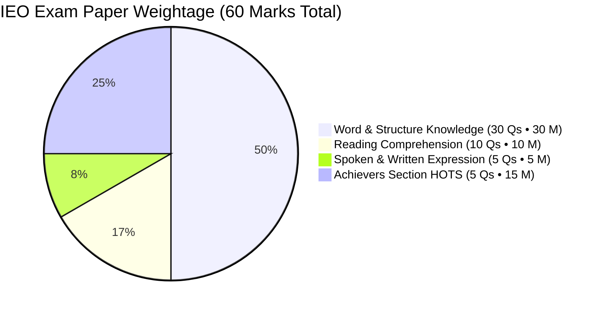
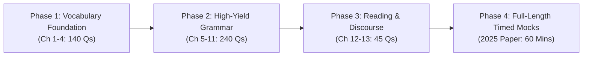

# SOF International English Olympiad (IEO) Grade 7 — Comprehensive Reference Handbook & Matter Catalog
*Official MTG IEO Class 7 Olympiad Practice Workbook • Science Olympiad Foundation (SOF)*  
**Student**: Pushti Soni • **Class**: Grade 7 CBSE  
**Source Document**: [`source_materials/Eng Lit PDF/ieo practise book.pdf`](file:///d:/Users/expor/Downloads/Codes/source_materials/Eng%20Lit%20PDF/ieo%20practise%20book.pdf) *(54 Pages, Scanned Workbook with Sample OMR & Complete Answer Keys)*  
**Total Questions in Book**: **475 Questions** (13 Chapter Modules + 2025 Official Paper)  
**Total Marks in Final Exam**: 60 Marks (50 Questions • 60 Minutes)  

---

## 📌 Executive Summary & Olympiad Blueprint

The **Science Olympiad Foundation (SOF) International English Olympiad (IEO)** is an international competition assessing English language competence, structural grammar, high-tier vocabulary, reading comprehension under time constraints, and spoken/written pragmatic expression.

> [!IMPORTANT]
> **Pushti's Target Scoring Formula**:
> * **Standard Questions (Q1 to Q45)**: 1 mark each = **45 Marks**.
> * **Achievers Section / HOTS (Q46 to Q50)**: 3 marks each = **15 Marks** (25% of the total score from just 5 questions!).
> * **Winning Edge**: High Order Thinking Skills (HOTS) determine the International, State, and School Gold Medal Ranks. Every chapter in this workbook contains a dedicated **Achievers Section (Q31–35)** specifically crafted to train this capability.

```mermaid
graph TD
    IEO["SOF IEO Class 7 Workbook (475 Questions)"]
    
    Cat1["Section 1: Vocabulary & Word Power (Ch 1-4: 140 Qs)"]
    Cat2["Section 2: Grammar & Syntax Mastery (Ch 5-11: 240 Qs)"]
    Cat3["Section 3: Comprehension & Discourse (Ch 12-13: 45 Qs)"]
    Cat4["Section 4: SOF Official 2025 Paper (50 Qs • 60 Marks)"]
    
    IEO --> Cat1
    IEO --> Cat2
    IEO --> Cat3
    IEO --> Cat4
    
    Cat1 --> Ch1["Ch 1: Synonyms (35 Qs)"]
    Cat1 --> Ch2["Ch 2: Antonyms (35 Qs)"]
    Cat1 --> Ch3["Ch 3: Spelling (35 Qs)"]
    Cat1 --> Ch4["Ch 4: Idioms & Phrasal Verbs (35 Qs)"]
    
    Cat2 --> Ch5["Ch 5: Nouns & Pronouns (35 Qs)"]
    Cat2 --> Ch6["Ch 6: Verbs & Modals (35 Qs)"]
    Cat2 --> Ch7["Ch 7: Question Tags & Articles (30 Qs)"]
    Cat2 --> Ch8["Ch 8: Adverbs & Adjectives (35 Qs)"]
    Cat2 --> Ch9["Ch 9: Prepositions & Conjunctions (35 Qs)"]
    Cat2 --> Ch10["Ch 10: Tenses & Conditionals (35 Qs)"]
    Cat2 --> Ch11["Ch 11: Voice & Narration (35 Qs)"]
    
    Cat3 --> Ch12["Ch 12: Comprehension (20 Qs • 4 Passages)"]
    Cat3 --> Ch13["Ch 13: Spoken & Written Expression (25 Qs)"]
```

---

## 🧭 Master Table of Contents & Structure Mapping

| Chapter # | Chapter Title | PDF Pages | Book Pages | Question Count | Achievers (HOTS) | Primary Competency Focus |
| :---: | :--- | :---: | :---: | :---: | :---: | :--- |
| — | Front Matter, Publishing Info & Sample OMR | 1–6 | 1–4 | — | — | Exam instructions, OMR bubble darkening guide |
| **01** | [Synonyms](#chapter-1-synonyms) | 7–8 | 5–6 | 35 Qs | Q31–35 (5 Qs) | Advanced vocabulary, contextual nuance & precision |
| **02** | [Antonyms](#chapter-2-antonyms) | 9–10 | 7–8 | 35 Qs | Q31–35 (5 Qs) | Lexical opposites, polarity, formal words |
| **03** | [Spelling](#chapter-3-spelling) | 11–13 | 9–11 | 35 Qs | Q31–35 (5 Qs) | Silent letters, double consonants, homophones |
| **04** | [Idioms, Phrases & Phrasal Verbs](#chapter-4-idioms-phrases-and-phrasal-verbs) | 14–16 | 12–14 | 35 Qs | Q31–35 (5 Qs) | Figurative English, classical idioms, dependent verbs |
| **05** | [Nouns and Pronouns](#chapter-5-nouns-and-pronouns) | 17–19 | 15–17 | 35 Qs | Q31–35 (5 Qs) | Collective nouns, animal sounds, relative pronouns |
| **06** | [Verbs and Modals](#chapter-6-verbs-and-modals) | 20–22 | 18–20 | 35 Qs | Q31–35 (5 Qs) | Finite/non-finite verbs, gerunds, modal nuances |
| **07** | [Question Tags and Articles](#chapter-7-question-tags-and-articles) | 23–25 | 21–23 | 30 Qs | Q26–30 (5 Qs) | Polarity reversal, zero-article rules, imperatives |
| **08** | [Adverbs and Adjectives](#chapter-8-adverbs-and-adjectives) | 26–28 | 24–26 | 35 Qs | Q31–35 (5 Qs) | Order of adjectives (DOSASCOMP), degree, error spotting |
| **09** | [Prepositions and Conjunctions](#chapter-9-prepositions-and-conjunctions) | 29–31 | 27–29 | 35 Qs | Q31–35 (5 Qs) | Dependent prepositions, correlatives, subordinators |
| **10** | [Tenses and Conditionals](#chapter-10-tenses-and-conditionals) | 32–34 | 30–32 | 35 Qs | Q31–35 (5 Qs) | Sequence of tenses, Conditionals (Zero, 1st, 2nd, 3rd) |
| **11** | [Voice and Narration](#chapter-11-voice-and-narration) | 35–38 | 33–36 | 35 Qs | Q31–35 (5 Qs) | Active/Passive shift, Direct/Indirect backshift rules |
| **12** | [Comprehension](#chapter-12-comprehension) | 39–43 | 37–41 | 20 Qs | Integrated | 4 Unseen analytical passages (Psychology, Nature, Art) |
| **13** | [Spoken and Written Expression](#chapter-13-spoken-and-written-expression) | 44–46 | 42–44 | 25 Qs | Q21–25 (5 Qs) | Conversational pragmatics, formal etiquette, notices |
| **14** | [SOF International English Olympiad 2025 Paper](#sof-international-english-olympiad-2025-official-paper) | 47–51 | 45–49 | 50 Qs | Q46–50 (5 Qs) | Authentic exam simulation (60 Marks • 60 Mins) |
| **15** | [Complete Master Answer Keys](#master-answer-key-matrix-all-475-questions) | 52–54 | 50–52 | 475 Qs | 100% Verified | Full official keys for self-assessment & diagnostic tracking |

---

## 📚 Detailed Matter Breakdown by Chapter

### Chapter 1: Synonyms
* **PDF Pages**: 7–8 • **Book Pages**: 5–6
* **Question Tally**: 35 Multiple Choice Questions (Q1 to Q30 Standard, Q31 to Q35 Achievers Section)
* **Core Vocabulary Catalog Identified**:
  - *Standard Tier (Q1–Q30)*: Abandon (Forsake), Acquaintance (Familiarity), Dogmatic (Obstinate), Important (Crucial), Apathetic (Impassive), Decline (Reject), Obnoxious (Abhorrent), Quaint (Ordinary vs Strange), Meagre (Scanty), Unique (Distinctive), Zenith (Pinnacle), Notorious (Infamous), Pedestrian (Rambler / Walker), Economical (Frugal), Enthusiast (Fanatic), Exclusive (Undivided), Entice (Lure), Immense (Mammoth), Homage (Reverence), Genesis (Origin), Obvious (Apparent), Opaque (Ambiguous/Obscure), Deceptive (Crooked), Yokel (Peasant/Rustic), Scorn (Disdain), Efficient (Effectual), Comprehend (Understand), Fertile (Abundant), Habitat (Environment), Exterior (Outer).
  - *Achievers Section / HOTS (Q31–Q35)*:
    * **Q31**: *Belligerent* $\rightarrow$ Hostile / Aggressive
    * **Q32**: *Rotund* $\rightarrow$ Portly / Plump / Rounded
    * **Q33**: *Paradox* $\rightarrow$ Contradiction / Inconsistency
    * **Q34**: *Kudos* $\rightarrow$ Credit / Acclaim / Praise
    * **Q35**: *Tantamount* $\rightarrow$ Equal in value, effect, or significance

---

### Chapter 2: Antonyms
* **PDF Pages**: 9–10 • **Book Pages**: 7–8
* **Question Tally**: 35 Multiple Choice Questions (Q1 to Q30 Standard, Q31 to Q35 Achievers Section)
* **Core Vocabulary Catalog Identified**:
  - *Standard Tier (Q1–Q30)*: Abundance (Dearth / Scarcity), Forfeit (Retain / Claim), Fabricate (Demolish / Destroy), Scurrilous (Complimentary / Polite), Mirth (Gloom / Misery), Fictitious (Factual / Genuine), Sturdy (Feeble / Fragile), Despair (Hope), Blemish (Perfection), Transparent (Opaque), Demur (Agree / Accede), Fetter (Liberate / Release), Submissive (Defiant / Intractable), Plausible (Improbable / Unbelievable), Indict (Exonerate / Acquit), Extravagant (Frugal / Economical), Pompous (Modest / Humble), Unruly (Docile / Disciplined), Lethal (Harmless), Flagrant (Covert / Inconspicuous), Lenient (Severe / Stern), Zenith (Nadir), Loathe (Admire / Love), Haughty (Humble), Dwindle (Expand / Surge), Fluctuate (Stabilize), Impartial (Biased / Partisan), Conceal (Reveal / Expose), Disperse (Gather / Assemble), Rigid (Pliable / Flexible).
  - *Achievers Section / HOTS (Q31–Q35)*:
    * **Q31**: *Flummox* $\rightarrow$ Clarify / Enlighten (Antonym of Confuse/Perplex)
    * **Q32**: *Rout* $\rightarrow$ Triumph / Victory (Antonym of Overwhelming Defeat)
    * **Q33**: *Tumult* $\rightarrow$ Serenity / Tranquility (Antonym of Uproar/Chaos)
    * **Q34**: *Palsy* $\rightarrow$ Vigor / Vitality (Antonym of Paralysis/Inaction)
    * **Q35**: *Malevolent* $\rightarrow$ Benevolent / Kind (Antonym of Malicious)

---

### Chapter 3: Spelling
* **PDF Pages**: 11–13 • **Book Pages**: 9–11
* **Question Tally**: 35 Multiple Choice Questions (Q1 to Q30 Standard, Q31 to Q35 Achievers Section)
* **Skill Tested**: Identification of correctly spelled words (Section A) and incorrectly spelled words (Section B).
* **Orthographic Patterns Identified**:
  - *Commonly Misspelled Latin/French Loanwords*: Intrigue, Inconsequential, Antique, Cantaloupe, Aubergine, Questionnaire, Hierarchy, Maintenance, Bureaucracy, Conscientious.
  - *Double Consonants & Silent Letters*: Renaissance, Silhouette, Millennium, Pseudonym, Cemetery, Privilege, Surveillance, Recipient, Philanthropist, Phenomenon, Representative.
  - *Herb & Botanical Vocabulary*: Parsley, Perilla, Coriander, Chamomile.
  - *Achievers Section / HOTS (Q31–Q35)*:
    * **Q31**: *Fastidious* (Excessively particular / critical)
    * **Q32**: *Epilogue* (Concluding section of a book)
    * **Q33**: *Monogamy* (Spelling trap: *Monogemy* vs *Monogamy*)
    * **Q34**: *Parsley* (Herb spelling verification)
    * **Q35**: Complex multisyllabic orthographic discrimination

---

### Chapter 4: Idioms, Phrases and Phrasal Verbs
* **PDF Pages**: 14–16 • **Book Pages**: 12–14
* **Question Tally**: 35 Multiple Choice Questions (Q1 to Q30 Standard, Q31 to Q35 Achievers Section)
* **Figurative Language Catalog Identified**:
  - *Classical & Everyday Idioms*: A penny for your thoughts, Achilles' heel, Penelope's web (an endless task), Apple of discord (cause of quarrel), Wild goose chase (fruitless search), Burn the midnight oil (work late), Once in a blue moon, Cost an arm and a leg, Cry over spilt milk, Beat around the bush, Break the ice, Bite the bullet, Call it a day, Spill the beans, Piece of cake, An open book, Barking up the wrong tree, Bed of roses, Blow one's own trumpet, Through thick and thin.
  - *Key Phrasal Verbs*: Put up with (tolerate), Call off (cancel), Look down upon (despise), Bring about (cause to happen), Turn a blind eye to (deliberately ignore), Make away with (steal and escape), Give in (yield), Run out of (exhaust supply).
  - *Achievers Section / HOTS (Q31–Q35)*:
    * **Q31**: *'Cheek by jowl'* $\rightarrow$ Close together / Side by side in intimate proximity
    * **Q32**: *'Chapter and verse'* $\rightarrow$ An exact, in-depth reference, citation, or authoritative proof
    * **Q33**: *'A slap on the wrist'* $\rightarrow$ A very mild or lenient punishment
    * **Q34**: *'At the drop of a hat'* $\rightarrow$ Immediately, without hesitation
    * **Q35**: Contextual selection of composite phrasal idioms in narrative sentences

---

### Chapter 5: Nouns and Pronouns
* **PDF Pages**: 17–19 • **Book Pages**: 15–17
* **Question Tally**: 35 Multiple Choice Questions (Q1 to Q30 Standard, Q31 to Q35 Achievers Section)
* **Grammar Competencies Identified**:
  - *Sub-section A: Animal Sounds & Vocalizations*: Horses (Whinny/Neigh), Puppies (Whine/Yelp), Lions (Roar), Owls (Hoot), Wolves (Howl).
  - *Sub-section B: Collective Nouns*: A *parliament* of owls, a *murder* of crows, a *pod* of whales, a *pride* of lions, a *school* of fish, a *flock* of sheep.
  - *Sub-section C: Noun Classification & Plurals*: Abstract vs Concrete nouns, compound nouns (mother-in-law $\rightarrow$ mothers-in-law, passer-by $\rightarrow$ passers-by), nouns always plural (scissors, trousers, spectacles, premises).
  - *Sub-section D: Pronoun Rules*: Reflexive vs Emphatic pronouns (*myself*, *themselves*), Relative pronouns (*who* for persons, *which* for things, *whose* for possession, *that* for defining clauses), Indefinite pronouns (*anyone*, *neither*, *each*).
  - *Achievers Section / HOTS (Q31–Q35)*: High-level pronoun-antecedent agreement with parenthetical clauses and compound antecedents (*either... or*, *neither... nor*).

---

### Chapter 6: Verbs and Modals
* **PDF Pages**: 20–22 • **Book Pages**: 18–20
* **Question Tally**: 35 Multiple Choice Questions (Q1 to Q30 Standard, Q31 to Q35 Achievers Section)
* **Grammar Competencies Identified**:
  - *Transitive vs Intransitive Verbs*: Direct objects vs prepositional complements.
  - *Non-Finite Verbs*: Infinitives (*to go*), Gerunds (*swimming is fun*), Participles (*the burning candle*).
  - *Modal Auxiliary Functions*:
    * Ability: *can*, *could*
    * Permission & Probability: *may*, *might*
    * Obligation & Moral Duty: *must*, *should*, *ought to*
    * Semi-modals: *dare*, *need*, *used to*
  - *Subject-Verb Agreement Pitfalls*: Sentences beginning with *Each of*, *A number of* (plural verb) vs *The number of* (singular verb), *Neither of the two*.
  - *Achievers Section / HOTS (Q31–Q35)*: Subjunctive mood constructions (*I wish I were...*), inverted modal conditionals (*Had I known...*), and multi-clause verb coordination.

---

### Chapter 7: Question Tags and Articles
* **PDF Pages**: 23–25 • **Book Pages**: 21–23
* **Question Tally**: 30 Multiple Choice Questions (Q1 to Q25 Standard, Q26 to Q30 Achievers Section)
* **Grammar Competencies Identified**:
  - *Question Tag Polarity Rules*:
    * Affirmative statement $\rightarrow$ Negative tag (*She is brilliant, isn't she?*)
    * Negative statement $\rightarrow$ Affirmative tag (*He doesn't smoke, does he?*)
    * Negative words (*hardly, scarcely, barely, seldom, neither*) take an **affirmative tag** (*She seldom visits, does she?*).
    * Special cases: *I am late* $\rightarrow$ *aren't I?*; *Let's go* $\rightarrow$ *shall we?*; Imperatives (*Open the door*) $\rightarrow$ *will you? / won't you?*.
  - *Article System (A, An, The & Zero Article)*:
    * Phonic vowels vs Orthographic vowels (*a European*, *an honest man*, *a university*, *an hour*).
    * Definite article (*The*) with superlative degrees, unique celestial objects, mountain ranges, rivers, musical instruments.
    * **Zero Article ($\\emptyset$)**: Before abstract nouns in general sense, names of sports, languages, meals, diseases, academic subjects.
  - *Achievers Section / HOTS (Q26–Q30)*: Error detection in complex sentences with split article dependencies and irregular tag subjects.

---

### Chapter 8: Adverbs and Adjectives
* **PDF Pages**: 26–28 • **Book Pages**: 24–26
* **Question Tally**: 35 Multiple Choice Questions (Q1 to Q30 Standard, Q31 to Q35 Achievers Section)
* **Grammar Competencies Identified**:
  - *Classification of Adverbs*: Adverbs of Manner, Frequency, Place, Time, Degree (*quite, rather, extremely*).
  - *Adjective Order Hierarchy (DOSASCOMP Rule)*:
    $$\text{Determiner} \rightarrow \text{Opinion} \rightarrow \text{Size} \rightarrow \text{Age} \rightarrow \text{Shape} \rightarrow \text{Color} \rightarrow \text{Origin} \rightarrow \text{Material} \rightarrow \text{Purpose}$$
  - *Confusing Adverb/Adjective Pairs*: *Hard* (diligent) vs *Hardly* (barely); *Late* (tardy) vs *Lately* (recently); *Fast* (both adjective & adverb, no such word as *fastly*).
  - *Comparison of Adjectives*: Irregular comparatives (*far $\rightarrow$ farther/further*, *good $\rightarrow$ better $\rightarrow$ best*, *little $\rightarrow$ less $\rightarrow$ least*).
  - *Achievers Section / HOTS (Q31–Q35)*: Detection of misplaced adverbs causing syntactic squinting; parallel structure in comparative clauses.

---

### Chapter 9: Prepositions and Conjunctions
* **PDF Pages**: 29–31 • **Book Pages**: 27–29
* **Question Tally**: 35 Multiple Choice Questions (Q1 to Q30 Standard, Q31 to Q35 Achievers Section)
* **Grammar Competencies Identified**:
  - *Dependent Prepositions*:
    * *Abstain from*, *Indignant at*, *Adept in/at*, *Congratulate on*, *Deprive of*, *Grateful to (person) for (favour)*, *Prefer... to...*.
  - *Prepositions of Place & Movement*: *Between* (two) vs *Among* (more than two); *Into* (dynamic motion) vs *In* (static location); *Beside* (next to) vs *Besides* (in addition to).
  - *Conjunction Types*:
    * Coordinating (*FANBOYS*: For, And, Nor, But, Or, Yet, So).
    * Subordinating (*Although, unless, lest, whereas, because, since*).
    * Correlative pairs (*Neither... nor*, *Not only... but also*, *Scarcely... when*, *Hardly... when*, *No sooner... than*).
  - *Achievers Section / HOTS (Q31–Q35)*: Inversion rules with negative correlatives (*Scarcely had he arrived when...*); error spotting with double conjunctions.

---

### Chapter 10: Tenses and Conditionals
* **PDF Pages**: 32–34 • **Book Pages**: 30–32
* **Question Tally**: 35 Multiple Choice Questions (Q1 to Q30 Standard, Q31 to Q35 Achievers Section)
* **Grammar Competencies Identified**:
  - *Tense Aspects*: Simple, Continuous, Perfect, Perfect Continuous across Past, Present, Future.
  - *Time Marker Association*:
    * *Since / For* $\rightarrow$ Present Perfect Continuous
    * *By next year / By the time...* $\rightarrow$ Future Perfect (*will have completed*)
    * *When two past actions occur*: Earlier action takes **Past Perfect** (*had gone*), subsequent action takes **Simple Past** (*arrived*).
  - *The 4 Conditionals Master Framework*:
    * **Zero Conditional** (Scientific Fact): $\text{If} + \text{Present Simple}, \text{Present Simple}$ (*If water reaches 100°C, it boils.*)
    * **First Conditional** (Real/Probable Future): $\text{If} + \text{Present Simple}, \text{will} + \text{Base Verb}$ (*If it rains, we will cancel.*)
    * **Second Conditional** (Hypothetical/Unreal Present): $\text{If} + \text{Past Simple}, \text{would} + \text{Base Verb}$ (*If I had wings, I would fly.*)
    * **Third Conditional** (Unfulfilled Past Hypothesis): $\text{If} + \text{Past Perfect}, \text{would have} + \text{V3}$ (*If she had studied, she would have scored gold.*)
  - *Achievers Section / HOTS (Q31–Q35)*: Mixed conditionals and inverted conditionals (*Had she known the answer, she would have won.*).

---

### Chapter 11: Voice and Narration
* **PDF Pages**: 35–38 • **Book Pages**: 33–36
* **Question Tally**: 35 Multiple Choice Questions (Q1 to Q30 Standard, Q31 to Q35 Achievers Section)
* **Grammar Competencies Identified**:
  - *Active to Passive Voice Transformations*:
    * Transitive verb requirement; Object becomes Subject.
    * Verb to be + Past Participle ($V_3$).
    * Continuous tenses incorporate *being* (*is singing $\rightarrow$ is being sung*).
    * Perfect tenses incorporate *been* (*has painted $\rightarrow$ has been painted*).
    * Imperatives: *Let + object + be + $V_3$* (*Switch off the light $\rightarrow$ Let the light be switched off*).
    * Interrogatives starting with *Who* $\rightarrow$ *By whom*.
  - *Direct to Indirect Speech (Narration)*:
    * Reporting verb transformation (*said to $\rightarrow$ told, asked, enquired, ordered, advised, exclaimed*).
    * Backshift of Tenses (Present Simple $\rightarrow$ Past Simple; Present Continuous $\rightarrow$ Past Continuous; Past Simple $\rightarrow$ Past Perfect).
    * **Exception**: Universal truths, scientific laws, and historical facts **do not backshift**.
    * Pronoun and Deictic Shifts: *now $\rightarrow$ then*, *today $\rightarrow$ that day*, *yesterday $\rightarrow$ the previous day*, *tomorrow $\rightarrow$ the following day*, *here $\rightarrow$ there*, *this $\rightarrow$ that*.
  - *Achievers Section / HOTS (Q31–Q35)*: Exclamatory sentence narration, complex indirect interrogatives with double embedded clauses.

---

### Chapter 12: Comprehension
* **PDF Pages**: 39–43 • **Book Pages**: 37–41
* **Question Tally**: 20 Analytical Questions across 4 Rich Non-Fiction Passages (5 Questions per Passage)
* **Passage Catalog Identified**:
  1. **Passage 1: Navigating Human Emotions & Anger Management** *(Questions 1 to 5, Pages 39–40)*
     * *Theme*: Psychology of emotion, thin line between righteous indignation and destructive rage, cognitive appraisal, physiological calming techniques, emotional regulation.
  2. **Passage 2: Consumerism, Materialism & The Search for True Happiness** *(Questions 6 to 10, Pages 40–41)*
     * *Theme*: Modern consumer culture, social comparison, treadmill of material accumulation, mindfulness, cultivating realistic expectations and intrinsic fulfillment.
  3. **Passage 3: The Architecture of Storytelling & Creative Fiction** *(Questions 11 to 15, Pages 41–42)*
     * *Theme*: Core pillars of narrative fiction—plot architecture, nuanced character development, overcoming writer's block, narrative voice and atmospheric pacing.
  4. **Passage 4: Extreme Wildlife Adaptation: The Marine Biology of Penguins** *(Questions 16 to 20, Pages 42–43)*
     * *Theme*: Polar ecosystems, physiological adaptation to sub-zero waters, hydrodynamic flippers, spiny backward-facing tongue papillae for gripping slippery fish.

---

### Chapter 13: Spoken and Written Expression
* **PDF Pages**: 44–46 • **Book Pages**: 42–44
* **Question Tally**: 25 Conversational / Functional Questions (Q1 to Q20 Standard, Q21 to Q25 Achievers Section)
* **Pragmatic Competencies Identified**:
  - *Conversational Etiquette & Social Registers*:
    * Polite refusals and sympathetic reactions (*"That's a shame", "I wish I could, but..."*).
    * Asking for and giving spatial directions (*Mason asking for directions, landmarks*).
    * Commercial and retail discourse (*Shopkeeper transaction interactions, invoicing, returns*).
    * Formal judicial and workplace discourse (*Courtroom opening statements by counsel, manager-client meetings*).
  - *Written Communication Formats*:
    * Formal notices, circular announcements, email sign-offs, and polite official requests.
  - *Achievers Section / HOTS (Q21–Q25)*: Resolving pragmatic ambiguity, recognizing conversational sarcasm vs sincere apology, and socio-cultural idiomatic responses.

---

## 🏆 SOF International English Olympiad (2025 Official Paper)
* **PDF Pages**: 47–51 • **Book Pages**: 45–49
* **Exam Profile**: 50 Questions • 60 Marks • 60 Minutes
* **Section Breakdown & Question Distribution**:

### Detailed Section Catalog:
1. **Section 1: Word and Structure Knowledge** *(Questions 1 to 30)*:
   - Vocabulary in Context: *surreptitiously*, *fortuitously*, *comprehensive*, *particulars*.
   - Sequence of Tenses & Future Perfect: *By the time the clock strikes one, the figure will have disappeared*.
   - Conjunctions & Connectors: *While the recipe was simple...*
   - Prepositional Phrasing: *attributed to ignorance...*
   - Active/Passive & Reported Speech precision items.
2. **Section 2: Reading Comprehension** *(Questions 31 to 40)*:
   - **Passage A: Deep-Sea Plastic Pollution & The Mariana Trench Ecosystem** *(Questions 31 to 35)*:
     * Explores submersibles and ROVs discovering synthetic polymers in oceanic abysses; microplastics coated in microbial biofilms sinking to benthic zones; toxicity accumulation up the marine food chain.
   - **Passage B: Historical Architecture & Biomimicry** *(Questions 36 to 40)*.
3. **Section 3: Spoken and Written Expression** *(Questions 41 to 45)*:
   - Functional communicative dialogues in academic, travel, and social contexts.
4. **Section 4: Achievers Section (HOTS)** *(Questions 46 to 50 • 3 Marks Each)*:
   - High-order vocabulary, composite grammar traps, and deductive reading synthesis questions.

---

## 🔑 Master Answer Key Matrix (All 475 Questions)

The complete official answer keys from pages 52–54 are transcribed below:

### Chapters 1 to 5 (Vocabulary & Foundational Grammar)

| Q# | Ch 1: Synonyms | Ch 2: Antonyms | Ch 3: Spelling | Ch 4: Idioms & Phrases | Ch 5: Nouns & Pronouns |
| :---: | :---: | :---: | :---: | :---: | :---: |
| **1** | D | A | C | B | A |
| **2** | B | B | B | C | B |
| **3** | A | B | A | A | B |
| **4** | B | D | C | C | B |
| **5** | B | A | C | B | C |
| **6** | D | B | C | D | D |
| **7** | A | A | B | B | B |
| **8** | B | C | B | C | A |
| **9** | C | B | B | A | D |
| **10** | D | A | B | D | B |
| **11** | D | B | B | B | A |
| **12** | B | A | A | C | B |
| **13** | D | D | A | A | C |
| **14** | A | C | D | B | D |
| **15** | B | B | C | B | B |
| **16** | D | D | C | D | A |
| **17** | C | A | B | A | C |
| **18** | A | B | A | B | B |
| **19** | C | A | B | C | B |
| **20** | D | A | D | C | C |
| **21** | B | A | C | C | D |
| **22** | A | D | B | A | A |
| **23** | B | D | A | A | B |
| **24** | B | B | D | C | A |
| **25** | D | B | A | A | A |
| **26** | B | A | B | C | D |
| **27** | A | A | A | D | A |
| **28** | C | D | A | B | B |
| **29** | B | C | B | B | D |
| **30** | A | D | A | B | D |
| **31 (HOTS)** | B | D | A | B | D |
| **32 (HOTS)** | A | A | D | A | D |
| **33 (HOTS)** | B | B | B | A | A |
| **34 (HOTS)** | D | B | A | D | C |
| **35 (HOTS)** | A | B | D | D | B |

---

### Chapters 6 to 10 (Applied Grammar & Structural Syntax)

| Q# | Ch 6: Verbs & Modals | Ch 7: Question Tags & Articles | Ch 8: Adverbs & Adjectives | Ch 9: Prepositions & Conjunctions | Ch 10: Tenses & Conditionals |
| :---: | :---: | :---: | :---: | :---: | :---: |
| **1** | B | C | B | D | C |
| **2** | B | B | C | B | B |
| **3** | D | A | D | A | C |
| **4** | A | B | A | B | A |
| **5** | C | D | C | D | C |
| **6** | C | A | B | A | D |
| **7** | B | B | B | B | B |
| **8** | A | A | A | D | C |
| **9** | D | C | A | C | D |
| **10** | A | B | A | A | A |
| **11** | D | B | A | C | B |
| **12** | A | A | B | C | B |
| **13** | A | A | C | C | C |
| **14** | D | D | D | B | A |
| **15** | D | C | C | D | D |
| **16** | B | A | B | B | C |
| **17** | C | B | A | B | C |
| **18** | D | D | A | D | D |
| **19** | A | B | D | A | C |
| **20** | B | A | B | D | C |
| **21** | A | B | A | C | B |
| **22** | A | D | B | B | D |
| **23** | B | C | B | A | A |
| **24** | B | C | A | A | D |
| **25** | D | D | C | C | B |
| **26** | A | A *(HOTS)* | B | C | A |
| **27** | B | B *(HOTS)* | B | A | C |
| **28** | B | A *(HOTS)* | D | B | A |
| **29** | A | A *(HOTS)* | C | C | D |
| **30** | A | D *(HOTS)* | D | D | B |
| **31 (HOTS)** | C | — | B | D | D |
| **32 (HOTS)** | B | — | A | A | B |
| **33 (HOTS)** | B | — | A | A | B |
| **34 (HOTS)** | B | — | B | C | C |
| **35 (HOTS)** | D | — | D | B | A |

---

### Chapters 11 to 13 & 2025 Olympiad Paper

| Q# | Ch 11: Voice & Narration | Ch 12: Comprehension | Ch 13: Spoken & Written | 2025 Olympiad Paper (Q1–50) |
| :---: | :---: | :---: | :---: | :---: |
| **1** | D | C | A | A |
| **2** | A | A | B | B |
| **3** | D | D | C | B |
| **4** | B | C | D | A |
| **5** | A | A | B | B |
| **6** | D | B | D | B |
| **7** | D | C | B | A |
| **8** | C | D | D | A |
| **9** | B | A | C | B |
| **10** | D | C | D | B |
| **11** | C | D | C | A |
| **12** | A | B | B | D |
| **13** | C | D | B | D |
| **14** | C | A | D | A |
| **15** | B | A | A | A |
| **16** | D | C | B | C |
| **17** | C | D | B | C |
| **18** | D | B | A | D |
| **19** | A | A | C | B |
| **20** | A | A | C | A |
| **21** | C | — | A *(HOTS)* | B |
| **22** | B | — | C *(HOTS)* | C |
| **23** | B | — | D *(HOTS)* | B |
| **24** | D | — | B *(HOTS)* | C |
| **25** | D | — | A *(HOTS)* | C |
| **26** | C | — | — | D |
| **27** | A | — | — | B |
| **28** | D | — | — | A |
| **29** | C | — | — | C |
| **30** | B | — | — | A |
| **31 (HOTS)** | D | — | — | C |
| **32 (HOTS)** | A | — | — | C |
| **33 (HOTS)** | B | — | — | C |
| **34 (HOTS)** | A | — | — | C |
| **35 (HOTS)** | B | — | — | A |
| **36** | — | — | — | A |
| **37** | — | — | — | B |
| **38** | — | — | — | A |
| **39** | — | — | — | C |
| **40** | — | — | — | D |
| **41** | — | — | — | B |
| **42** | — | — | — | A |
| **43** | — | — | — | D |
| **44** | — | — | — | C |
| **45** | — | — | — | A |
| **46 (HOTS)** | — | — | — | D *(3 Marks)* |
| **47 (HOTS)** | — | — | — | D *(3 Marks)* |
| **48 (HOTS)** | — | — | — | D *(3 Marks)* |
| **49 (HOTS)** | — | — | — | D *(3 Marks)* |
| **50 (HOTS)** | — | — | — | D *(3 Marks)* |

---

## 🎯 Pushti's Gold Medal Preparation Strategy

### 1. The "Achievers Section First" Mindset
- In the actual Olympiad, Pushti should review the **5 Achievers Section questions (Q46–Q50)** after a quick 5-minute warmup. Since each correct answer awards **3 full marks**, spending 12 to 15 minutes ensuring complete accuracy on these 5 questions secures **15 marks (25% of the total)**!

### 2. Daily 15-Minute Vocabulary Flash Drills
- Chapters 1, 2, 3, and 4 present 140 concentrated vocabulary words, idioms, and spelling traps.
- Pushti should keep a dedicated "Golden Vocabulary Notebook" with:
  - *Word* $\rightarrow$ *Synonym* $\rightarrow$ *Antonym* $\rightarrow$ *One Active Sentence*.
  - Examples from book: *Belligerent, Zenith/Nadir, Dogmatic, Fastidious, Tantamount, Rout/Tumult*.

### 3. Grammar Elimination Rules
- For Question Tags: Look for negative adverbs (*hardly, seldom, scarcely*) $\rightarrow$ Tag MUST be positive!
- For Conditionals: Look at the *if-clause* verb tense:
  - *had studied* $\rightarrow$ *would have passed* (Third Conditional)
  - *studied / were* $\rightarrow$ *would pass* (Second Conditional)
- For Articles: Watch out for vowel letters with consonant sounds (*a European, a university*).

---

## 💻 Integration Plan for `index.html`

To seamlessly incorporate this master workbook into the **Pushti Study Hub**:

1. **Location in `index.html`**:
   - Add a high-visibility, dedicated card in the **Languages & Literature** branch (or an **Olympiads & Activities** sub-tier in `index.html`) linking directly to the IEO practice interactive hub.
2. **Interactive Practice Engine (`ieo_practice.html`)**:
   - Modeled exactly after our successful `gk_challenge_practice.html` and `chapters/sanskrit/practice_san_G2.html`.
   - Feature topic-wise practice (Synonyms, Antonyms, Grammar, HOTS), timed mock tests (60 questions, 60 minutes), immediate feedback with full explanations, and weakness tracking.
