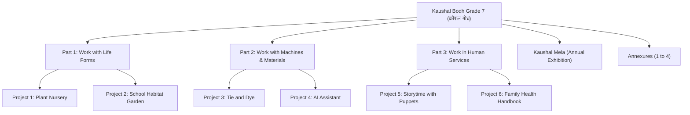
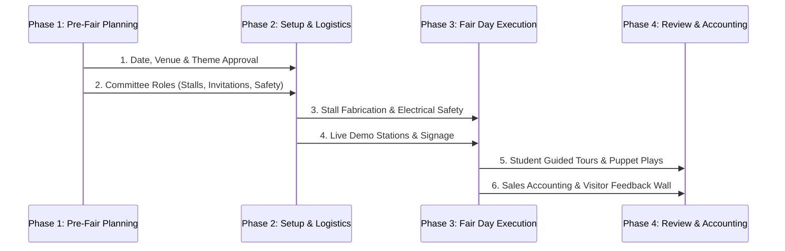
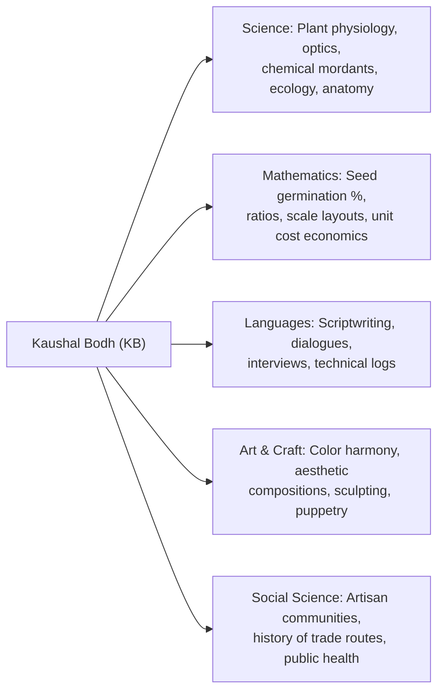

# Kaushal Bodh (कौशल बोध) — Grade 7 Complete Vocational Reference Handbook
*Official NCERT NEP 2020 Vocational Education Activity Book • Grade 7 (Middle Stage)*  
**Subject Code in Timetable:** `KB` (Friday Period 8, 12:50 PM – 1:30 PM • Teacher: Roger Sir)  
**Curriculum Status:** Non-Exam Subject (No written midterm or annual exams; experiential and project-based learning)  
**Source Document:** [`source_materials/KaushalBodh7.pdf`](file:///d:/Users/expor/Downloads/Codes/source_materials/KaushalBodh7.pdf) *(217 Pages)*

---

## 📌 Executive Summary & Curriculum Orientation

### 1. Philosophy of Kaushal Bodh
The National Education Policy (NEP 2020) and National Curriculum Framework for School Education (NCF-SE) mandate vocational exposure from Grade 6 to 8. **Kaushal Bodh** ("Understanding through Skills") is designed to bridge head, heart, and hands. It shifts education from rote textbook memorization to authentic, tactile, real-world work.

> [!NOTE]
> **Why is there no written examination for Kaushal Bodh?**  
> Unlike academic disciplines (Mathematics, Science, History), Kaushal Bodh is strictly an **experiential learning activity book**. There are **no written midterm exams, no paper-pencil marks, and no OMR sheets**. Students are assessed continuously through:
> - Direct active participation and teamwork.
> - Maintenance of their physical/digital Project Portfolio and Observation Logs.
> - Handcrafted artifacts (plant saplings, dyed fabrics, puppet shows, AI models, first-aid kits).
> - Peer discussions, demonstrations, and exhibition at the annual **Kaushal Mela**.

### 2. Structure of the Textbook
The curriculum spans **Three Major Forms of Work**, encompassing **Six Hands-on Projects**, followed by an exhibition guide and four comprehensive annexures:

---

## 🌿 Part 1: Work with Life Forms

*Living things include plants, mammals, birds, reptiles, insects, and microorganisms. These projects develop respect for biodiversity, sustainable agriculture, and ecological coexistence.*

---

### Project 1: Plant Nursery (पौधशाला)
*Textbook Pages: 3–24 • PDF Pages: 26–47*

#### 1. Objectives & Overview
A plant nursery is a dedicated, protected space where young plants (saplings/seedlings) are propagated, nurtured, and conditioned until they are strong enough to be transplanted into open gardens or farms.
- **Why nurseries are essential:** Preserving native/endangered species, mass multiplication of disease-free plants, climate protection (shielding fragile sprouts from extreme rain, sun, or frost), and commercial horticulture.
- **Key Environmental Factors:**
  - *Temperature:* Optimal range required for enzymatic activity during germination.
  - *Humidity:* Moisture in the air prevents excessive transpiration. (Like using a water bowl near a winter room heater/bukhari, nurseries use misting/humidity domes).
  - *Soil Moisture:* Adequate water without waterlogging (which causes root rot).
  - *Air & Light:* Oxygen for root respiration; diffused light for photosynthesis.

#### 2. Project Activities Step-by-Step

##### Activity 1: Field Visit to a Commercial/Government Plant Nursery
- **Field Observation Checklist (Table 1.1):**
  - Types of plants grown (ornamental, fruit-bearing, medicinal, timber).
  - Mother plants / mother beds used for taking cuttings and seeds.
  - Media used: Garden soil, river sand, farmyard manure (FYM), cocopeat, vermicompost (Standard ratio: $1:1:1$).
  - Watering infrastructure: Rose cans, micro-sprinklers, drip irrigation.
  - Protection: Agro shade-nets (green/black 50% or 75% light reduction), polyhouses, polytunnels.

##### Activity 2: Planning and Layout of the School Nursery
- Select a flat, well-drained site receiving at least 4–6 hours of morning sunlight.
- Ensure proximity to a reliable water tap/source.
- Divide space into: (a) Sowing/Germination Bed, (b) Potting & Bagging Area, (c) Hardening Zone under shade-net, (d) Storage for tools & soil mix.

##### Activity 3: Land Preparation and Shade-Net Assembly
- Clear stones, weeds, and debris using a hoe and rake.
- Erect 4 corner bamboo/wooden poles (minimum 6–7 feet high).
- Tie a 50% green agro shade-net securely with binding wire/coir twine to protect tender saplings from scorching sun and bird pecks.

##### Activity 4: Seed Viability & Germination Testing (Rag-Doll Method)
Before sowing hundreds of seeds, test their viability:
1. Cut a $30 \times 30\text{ cm}$ piece of porous cotton cloth or absorbent blotting paper.
2. Mark a grid with $3 \times 3\text{ cm}$ squares.
3. Moisten the cloth thoroughly; drain excess dripping water.
4. Count exactly 100 seeds (e.g., moong, gram, methi, tomato) and place one seed per square.
5. Gently roll the cloth into a cylinder ("rag doll") and secure with rubber bands. Keep in a warm, shaded spot for 3–5 days, misting lightly to keep damp.
6. Unroll, count how many seeds developed healthy radicles (roots), and calculate:
   $$\text{Germination Percentage (\%)} = \left(\frac{\text{Number of Germinated Seeds}}{\text{Total Seeds Tested}}\right) \times 100$$
   *(Example: If 88 seeds out of 100 germinated, rate is $88\%$, which indicates high quality seed).*

##### Activity 5: Plant Raising & Propagation Techniques
Students practice three primary methods:
- **Method A: Raised Seedbeds**
  - Prepare a soil bed raised $15\text{ cm}$ above ground level (width $1\text{ m}$, length $2–3\text{ m}$) for optimal drainage.
  - Incorporate sieved leaf compost and sand.
  - Draw shallow furrows $5–10\text{ cm}$ apart, sow small seeds thinly, cover with fine soil, and water with a fine-rose watering can.
- **Method B: Polybags & Seedling Trays**
  - Punch $2–3$ drainage holes at the bottom of nursery polybags ($4 \times 6\text{ inches}$).
  - Fill with moist $1:1:1$ soil-compost-sand mix. Sow $1–2$ seeds per bag.
- **Method C: Vegetative Stem Cuttings (Asexual Propagation)**
  - Suitable for Rose, Hibiscus, Bougainvillea, Money Plant, Coleus.
  - *Step 1:* Select a healthy, semi-hardwood pencil-thick branch from a mother plant.
  - *Step 2:* Make a clean, slanted $45^\circ$ cut just below a node using sharp secateurs.
  - *Step 3:* Remove lower leaves. Dip cut end in natural rooting promoter (aloe vera gel, cinnamon powder, or honey) or IBA rooting hormone.
  - *Step 4:* Insert cutting $3–5\text{ cm}$ deep into potting mix, firm soil around it, keep in shade, and maintain moisture until new shoots appear.

##### Activity 6: Growth Monitoring Record (Table 1.2)
Maintain weekly records for each batch:
- Date of sowing / planting.
- Date of first seedling emergence.
- Height of sapling (in cm measured with ruler).
- Number of healthy green leaves.
- Occurrence of pests (aphids, caterpillars) and biological remedy applied (neem oil spray).

##### Activity 7: Nursery Economics & Cost Accounting (Table 1.3)
Calculate the true cost of raising nursery plants:
$$\text{Cost per Viable Sapling} = \frac{\text{Total Input Costs (Seeds + Polybags + Manure + Shade-Net)}}{\text{Total Number of Healthy Saplings Produced}}$$
*(Teaches basic financial literacy, resource budgeting, and pride in value creation).*

> [!IMPORTANT]
> **Safety Protocols for Nursery Work:**
> - Always wash hands with soap and water after handling soil, manure, or plant saplings.
> - Handle cutting tools (secateurs, garden shears, khurpi) with cutting edges pointing downwards; never run while holding tools.
> - Wear gardening gloves when handling compost or spiny branches (like roses).

---

### Project 2: School Habitat Garden (विद्यालय पर्यावास वाटिका)
*Textbook Pages: 25–48 • PDF Pages: 48–71*

#### 1. Objectives & Overview
Unlike an ornamental garden designed purely for human visual appeal, a **Habitat Garden** is intentionally landscaped to invite, feed, and shelter local fauna (birds, butterflies, moths, bees, dragonflies, squirrels, garden lizards, and beneficial soil organisms).
- **Core Needs of Living Organisms:** Food (nectar, seeds, fruits, leaves), Shelter (dense foliage, hollows, brambles), Water (clean, shallow, accessible), and Safe Space (free from pesticides and aggressive disturbance).

#### 2. Project Activities Step-by-Step

##### Activity 1: Campus Biodiversity Survey (Table 2.1)
- Walk around school grounds with a notebook and camera.
- Categorize observed creatures:
  - *Welcome Wildlife:* Sunbirds, sparrows, bulbuls, swallowtail butterflies, honeybees, earthworms, ladybird beetles.
  - *Animals to Safely Deter / Avoid Attracting:* Mosquitoes (stagnant water), venomous snakes, termites near building foundations, rats.

##### Activity 2: Wildlife Expert Interaction & Habitat Mapping
- Consult biology teachers, naturalists, or local forest officers.
- Discover native host plants required by specific insects (e.g., Lemon/Citrus trees for Lime Butterfly caterpillars; Calotropis/Milkweed for Plain Tiger butterflies).
- Formulate safe, non-toxic deterrents (e.g., planting citronella/marigolds to deter mosquitoes; keeping areas clean to discourage rodents).

##### Activity 3 & 4: Micro-Habitat Classification (Table 2.4)
Students identify distinct ecological niches:
- *Canopy Zone (Trees):* Nesting and roosting for doves, pigeons, kites, squirrels.
- *Understory & Shrub Layer:* Hiding and foraging for babblers, tailorbirds, mantises.
- *Herbaceous / Flower Layer:* Nectar source for pollinators.
- *Ground & Leaf-Litter Zone:* Moisture retention for earthworms, millipedes, decomposers.
- *Dead Wood / Log Pile:* Micro-habitat for wood-boring beetles and fungi.

##### Activity 5 & 6: Garden Design & Ground Installation
Plan and construct dedicated zones:
1. **Pollinator Corner:** Plant colorful, fragrant native flowers with staggered blooming times (Marigold, Zinnia, Cosmos, Lantana alternatives, Sunflower, Tulsi).
2. **Bird Water & Bath Station:** Place wide, shallow terracotta dishes ($2–3\text{ cm}$ deep) on elevated pedestals. Add flat stones inside so small birds and bees can perch safely without drowning. Change water daily.
3. **Insect Hotel / Bug Haven:** Construct a wooden open-front crate packed with hollow bamboo reeds, dry pinecones, drilled hardwood blocks, and clay tubes for solitary bees and ladybugs.
4. **Mud-Puddling Patch:** A small moist sand-and-salt patch for butterflies to sip essential minerals and salts.

##### Activity 7: Observation Logbook of Garden Visitors (Table 2.6)
Record weekly fauna sightings:
- Species name (e.g., Purple Sunbird, Common Mormon Butterfly).
- Number of individuals.
- Behavior observed: Feeding on nectar, collecting nesting twigs, drinking water, basking in morning sun.
- Time of day and weather condition.

##### Activity 8 & 9: Garden Stewardship & Eco-Walk Showcase
- Assign daily student duties for bird-bath refilling, weeding, mulching, and checking for mosquito larvae.
- Create illustrated wooden plant labels mentioning local name, botanical name, and which butterfly or bird it supports.
- Lead guided nature walks for primary school students during assembly or recess.

---

## ⚙️ Part 2: Work with Machines and Materials

*This part introduces physical craft, chemical manipulation of natural fibers and dyes, computational logic, data collection, and applied artificial intelligence.*

---

### Project 3: Tie and Dye (बंधेज एवं रंगाई)
*Textbook Pages: 51–82 • PDF Pages: 74–105*

#### 1. Objectives & Heritage Context
Tie and Dye is one of India's oldest textile arts, relying on **resist-dyeing**: sections of fabric are tightly bound, clamped, or stitched so the dye cannot penetrate, creating intricate uncolored or multi-colored patterns.
- **Traditional Forms in India:**
  - *Bandhani / Bandhej:* Gujarat (Kutch, Jamnagar) and Rajasthan (Jaipur, Jodhpur). Originating from Sanskrit *bandh* ("to bind").
  - *Leheriya:* Wave-like diagonal striped patterns celebrating monsoon and Teej in Rajasthan.
  - *Shibori:* Ancient Japanese resist-dyeing using stitching, pleating, and wooden clamps.
  - *Sungudi:* Traditional tie-dye craft of Madurai, Tamil Nadu (migrated Saurashtrian weavers).

#### 2. Materials & Safety Rules
- **Fabrics:** $100\%$ pure, desized, bleached cotton, cambric, or silk (synthetic fibers like polyester do not absorb natural water-based dyes well).
- **Binding Tools:** Cotton thread/twine, rubber bands, mustard seeds, chickpeas, glass marbles, wooden ice-cream sticks, binder clips, needles.
- **Dyeing Utensils:** Stainless steel/enameled pots, wooden stirring tongs, measuring spoons, sieve/muslin strainer, rubber gloves, apron.

> [!WARNING]
> **Thermal & Chemical Safety:**
> - Dye baths involve boiling hot water. Always heat dye with teacher supervision; handle hot pots with insulated heat-proof tongs/gloves.
> - While natural dyes are non-toxic, fixatives like alum (phitkari) or washing soda should not be ingested; keep away from eyes.

#### 3. Project Activities Step-by-Step

##### Activity 1 & 2: Market Survey & Artisan Workshop Study
- Visit a local handloom store or watch artisan video documentaries.
- Examine fabric weave, texture, fastness, and traditional motifs (Table 3.1).

##### Activity 3: Exploring Tying Techniques with Practice Swatches
Students prepare five $6 \times 6\text{ inch}$ square practice cotton swatches:
- **Technique 1: Classic Bandhani (Seed Binding)**
  - Draw dots on fabric with a water-washable pencil.
  - Push a small mustard seed or grain of pulse from beneath the fabric.
  - Pull the fabric tight over the grain to form a tiny peak.
  - Wind strong thread tightly $10–15$ times around the base of the peak without cutting the thread; jump to the next peak.
  - *Traditional Motif Patterns:*
    - *Ekdali:* Single independent dot.
    - *Tikunthi:* Cluster of three dots.
    - *Chaubandi:* Diamond of four dots.
    - *Satbandi:* Group of seven auspicious dots.
    - *Dungar Shahi:* Mountain-like stepped pyramid arrangements.
- **Technique 2: Shibori Stitch-Resist (Nui Shibori)**
  - Thread a needle with thick, doubled cotton thread.
  - Make simple running stitches along a penciled curved or geometric line.
  - Pull the thread tight to gather the cloth into dense, tight accordions; tie off with a secure double knot.
- **Technique 3: Pleating & Folding (Leheriya / Striped & Marbled)**
  - Fold the cloth diagonally or accordion-style into a narrow strip.
  - Bind tightly at regular $2\text{ cm}$ intervals using rubber bands or string.

##### Activity 4: Formulating Kitchen-Based Natural Dyes & Fixers
Students extract eco-friendly, non-toxic dyes from natural sources:
1. **Beetroot Magenta / Rose-Pink Dye:**
   - Grate $2$ fresh red beetroots.
   - Boil in $1\text{ L}$ water for $25–30\text{ minutes}$ until rich dark red liquor forms.
   - Strain through muslin cloth. Add $2$ tablespoons common salt or vinegar as fixative/mordant.
2. **Turmeric Golden-Yellow Dye:**
   - Dissolve $2$ tablespoons turmeric powder in half a glass of cold water to avoid clumping.
   - Add slurry into $1\text{ L}$ warm water.
   - Stir in $1$ tablespoon alum (*phitkari*) or salt to enhance wash-fastness.
3. **Other Natural Palette Sources (Table 3.5):**
   - *Golden Amber:* Dry yellow onion peels boiled in water.
   - *Soft Olive/Brown:* Pomegranate rinds (*anaar chilka*) boiled with a pinch of iron rust water.
   - *Indigo Blue:* Natural indigo powder reduced with jaggery and lime.

##### Activity 5: The Dyeing, Oxidation, Drying & Untying Cycle
1. **Wet Pre-soaking:** Dip the bound dry fabric into lukewarm water so dye penetrates evenly up to the resists.
2. **Dye Immersion:** Immerse tied cloth into warm dye liquor ($60^\circ\text{C}–70^\circ\text{C}$) for $20–30\text{ minutes}$, turning constantly with wooden tongs.
3. **Rinsing:** Remove, squeeze gently, and rinse in cold running water until water runs clear.
4. **Shade Drying:** Dry completely in a breezy, shaded area (direct harsh sunlight fades natural dyes).
5. **The Big Reveal (Untying):** Once fully dry, cut threads carefully using blunt-end embroidery scissors (taking care not to snip the fabric). Unfurl cloth to reveal crisp white resist rings and vivid dyed fields!

##### Activity 6: Product Creation, Costing & Ornamentation (Tables 3.8, 3.9, 3.10)
- Students create a functional final item: Cotton handkerchief, tote bag, table runner, or dupatta.
- **Ornamentation:** Add mirror work, Kantha embroidery stitches, fabric tassels, or wooden beads along the borders.
- **Financial Costing Sheet:** Fabric cost $+$ Dye ingredients $+$ Thread $+$ Packaging $=$ Total Cost; calculate selling price with $20\%$ craft margin.

---

### Project 4: AI Assistant (कृत्रिम बुद्धिमत्ता सहायक)
*Textbook Pages: 83–106 • PDF Pages: 106–129*

#### 1. Objectives & Conceptual Core
Artificial Intelligence (AI) is the science of training computing machines to perform tasks that traditionally require human intelligence—such as recognizing visual images, understanding spoken languages, translating dialects, and making decisions based on past data patterns.

#### 2. Project Activities Step-by-Step

##### Activity 1: Human vs. Machine Capability Audit
- Compare biological cognitive strengths vs. silicon computational strengths:
  - *Where Computers Excel:* Massive numeric calculation in microseconds, storing billions of exact records, tireless repetitive sorting, 24/7 reliability.
  - *Where Humans Excel:* Emotional empathy, moral judgment, artistic intuition, understanding humor and sarcasm, common sense in unseen emergencies.

##### Activity 2: How AI Senses the World (Vision, Audio & Language)
- **Computer Vision:** How pixels are converted into numerical arrays to detect edges, colors, and objects (e.g., Google Lens identifying a leaf disease or monument).
- **Speech Recognition & Synthesis:** Converting analog sound frequencies to text (Speech-to-Text) and synthesizing natural modulated speech (Text-to-Speech).

##### Activity 3: Creative AI & Prompt Engineering
- Students learn that AI is not magical; it responds to **prompts**.
- **Prompt Anatomy:**
  - *Weak Prompt:* "Write a story." (Yields generic, dull text).
  - *Engineered Prompt:* "Write a 3-paragraph humorous fable for Grade 7 students about a clever crow in Ahmedabad who uses a solar cooker instead of dropping pebbles into a pitcher. Include dialogues."
- Compare student stories with AI generated stories; critique similarities, logical flaws, and emotional depth.

##### Activity 4 & 5: Designing a Local AI Classification Assistant
- **Exemplar Case Study (Aisha's Mango Classifier):**
  Aisha creates an AI assistant to help a newcomer in the local market identify mango varieties:
  - Class 1: Alphonso (Hapus) — round, golden yellow, slight reddish blush.
  - Class 2: Kesar — oblong, saffron-colored flesh, curved tip.
  - Class 3: Dasheri — elongated, greenish-yellow, sweet aroma.
  - Class 4: Langra — oval, retains bright green skin even when fully ripe.
- **Data Collection Rules:**
  - Collect at least $30–50$ clear photographs per class.
  - Ensure **dataset diversity**: capture photos under bright sunlight, indoor bulb light, shadows, different angles, with and without stems. (Biased or one-angle data leads to model failure!).

##### Activity 6: Training with Google Teachable Machine
1. Open Google's free web tool: `Teachable Machine` (`teachablemachine.withgoogle.com`).
2. Select **Image Project** $\rightarrow$ **Standard Image Model**.
3. Create classes and assign descriptive labels (`Alphonso`, `Kesar`, `Dasheri`, `Langra`).
4. Upload image datasets into each class bucket.
5. Click **Train Model**. Observe the machine calculating neural network weights over training cycles (*epochs*).

##### Activity 7: Testing, Error Debugging & Retraining
- Test the model using live webcam feed or brand-new test photos the AI has never seen before.
- Evaluate confidence scores ($0\%$ to $100\%$).
- If the model confuses a green Kesar with a Langra, investigate why: Add more distinct photos of both classes, retrain, and verify increased accuracy.

##### Activity 8 & 9: Gamifying with Scratch / MIT RAISE Playground
- Export the trained model link (TensorFlow.js format).
- Import into **Scratch** or **MIT AI RAISE Playground** (`raise.mit.edu`).
- Program interactive animations:
  - When AI classifies camera image as *Alphonso*, the Scratch cat sprite dances, speaks *"This is King Alphonso from Ratnagiri!"*, and displays nutrition facts.
  - Add audio feedback and quiz points for the user.

##### Ethical AI & Digital Citizenship Callout
- **Data Privacy:** Never train models on private personal faces or documents without explicit consent.
- **Bias Awareness:** If training an animal classifier with only white dogs, the AI will fail to recognize black dogs.
- **Environmental Footprint:** AI supercomputers consume immense electric power and cooling water.

---

## 🤝 Part 3: Work in Human Services

*Human services focus on communication, cultural heritage, empathy, preventive healthcare, and community wellness.*

---

### Project 5: Storytime with Puppets (कठपुतली द्वारा कहानी प्रस्तुति)
*Textbook Pages: 109–137 • PDF Pages: 132–160*

#### 1. Objectives & India's Puppetry Traditions
Puppetry is an ancient, multi-disciplinary art combining storytelling, sculpting, painting, voice modulation, music, and stagecraft. In India, puppetry has been used for over 2,000 years for entertainment and social education.

| Traditional Form | Region / State | Puppet Mechanism | Distinctive Characteristics |
| :--- | :--- | :--- | :--- |
| **Kathputli** | Rajasthan | String puppet (marionette) | Carved wooden heads, colorful flowing bandhani skirts, controlled by looped strings on fingers, accompanied by *boli* whistle. |
| **Kundhei** | Odisha | String / glove puppet | Light wood, jointed limbs, multiple string controls, influenced by Odissi music. |
| **Gombeyatta** | Karnataka | String puppet | Highly stylized costumes resembling Yakshagana theater dancers. |
| **Bommalattam** | Tamil Nadu | Combined rod & string | Heaviest, largest Indian puppets; iron ring worn on puppeteer's head with attached strings. |
| **Togalu Gombeyaata / Tholu Bommalata** | Karnataka / Andhra Pradesh | Shadow puppets | Flat figures made of translucent goat leather, illuminated from behind against a white cloth screen. |
| **Putul Nach** | West Bengal | Rod puppet | Mounted on heavy wooden rods strapped to puppeteer's waist. |

> [!NOTE]
> **Archaeological Heritage:** Terracotta toy bulls with movable, string-operated heads discovered at Mohenjo-Daro and Harappa prove that puppetry mechanisms existed in the Indus Valley Civilization over 4,000 years ago!

#### 2. Project Activities Step-by-Step

##### Activity 1 & 2: Story Anatomy & Watching Puppet Performances
- Analyze what makes narratives work: Protagonist with a goal $\rightarrow$ rising obstacle/conflict $\rightarrow$ humorous or clever climax $\rightarrow$ satisfying resolution.
- Observe professional puppeteer techniques: Voice pitch variation, rhythmic swaying, pauses for comedic timing.

##### Activity 3 & 4: Story Adaptation & Scriptwriting
- Choose a meaningful moral story (e.g., NCERT's classic *"Gopal and the Hilsa Fish"* or local folk fables).
- **The 5-Column Puppet Play Script Format (Table 5.3):**
  1. *Scene Number & Setting:* (e.g., Scene 1: King's Palace Courtroom; midday).
  2. *Characters on Stage:* (King, Gopal, Courtiers).
  3. *Puppet Movement Cues:* [Gopal enters from left, bowing comically with head bobbing].
  4. *Spoken Dialogues:* (Delivered with exaggerated voice modulation).
  5. *Sound Effects (SFX) & Music:* [Trumpet fanfare, laughter track, drum roll].

##### Activity 5: Puppet Fabrication Techniques (Upcycling Materials)
Students craft puppets using diverse, zero-cost household resources:
- **Paper-Mâché Puppet Heads (9-Step Sculpting Protocol):**
  1. Crumple waste newspaper into a tight, firm sphere (size of a tennis ball).
  2. Wrap tightly with thread or paper tape to secure round shape.
  3. Insert a hollow cardboard tube or $1\text{ cm}$ PVC pipe into the base (this forms the finger/rod socket); glue firmly.
  4. Prepare paper-mâché paste: Mix all-purpose flour (*maida*) or PVA white glue with water to thin cream consistency.
  5. Tear newspaper strips into $1 \times 3\text{ inch}$ ribbons (never cut with scissors; torn feathered edges blend seamlessly).
  6. Dip paper strips into glue paste, smooth over the ball, overlapping in crisscross layers ($4–5$ complete coats).
  7. Roll small cones of wet paper pulp to mold nose, chin, ear ridges, and brow; paste firmly.
  8. Allow head to dry in the sun for $24–48\text{ hours}$ until rock-hard.
  9. Apply white base primer (chalk/gesso), paint skin tones, lively eyes, eyebrows, and mustache using acrylic colors, and seal with varnish.
- **Costume & Body Assembly:**
  - Stitch a loose fabric glove or tunic ($A$-line robe) attached to the neck cylinder.
  - Attach lightweight wire or bamboo barbecue skewers to the puppet's hands for rod manipulation.
- **Alternative Quick Puppet Types:**
  - *Sock Puppets:* Clean old socks with felt button eyes and red felt mouth lining.
  - *Shadow Cutouts:* Stiff cardboard silhouettes mounted on thin bamboo sticks with jointed split-pin (brad) elbows and knees.

##### Activity 6 & 7: Stagecraft, Lighting & Acoustic Foley Sound
- **Cardboard Theater Stage:** Repurpose a large refrigerator or appliance carton. Cut a $3 \times 2\text{ foot}$ rectangular viewing proscenium opening. Paint exterior black or drape with dark cloth.
- **Curtains:** Hang a miniature horizontal split curtain on a string wire.
- **Stage Lighting:** Use two adjustable desk lamps or LED spotlights from 45-degree front angles. Cover with colored cellophane sheets (blue for night scenes, amber for celebrations).
- **Foley Sound Effects:** Real-time physical sound effects:
  - Horse hooves: Knocking two halved coconut shells on wood.
  - Rain: Shaking dry rice in an aluminum foil canister.
  - Thunder: Shaking a large thin tin sheet.

##### Activity 8: Production Checklist & Live Presentation (Table 5.5, 5.6)
Assign student roles like a real theater company:
- *Director & Stage Manager:* Overall timing and curtain cues.
- *Puppeteers (Manipulators):* Controlling puppet heads and rods behind screen.
- *Voice Actors:* Speaking dialogues into microphone with dynamic character voices.
- *Audio & Foley Operator:* Managing background music and sound effects.
- *Lighting Technician:* Operating spotlights and color switches.

---

### Project 6: Family Health Handbook (पारिवारिक स्वास्थ्य संदर्शिका)
*Textbook Pages: 138–160 • PDF Pages: 161–183*

#### 1. Objectives & Overview
Good health is not merely the absence of disease, but a state of dynamic physical, mental, emotional, and social well-being. This project equips Grade 7 students to become **Health Champions** in their homes and communities.
- **Five Pillars of Family Health:**
  1. *Balanced Nutrition:* Wholesome food rich in micro-nutrients, seasonal greens, pulses, whole grains; low processed sugar and saturated trans-fats.
  2. *Physical Activity:* At least 60 minutes of daily active outdoor play, walking, or yoga.
  3. *Sleep Hygiene:* Consistent 8–9 hours of restful sleep without screens in bedroom.
  4. *Mental Wellness:* Open family communication, stress relief, hobbies, gratitude.
  5. *Environmental Hygiene:* Clean drinking water, proper garbage segregation, mosquito breeding prevention.

#### 2. Project Activities Step-by-Step

##### Activity 1 & 2: Health Determinants & Survey Question Formulation
- Students frame interview questions to record their family's health profile:
  - Dietary habits (servings of vegetables, water intake in liters).
  - Physical movement and screen time hours.
  - Chronic conditions (blood pressure, diabetes, asthma, allergies).
  - Immunization records and routine dental/eye checkups.

##### Activity 3: Institutional Visit to a PHC / CHC / Urban Health Center
- Visit local Primary Health Centre (PHC) or invite an ASHA worker (Accredited Social Health Activist) / Anganwadi worker to school.
- Learn how public health immunization drives operate, how ORS packets save lives during dehydration, and how vital signs (temperature, pulse, BP, oxygen saturation) are measured.

##### Activity 4: Assembling a Home / Classroom First-Aid Kit
Students construct and label a standardized first-aid emergency box:

```mermaid
graph TD
    FAK["Standardized First-Aid Kit"]
    
    Wound["Wound Care"]
    Burn["Burn & Sprain Care"]
    Meds["Basic Relief Supplies"]
    Tools["Instruments & Manual"]
    
    FAK --> Wound
    FAK --> Burn
    FAK --> Meds
    FAK --> Tools
    
    Wound --> W1["Sterile Gauze Pads (4x4)"]
    Wound --> W2["Adhesive Bandages (Band-Aids)"]
    Wound --> W3["Antiseptic Lotion (Betadine / Dettol)"]
    Wound --> W4["Micropore Medical Tape"]
    
    Burn --> B1["Silver Sulfadiazine Burn Cream"]
    Burn --> B2["Crepe Elastic Bandage (sprains)"]
    Burn --> B3["Triangular Sling Bandage"]
    
    Meds --> M1["ORS Sachets (Oral Rehydration)"]
    Meds --> M2["Paracetamol (teacher/parent guided)"]
    Meds --> M3["Antacid / Glucose Powder"]
    
    Tools --> T1["Digital Clinical Thermometer"]
    Tools --> T2["Blunt-Ended Surgical Scissors"]
    Tools --> T3["Medical Tweezers & Cotton Swabs"]
    Tools --> T4["Emergency Numbers Card (108, Doctor)"]
```

##### Standard Emergency Protocols Every Student Must Know
1. **Minor Bleeding Cuts:** Wash under clean running tap water to dislodge dirt. Press a sterile gauze pad firmly on the wound for $3–5\text{ minutes}$ to stop bleeding. Apply antiseptic lotion and dress with an adhesive bandage.
2. **Minor Thermal Burns:** Immediately immerse or hold burned area under **cool running tap water for 10–15 minutes** to dissipate heat. **NEVER** apply ice (causes tissue damage), butter, oil, or toothpaste! Apply burn ointment and leave loose.
3. **Heat Exhaustion & Dehydration:** Move person to a cool, shaded spot. Loosen tight clothing. Sip fresh ORS solution ($1$ packet in $1\text{ L}$ clean water) slowly.
4. **Nosebleeds:** Sit upright, lean head slightly **forward** (never backward, which causes blood ingestion). Pinch soft nostrils firmly for $10\text{ minutes}$ and breathe through mouth.

##### Activity 5 & 6: Family Health Survey Data Analysis (Tables 6.1, 6.2, 6.3)
- Tabulate survey responses across age brackets (infants, school children, working adults, grandparents).
- Calculate simple metrics: Average daily water intake, fruit consumption frequency, steps walked.
- Identify risk flags: Insufficient hydration, skipping breakfast, late bedtime.

##### Activity 7 & 8: Preventive Family Health Action Plan & Tracker (Tables 6.4, 6.5)
- **Family Wellness Commitments:**
  - Introduce a colorful raw salad bowl at dinner every day.
  - Implement a family "Screen-Free Hour" before sleep.
  - Establish a weekend 30-minute brisk walk or cycling tradition.
- **Environmental Safeguards:** Inspect coolers, plant pots, and terrace tires weekly to eliminate stagnant water pockets where *Aedes* dengue mosquitoes breed.
- **Telemedicine Awareness:** Introduce parents to the Government of India's **e-Sanjeevani** (`esanjeevani.mohfw.gov.in`) national free telemedicine teleconsultation service.

---

## 🎪 Planning for Kaushal Mela (कौशल मेला — Vocational Fair)
*Textbook Pages: 161–163 • PDF Pages: 184–186*

The **Kaushal Mela** is the culminating school festival where students celebrate the dignity of labor by publicly demonstrating their skills, exhibiting handcrafted products, and educating visitors.

### The 14-Point Organizing Roadmap

1. **Venue & Zoning:** Allocate dedicated pavilions in school ground:
   - *Green Pavilion:* Nursery saplings, potted herbs, habitat garden guided tour booking.
   - *Textile Pavilion:* Hand-dyed Bandhani scarves, Leheriya swatches, live seed-tying demonstrations.
   - *Innovation & AI Booth:* Computer station testing student-trained Teachable Machine models and Scratch games.
   - *Puppet Theater Corner:* Shaded tent stage with scheduled puppet show timings.
   - *Health & First-Aid Kiosk:* Free BMI, pulse, blood oxygen checks, ORS preparation demonstrations.
2. **Live Demonstrations:** Rather than merely displaying finished items, students must actively demonstrate processes (e.g., tying mustard seeds into cloth, mixing potting soil, training an AI class live).
3. **Invitation & Outreach:** Students design hand-illustrated invitations using tie-dye scraps and recycled card paper for parents, community artisans, and school trustees.
4. **Safety & Zero-Waste Protocols:**
   - Clearly marked first-aid emergency post.
   - Separate wet and dry waste recycling bins at every stall; strictly **zero single-use plastics**.
5. **Anchoring & Student Leadership:** Student emcees manage visitor flow, deliver welcome speeches, and facilitate reflection registers.

---

## 📚 Annexures & Curricular Alignment

### Annexure 1: Universal Project Template (Pages 164–168)
Every vocational activity in Middle Stage follows this standard scientific design template:
1. **Title & Theme:** Which form of work does it belong to?
2. **Learning Objectives:** What will students be able to do and understand?
3. **Materials Checklist:** What low-cost, local resources are needed?
4. **Safety & Protocols:** What precautions are required before handling tools?
5. **Procedure & Action Steps:** Clear, sequential hands-on instructions.
6. **Observation & Data Recording:** Quantitative and qualitative tables.
7. **Costing & Financial Ledger:** Recording input expenditure and value.
8. **Reflection & Self-Assessment:** "What worked well? What would I do differently next time?"

---

### Annexure 2: NEP 2020 Curricular Goals & Competency Mapping (Pages 169–170)

| Curricular Goal (CG) | Competency (C) | Grade 7 Specific Learning Outcome (LO) |
| :--- | :--- | :--- |
| **CG-1: Basic Technical Skills** | **C-1.1:** Perform procedures competently with tools. | **LO 1:** Select appropriate tools for gardening, dyeing, sewing, or computing.  **LO 2:** Use tools safely and accurately according to established standard procedures. |
|  | **C-1.2:** Approach tasks systematically. | **LO 3:** Plan sequence of activities, estimate required materials, and manage time efficiently. |
| **CG-2: Work Ethics & Safety** | **C-2.1:** Maintain rigorous safety standards. | **LO 4:** Demonstrate correct personal protection (gloves, goggles, apron, thermal caution).  **LO 5:** Maintain a tidy, hazard-free workstation and clean up post-activity. |
| **CG-3: Dignity of Labor & Culture** | **C-3.1:** Appreciate traditional artisan skills. | **LO 6:** Value manual labor, recognize the science embedded in traditional Indian crafts, and respect working communities regardless of occupation. |
| **CG-4: Environmental Harmony** | **C-4.1:** Sustainable resource utilization. | **LO 7:** Conserve water, upcycle discarded waste materials, choose biodegradable natural dyes, and foster urban campus biodiversity. |

---

### Annexure 3: Additional Extension Projects (Pages 171–185)
For schools, clubs, or enthusiastic learners wanting to explore beyond the 6 core projects:
1. **Hydroponics (Growing Plants Without Soil):** Cultivating leafy greens (spinach, mint, methi) in nutrient-rich water using net pots and cocopeat/clay pellets.
2. **Vermicomposting (Black Gold from Waste):** Setting up an earthworm compost bin (*Eisenia fetida*) fed with canteen vegetable peels to produce odorless organic fertilizer.
3. **Solar Cooker Fabrication:** Building a box-type solar cooker with reflective mirrors and blackened aluminum pots to bake potatoes or boil rice using pure solar energy.
4. **Household Electrical Maintenance & Splicing:** Learning wire stripping, three-pin plug wiring (Live, Neutral, Earth color coding), fuse testing, and safe handling of home electrical appliances.
5. **Herbal Apothecary Garden:** Cultivating local medicinal plants (Tulsi, Aloe Vera, Lemongrass, Mint, Giloy) and cataloging traditional home remedies.
6. **Campus Newspaper & Community Journalism:** Reporting school events, conducting interviews, desktop publishing, and photojournalism.

---

### Annexure 4: Cross-Curricular Connections (Pages 186–194)
Vocational education is not an isolated island—it deeply integrates with and reinforces all academic subjects:

---

## 🎯 Quick Reference Summary for Students & Parents

- **Book Title:** Kaushal Bodh (Grade 7 Activity Book for Vocational Education)
- **Publisher:** National Council of Educational Research and Training (NCERT, New Delhi)
- **Syllabus Baseline:** NEP 2020 & NCF-SE Middle Stage Curriculum
- **Exam Status:** **Zero Written Exams / Tests.** No syllabus cramming, no marks stress.
- **Core Focus:** Practical life skills, hand-eye coordination, team spirit, ecological responsibility, design thinking, and genuine respect for every form of productive human work.
- **Weekly Schedule:** 1 dedicated activity period every Friday (Period 8, 40 minutes with Roger Sir).
- **Physical Document:** Safely archived in the repository at [`source_materials/KaushalBodh7.pdf`](file:///d:/Users/expor/Downloads/Codes/source_materials/KaushalBodh7.pdf).
